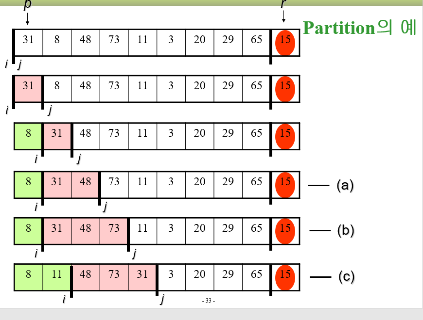
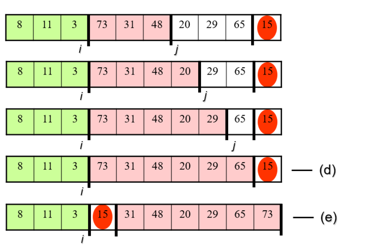
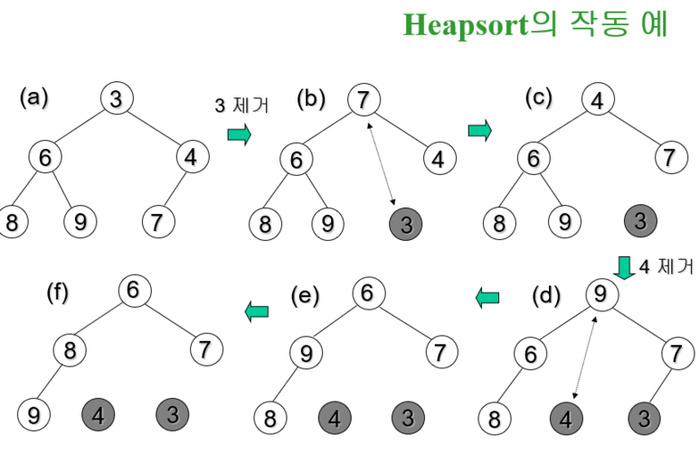
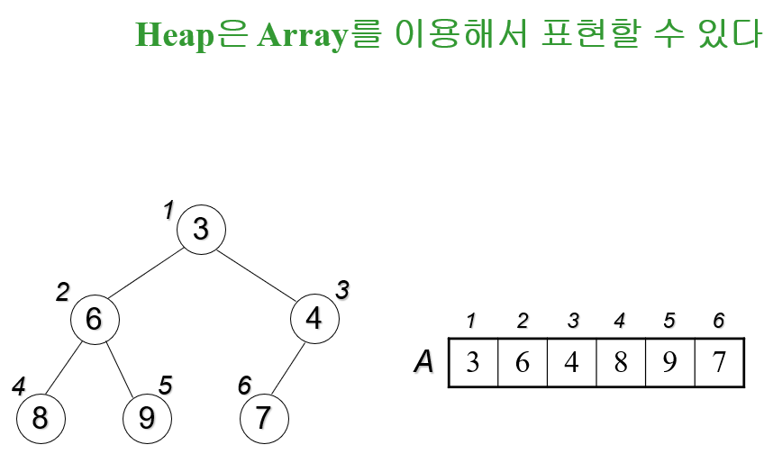
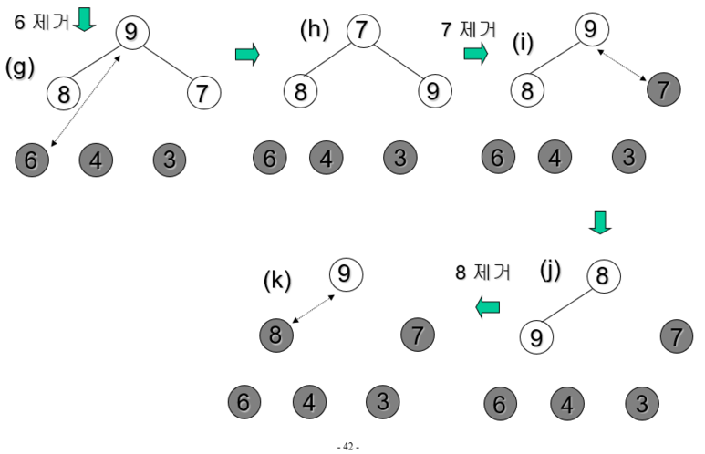

==**1. Quick sort**==
- 재귀함수 이용, 정렬 알고리즘 중에서 가장 자주 사용할 알고리즘
```
quickSort(A[], p, r)   ▷ A[p ... r]을 정렬한다 
{ 
      if (p < r) { 
          q = partition(A, p, r);  ▷ 분할 
          quickSort(A, p, q-1);   ▷ 왼쪽 부분배열 정렬 
          quickSort(A, q+1, r);   ▷ 오른쪽 부분배열 정렬 
        } 
} 
```
```
partition(A[], p, r) 
{ 
        배열 A[p ... r]의 원소들을 A[r]을 기준으로 양쪽으로 재배치하고 
        A[r]이 자리한 위치를 return 한다; 
}  
```
```
 partition(A[], p, r)
{ 
	x ← A[r]; 
	i ← p – 1;
	for j ← p to r – 1
		if(A[j] ≤ x) then A[++i] ↔ A[j];
	A[i+1] ↔ A[r];
	return i+1;
} 
```


==**2. Heap sort**==
- Heap? Complete binary tree로서 다음의 성질을 만족한다
	- 각 노드의 값은 자신의 children의 값보다 크지 않다

> Heapsort
: 주어진 배열을 힙으로 만든 다음, 차례로 하나씩 힙에서 제거함으로써 정렬한다

```
heapSort(A[ ], n)
{
		buildHeap(A, n);              ▷ 힙 만들기
		for i ← n downto 2 {
			A[1] ↔ A[i];        ▷ 교환
			heapify(A, 1, i-1);
		}
}
```
```
buildHeap(A[ ], n)
{
	for i ← n/2 downto 1 
		heapify(A, i, n)
}

heapify(A[ ], k, n)
{
	left ← 2k; right ← 2k+1;
	if(right ≤ n) then{
		if(A[left] < A[right]) then smaller ← left;
		                                  else smaller ← right;
	}
	else if (left ≤ n) then smaller ← left;
	else return;
	if(A[smaller] < A[k]) then{
		A[k] ↔ A[smaller];
		heapify(A, smaller, n);
	}
}

```


==** 3. o(n) sort **==
- 두 원소를 비교하는 것을 기본 연산으로 하는 정렬의 하한선은 Ω (n log n)이다
- 그러나 원소들이 특수한 성질을 만족하면 O(n) 정렬도 가능하다
- When? 원소들의 크기가 모두 –O(n) ~ O(n) 범위에 있을 때

```
countingSort(A[ ],  n)  ▷ simple version
{		▷ A[ ]: 입력 배열,  n: 입력 크기
		for i = 1 to k 
			C[i] ← 0;
		for j = 1 to n 	
			C[A[j]]++;	
		▷ 이 지점에서 C[i] : 값이 i인 원소의 총 수
		for i = 1 to k 
		 	print C[i]  i’s;	▷ i를 C[i]번 출력
}
```
==**4. Radix sort ** ==
- 원소들이 모두 k 이하의 자리수를 가졌을 때 (k: 상수)
```
radixSort(A[ ], d)
{				
		for j = d downto 1 {
			Do a stable sort on A[ ] by jth digit;
		}
}
```

==**5. Stable sort**==

- 같은 값을 가진 item들은 sorting 후에도 원래의 순서가 유지되는 성질을 가진 sort를 일컫는다.


참고문헌
> 1) 문병로, 쉽게 배우는 알고리즘, 한빛미디어
> 2) 박상현, 뇌를 자극하는 알고리즘, 한빛미디어

