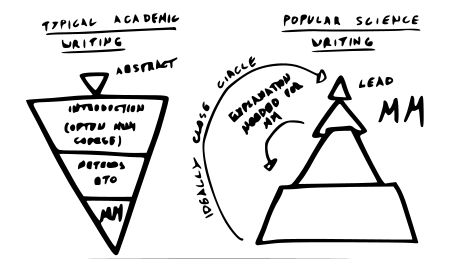

Whether you like it or not, a large part of a scientist job is communicating.

Last month I participated at the [Flemish PhD Cup](http://www.vlaamsephdcup.be/), a competition for science communication for young postdocs. The goal was to present our PhD *in three minutes* as clearly and entertainingly as possible. Most of us worked four to six years to obtain our PhD and needed in a 45 minute presentation to explain our research during our thesis defense. Sufficient to say that the PhD Cup was no easy task.

Luckily for us, and our audience, the organizers made sure that we received a thorough preparation. The sixteen selected candidates, postdocs from field as diverse as microbiology, law, language, history and robotics, received an intensive four-day media training. During the first two days, we learned how to write popular science articles and how to give a good presentation. In the next two days, we went to the Flemish Radio and Television organization to learn how to tell a story, be interviewed, interact with a camera and how to get the best out of our voice.

I promised myself that if I would make it to the finals, I would start a blog to communicate my research and ideas to a wider audience. Last Monday the competition ended. Though I did not make it to the top three, the other seven finalist and myself gave it all to show that being a scientist is the coolest job in the world! In the last month, I had the incredible opportunity to grow as a communicator. Would there be a better topic for a first blog post than sharing some of the things I learned at the media school?

Below are the seven lessons ...

## Good elevator pitch

You are at a conference and you meet *the* authority in your field. She gives you one minute to explain your research (everybody wants to talk to her!). How do you both inform and spark an interest in your work using only a handful of sentences?

A good elevator pitch starts with a problem, to clarify the relevance of your work. Your research provides of course a solution for this problem. For example, an ecologist might say: 'We do not know how the photosynthesis of plants are affected by changes in environment temperature. I build models to help understand how plants adapt to changing temperature.'

Likely, your science hero will respond with something as 'Ah, that is nice for you.' You have informed, but not involved! For this reason, it is very important that you include a sentence with a 'what is in it for them', something relevant to your audience. In the example, the ecologist might add 'This way we can take the appropriate measures to counteract the effect of global warming.' This might do well if your audience cares about environment. Another conclusion to your pitch might be 'This could help greenhouse farmers save a lot of heating costs', which might appeal more to a capitalistic nature. Taylor the last part to the audience preferences!

So in conclusion, a good elevator pitch is a problem with a solution + a-what's-in-it-for-them.

## Stick to one main message

As passionate researchers, we are always full of ideas and we want to tell you about all of them. *Don't do this!* A good presentation, article or lecture has ideally only a single message. Of the many awesome things you know and have done, pick only one! Your main message has of course many facets, on which you can elaborate, but there is only one main point which the audience should remember.

During my PhD, I developed mathematical models that can help with personalized medicine. Of these models I made several theoretical discoveries and I have countless other equally interesting applications of them. I want to tell you how they work and why they are different from what other models do, but my main point is that I made models for suggesting the best medicine for you.

Note the difference between a main message and a theme. The main message is your main point and both gives the reader grip on what you are going to tell and helps you build your text. The theme is more vague and is determined by the message, not the other way around.

## Structure text as a triangle

If you have main message, tell it directly. As scientists and experts, we like to give a comprehensive reasoning and justification before getting to our main point. A reader just wants to know what you have to say. Only if he is interested, then he wants to hear the details. Think about this when you write your next research paper! This is also how a [Nature summary abstract](https://cbs.umn.edu/sites/cbs.umn.edu/files/public/downloads/Annotated_Nature_abstract.pdf) should be structured.

## Involve your audience

## Tell a story!

> 'Storytelling is the most powerful way to put ideas into the world today' ~ Robert McKee

## Voice and posture

## Be yourself
