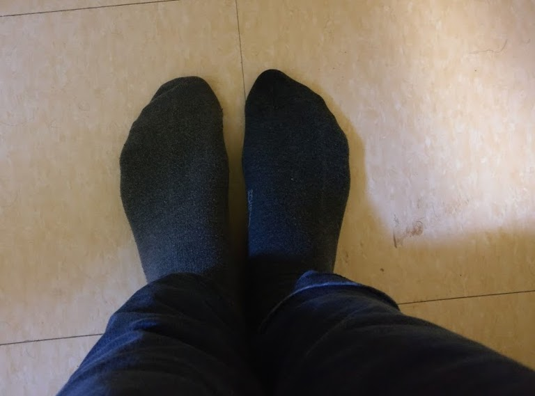

Algorithms are awesome! While mathematics is mainly involved with proving theorems, which merely state some truth, computer science studies algorithms, which *produce truths*. A mathematician might be able to tell you that there is a way, a computer scientist will be able to find the way!

Recently, I came across the book '[Algorithms to Live by: The Computer Science of Human Decisions](https://www.goodreads.com/book/show/34150973-algorithms-to-live-by)'. Part self-help book on organizing, part popular science, it made for both an enjoyable and interesting read. In the different chapters, the authors discussed different computer science problems and how the solutions are relevant to more mundane problems, such as how to seat guests at a wedding party or deal with being stood up for a date.

Also nice is that the authors provided some biological context. Algorithms are hard-wired in our genes and brains, courtesy of evolution. For example, slime molds use their body to 'compute' a minimum spanning tree to connect different food particles in an optimal way. Seeing the world around in terms data-processing algorithms was also one of the main ideas of [Homo Deus](https://michielstock.github.io/Homo_Deus/), another interesting book.

In this post I give a summary of some of the chapters in the book. I originally wanted to summarize the whole book, but it contained too many interesting ideas. Hope that this post sparks some people to read it, or at least helps to save some time sorting out your laundry!

## On hiring a new secretary

Suppose that you are in an ice cream salon with a hundred different flavors of ice cream: chocolate-mint, peanut butter, pepper, coffee-chocolate-garlic and many more! Because you do not know any of these strange combinations, the friendly ice cream vendor allows you to taste some! You can try a little spoon of a kind of ice cream and have to decide whether you want a full serving or want to taste something else. Unspoken rules of politeness say that if you have declined a flavor to try a new one, you can never choose that previous flavor again. Which strategy will lead to the best bowl of ice cream?

In mathematical circles, this problem is known as the **secretary problem**: a set of candidates to fill a vacant secretary position, who do you hire? These candidates visit your office one-by-one to get interviewed. After every interview you have to decide to either hire the candidate or reject her and interview someone else. If you decide to hire too soon you likely end up with a mediocre candidate. On the other hand, keeping to reject applicants in the hope of finding someone better will probably result in retrospectively rejecting the best one!

There is a rather elegant solution to this problem:

> When searching for the best 'item', first spend $$e^{-1}\approx 37$$% of your effort just looking. From then onwards settle for an item at least as good as what you have encountered up to that moment.

Returning to the ice cream dilemma, if you can reasonably try ten flavors, the best strategy is to taste and reject the first four flavors to get a feel of the 'distribution' of the flavors. Now that you have some points of reference, pick the first flavor that tastes better than you had so far. If you found nothing that surpasses the initial four, you are out of luck and have to stick with the last flavor. Better some ice cream than none at all!

The secretary problem can pop up in various disguises: hiring candidates, looking for a job, finding a new apartment, selecting your life partner, etc. Typical for all these problems is that the distribution is unknown beforehand: before starting our search we have no point of reference for what is good or not. If instead of hiring people based on their qualitative competence (e.g. scores on a test or study results), the choice becomes much easier: look until you find a candidate with the highest score you can reasonably expect. When interviewing ten candidates you can reasonably expect one to be in the top-ten percentile grade-wise. Problem solved.

## When to try something new

Where should we go and eat tonight? Are we going to our favorite Italian which we always enjoy or are we taking a gamble and try that new Lebanese place, which might be a hit or a miss. Computer scientists refer to this as the **exploration versus exploitation dilemma**. Is it better to exploit your best strategy or to engage in the risky endeavor of exploring? Researchers face this problem regularly: continue working on a current research line (resulting in a steady output of papers, but not necessary the most exciting topic) or try this new thing you just read about (which could be high-impact, but will probably be a dead end)?

A simple strategy to determine whether you should try something new is the **win-stay, loose-shift algorithm**: keep doing the same thing as long as you are winning and change when things are going bad. This strategy is provably better than chance, though rather severe towards good but imperfect options. Even the best restaurants can have a bad evening and win-stay, loose-shift implies going to a new restaurants after a single disappointment, even at the last night in town.  

Gittin developed a formal solution to the exploration versus exploitation dilemma in the form of the eponymous [Gittins index](https://en.wikipedia.org/wiki/Gittins_index). The main idea using a **discount factor**: a reward now is worth more than the same reward in the future. Using some rather complex formulas and a discount factor to weigh the important the Gittins index provides a number that allows you to determine if you should try something new or stick to the same thing.

A more simple way guiding your choices is through a **regret bound**: which ones of these choices will I regret most of not having done? Often, it is hard to say what you could gain by choice, while it might be easy to state what you would loose. If you are considering making the leap from being an employee to doing a risky startup, think which choice will likely result in the fewest number of regrets when you are 80. Only you can tell.

## Sorting laundry in linear time

Despite having a master degree in engineering, I have to admit that I do not have a solid grasp on how to operate our washing machine. Hence, more often than not I am the one who has to fold the laundry that my partner has washed. No problem, I can treat this as an exercise in mindfulness. Except for the socks. We seem to have an endless variety of different kinds of socks (my mother has a shop selling underwear). Most of my time in the laundry room is finding the matching pairs of socks. Sadly, I use a rather inefficient form of insertion sort: I pick one sock (brightly colored ones are first to go) and subsequently comb trough the pile to find its partner. Repeat until task completed. This leaves me with a depressing time complexity of $$\mathcal{O}(n^2)$$, time proportional to the number of socks squared.

When going through your laundry, organizing your contacts, alphabetizing your books or sorting a pack of cards, any sorting method requires more effort than going though the whole collection once. More precisely, it requires about $$\mathcal{O}(n\log n)$$ comparisons on average for the best methods. This is better than how I organize my socks, but still requires several passes through the laundry basket to complete this chore.

Why do we sort when it requires that much work? Because it is much easier to find items from a sorted collection compared to an unorganized collection! And this is the **searching-sorting trade-off**. Sorting is a lot of work in advance, but you save time searching on the long run.

As an easy alternative for keeping your stuff completely sorted you can use **bin sort**:

> Ordering and keeping things ordered is often an unnecessary hassle. Instead, simply divide your collection in a manageable number of 'bins'.

Sorting items into $$k$$ bins has a time complexity of merely $$\mathcal{O}(kn)$$. Furthermore, there are relatively few objects per bin, so sorting the individual bins is easy. I actually use this system myself for my books, rather than sorted by author, I organize my books by color. In addition to being esthetically pleasing, I can find my books much easier based on the color of their cover than the author's name.

And yes, since having read *Algorithms to Live by* I subdivide my socks in brownish, dark and colored groups. Slightly mismatched feet are as small price to pay for a great time complexity!

## The self-organizing pile of paper

*Caching* means that you keep your stuff close to where you might need it. If you keep your spices in the kitchen rather than your lavatory, congratulations, you are already doing this. Computers perform caching by storing data that it often needs in its fast memory rather than the slower hard drive. This poses the obvious problem of predicting what you will need a lot and what not. An ideal caching system should be **clairvoyant**.

An elegant solution is assuming that the things you used in the past will be useful in the near future as well. For organizing your paper files you can use the clever **Nogushi filing system**:

> Keep your documents in a stack. New documents go on top. If you need a document from the stack put it back on top afterwards.

This stack of documents will essentially be self-organizing in the sense that the documents you need a lot tend to be at the top while papers you do not need any more will slowly collect at the bottom. I find it a comforting thought that one of the most efficient ways to organize paperwork is by plopping it on a pile on your desk.

You can also applied this on your computer. I set the filing system of my MacBook such that a new Finder window will show all my documents in the order of last opened.

## Preparing a dinner party

Planning complex project with many interdependent tasks is no easy task. One such project is cooking a multi-course dinner: vegetables should be cut before they can be sautéed, the oven should be used optimally and, for God's sake, do not use the knife for raw vegetables after using it for meat! **Scheduling theory** is serious business!

Depending on what metric is important, different strategies have to be followed. Using **earliest due date** you try to *minimize the maximum lateness* by always choosing the task which has to be finished first, irregardless of how long it takes. This ensures that everything is finished as early as possible. If you rather want the maximize the *number of tasks finished* before the due data, you best follow **Moore's algorithm**. Here, you again pick the task that has to be finished first, unless it looks like you cannot finish it in time. In that case you discard that task and choose the next most urgent task. You will end up with a splendid dinner, but without meringue on your lemon pie.

If you just have to do some chores at home or some tasks at work, without a specific order, you will spend the same amount of time irregardless of their order. When there are different people waiting on you to finish your tasks however, you can minimize their *collective waiting time*. To this end, just do the tasks in order of the time needed to complete them. This is called **shortest processing time**. In practice some things are more important than other (taking out the trash takes less time than bringing someone to the hospital, but you are still advised to to the latter first). For this reason, it makes sense to weight your tasks by importance:

> Do tasks in order of importance divided by the time it takes to finish the task.

So, if one task takes twice as much time as another, only do it first if it is more than two times as important.

## Other lessons from algorithms

- **Overfitting**: our brains are wired to find pattern that might not be there. Sometimes the most simple explanation is correct.
- **Randomness** as an inspiration for new ideas. *Make your opening page in your browser a random Wikipedia page. Visit the Tumblrverse!*
- **Computational kindness**: try to limit the computational burden to your friends and family. *Rather than asking your friends for a data to meet (an open problem), give them some two possible dates to meet (a verification problem).*
- **[Optimal transportation theory](https://michielstock.github.io/OptimalTransport/)**: for dividing desserts among colleagues.
