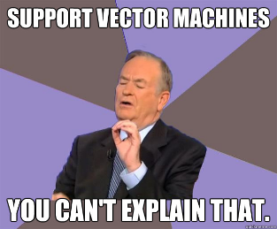
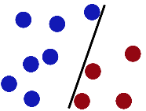
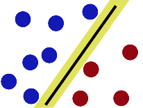
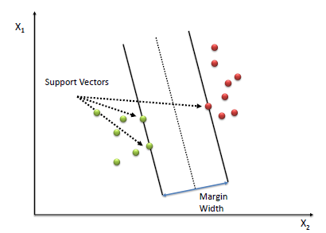
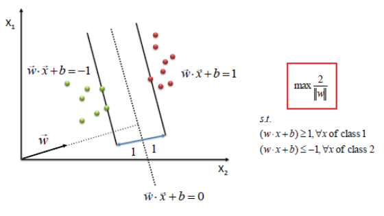
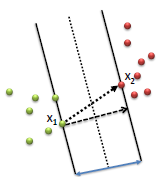
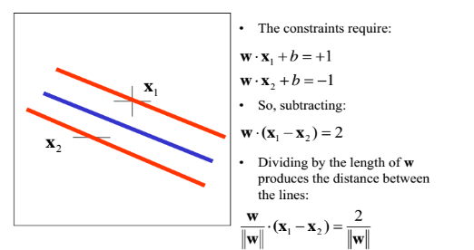

Support Vector Machine
----------------------

## Introduction
With research being conducted for the past 20-30 years in the field of Neural Network, and people thinking there was no trick left in the bag, in 1963 Vladimir N. Vapnik and Alexey Ya. Chervonenkis introduced the Support Vector Machine algorithm. The idea behind SVM was to find an optimal (k -1) dimensional hyperplane to separate data points represented using k dimensional vectors.

Wikipedia :
> **Support vector machines** are supervised learning models with associated learning algorithms that analyze data used for classification and regression analysis. Given a set of training examples, each marked as belonging to one or the other of two categories, an SVM training algorithm builds a model that assigns new examples to one category or the other, making it a non-probabilistic binary linear classifier.

## Intuition

- Imagine you have a two dimensional space with positive and negative samples. Blue/red dots represent the negative/positive samples.

- What is the easiest way to separate these samples? Vladimir N. Vapnik suggested that the easiest way is to do so is using a straight line. 

   
- Support Vector Machine separates the negative samples from the positive by finding the line with the widest gap (separation between +ve & -ve examples is maximum) on either sides.  

## SVM Classifier Mathematics

Support Vector Machine (SVM) performs classification by finding the hyperplane with the maximum margin between the two classes. The distance from the hyperplane to the nearest data point determines the margin/width of the classifier. The vectors that define these points are the called support vectors.

To define an optimal hyperplane we need to maximize the width of the margin (w).

Assumptions:

1. Let w be a vector of any length  perpendicular to the median of the margin.
2. Let x be a vector pointing to an unknown data point.

$$ \text{Our aim is to find the best decision vector } \overrightarrow x \text{ which maximizes the width of the margin w.}$$

**Decision Rule:**

- Classify unknown x as positive(class1) if
$$\overrightarrow w.\overrightarrow x > 0$$

- Constraint, for all positive sample vectors:
\begin{align} &&&& \overrightarrow w.\overrightarrow x & \ge 1 &&& \text{ (1)} \end{align}
- Constraint, for all negative(class2) sample vectors:
\begin{align} &&&& \overrightarrow w.\overrightarrow x & \lt 1 &&& \text{ (1)} \end{align}          

The dot product $$\overrightarrow w.\overrightarrow x$$ is the projection of vector x in the direction of w. If the projection is greater than a threshold (the median line) we classify it as a positive else negative sample.  

The width of the  margin w can be calculated by taking the dot product between the difference of the 2 vectors $$x_2 - x_1$$ and a unit vector normal to the margin ie. $$ \frac w {\|w\|}$$

$$Width = \frac w {\|w\|} . (x_2 - x_1)$$

For “mathematical convenience” let us introduce a new variable $$y_i$$st.
    $$y_i = +1 for +ve $$
    $$y_i = -1 for -ve $$

Multiplying  Eq. (1) & Eq. (2) with yi can rewrite the constraints as:
    $$y_i.(\overrightarrow w.\overrightarrow x +b) \ge 1$$

 
Maximizing the width   $$\frac 2 {\|w\|}$$        is equivalent to minimizing $$\frac 1 2 {\|w\|^2}$$

We find the values of w and b by solving the objective function using optimization techniques such as Lagrange Multipliers or Quadratic Programming.
$$Min\frac 1 2 {\|w\|^2}$$

## Conclusion

The beauty of SVM classifier is that if the data is linearly separable, there exists a hyperplane that can completely segregate the two classes.
 
**Pros**

 - Is well suited for small & clean datasets
 - It is efficient because it only uses a subset of training points for finding the optimal hyperplane.

**Cons**

- Not suited for large datasets as the training time with SVMs can be high.
- Requires complete labeling of input data.
- Doesn’t calculate the class membership probability for data points.
- SVM is only directly applicable for binary classification tasks.

## References
  - 
  - 
