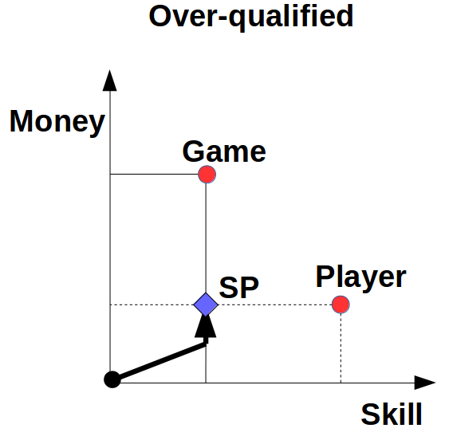
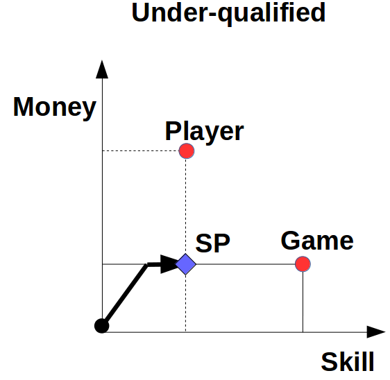
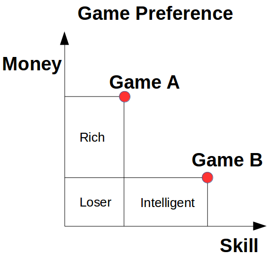
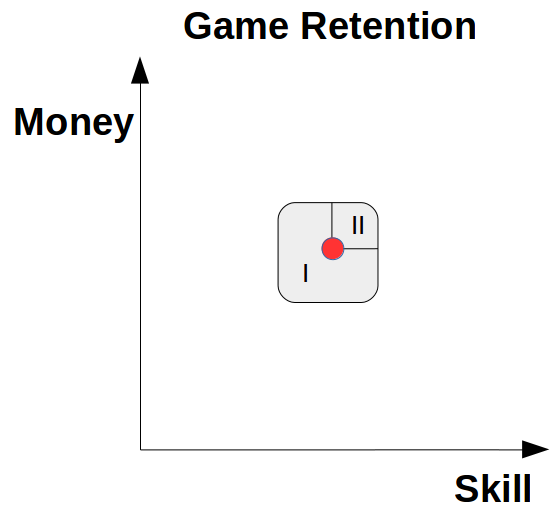
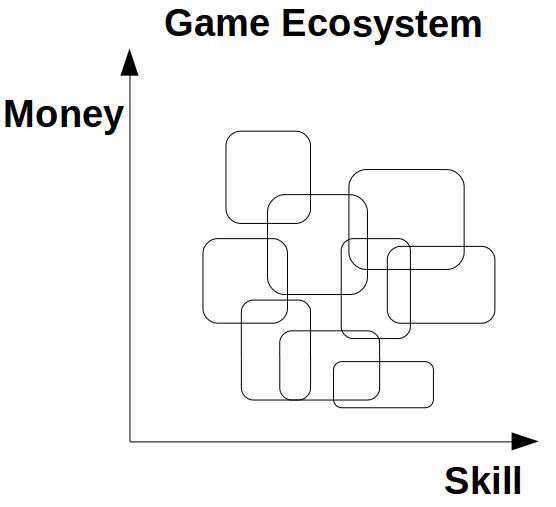
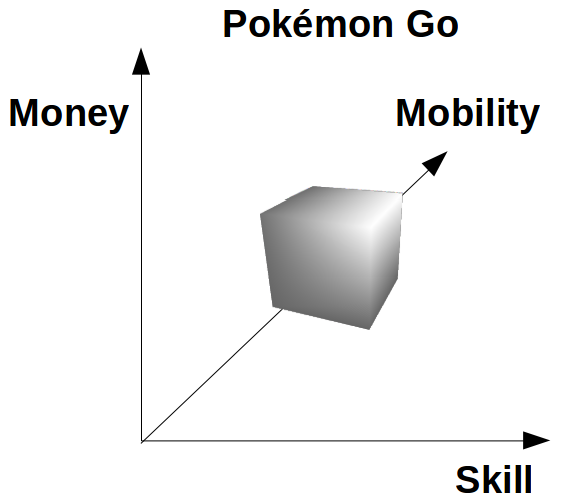

## Introduction
*Free-to-play* (F2P) and *Pay-to-play* are two different business models. Pay-to-play requires the players to make a fixed-amount purchase to play the game. Examples include *World of Warcraft*, *Eve Online*... Free-to-play usually adopts a freemium model and does not require any payment in advance to access the game. Instead, players can make in-game micropayment to enhance their gaming experience, which is also the method with which the company makes money. Examples include *League of Legends*, *Dota 2*, *Hearthstone*, *Clash Royale*, *Pokémon GO*... F2P has been a great commercial success, and more and more online games follow this model.

However, there is also criticism to F2P. The purchasable in-game items often give players significant advantages. Those players who do not spend any money on the game often find it difficult to compete with those who do, or to accomplish the quests in the game. They make jokes such as "free-to-play, pay-to-win". Nevertheless, those who do spend money argue that there are many counterexamples that some players spend much money but still do not play as well as a normal player. Someone hence coins the phrase "pay-to-accelerate".

This article gives a simple model to illustrate the necessary resources to "win" in F2P games. In this model, "pay-to-win" is no longer a qualitative judgment, but a quantitative measure. Throughout the remaining of this article, let us use the term of "dollar player" and "non-dollar player", whose meanings are self-evident.

## Stagnation point
There are two basic resources in any F2P games: money and skill. Money has two effects. Firstly, it can boost the gain per time unit, which forms a growing gap between dollar players and non-dollar players, if there is no ceiling to the final status. Secondly, it can unlock powerful items that can not be unlocked with pure skill in reasonable time. Skill is the resource to solve the enigma or the complexity built into the game. Players improve their in-game skill with repeated practice and learning.

Every F2P game has different requirement about the set of resources. Some are money hungry, others are skill hungry. Every player has also different asset of resources. Some are rich, others are skillful. It is interesting to see what will happen if there is a mismatch between the game requirement and the player asset.

First, let us discuss the case where a skillful player plays a money hungry game. With the time growing, he plays better and better this game and pay more and more money as well. But since the game does not have much complexity, he quickly hits the skill ceiling and has his extra skill unused. But he can still spend more money and still progress in the game. However, he soon hits the money ceiling because the micropayment has exceeded his budget. At this moment, he reaches the stagnation point (SP), and he can no longer experience the pleasure of progression. Meanwhile, he is outcompeted by players who are willing to pay more money, and hence suffer from the frustration of dominance. 

It is similar when a rich player plays a skill hungry game. He quickly hits the money ceiling set by the game because his extra budget gives him little or no advantage. Later, he hits the skill ceiling because he does not possess the capacity to solve the inner complexity of the game. At this moment, he reaches the stagnation point, and he can no longer experience the pleasure of progression. Meanwhile, he is outcompeted by players who are naturally more skillful, and hence suffer from the frustration of dominance. It may be worth noting that the underlying psychology could be the opposite. The player in question may refuse to admit his skill deficit. Instead, he may believe that he is not rich enough for this game.

## Game ecosystem
The above section supposes that there is only one game in the market. This section discusses the cases where there are two or more games.

First, let us suppose there are only two games: one is money hungry (A) and the other is skill hungry (B). Players initially play both games with equal time. Intelligent players quickly hit the SP in Game A, but can still progress in Game B. Later, they are dominated by rich players in Game A, which makes them eventually quit it. They become Game B exclusive players. Similarly, rich players quickly hit the SP in Game B, but can still progress in Game A. Later, they are dominated by intelligent players in Game B, which makes them eventually quit it. They become Game A exclusive players. Those who are neither rich nor intelligent hit the SP in both games. They are dominated by rich players in Game A, and intelligent players in Game B. They are losers, being there only to be "food" of the other two groups of players. They may eventually quit playing both games.

This brings an important concept in the game industry -- retention rate. Game A's retention rate is the proportion of rich players, and Game B's is the proportion of intelligent players. More generally, given an arbitrary F2P game, its retention rate is the proportion of the players in the neighborhood of this game's money-skill requirement. Players in Part I of the figure below have yet fully explore this game's complexity. This gives them pleasure of progression. Since they are not too faraway from the game requirement, they can still win against more competent players with a decent chance, let alone newbies who have just joined in the game. Thus, they do not suffer much from the frustration of dominance. Players in Part II fully explore the game's complexity. This gives them an advantage over other players and hence get the pleasure of dominance. Since they are not too faraway form the game requirement, they do not waste too much of their capacities, and hence do not suffer much from the frustration of progression. Players faraway from the neighborhood experience either severe frustration of progression or severe frustration of dominance, and are not likely to be retained.

The retention rate depends on two factors: the area of the neighborhood and its position. As product manager, he should decide the game requirement so that it is located where the players are dense. As game designer, he should design the game so that its area is the largest possible. In real life, there are already many F2P games. Their correspondent neighborhoods form a covering of the space, hence an ecosystem. Players tend to find the game that suits them the best.

## Extension
The above sections are a simple use of this model. One may well extend it to model more complex issues.

A curious reader may ask how about Pokémon Go. Actually, besides money and skill, there is a third resource in this game – mobility. Players are required to move physically to prosper in this game. The model still applies, but in a three-dimension coordinate system.

The skill itself can be further divided into several orthogonal skills. For instance, role playing games (RPG) and first-person shooting games (FPS) need very different sets of skills. Therefore, the entire market is in some higher space.

One amazing application is to use it to model job choice. There are many jobs in the world, and they require very different sets of skills, and hence form the division of labor. What special here is that people can not pick up or quit a job as easily as a game. Besides, people tend to look for the jobs providing the most salary instead of the ones they are most suitable to. These effects as well as others lead to the mismatch of the job holder's capacity and the job requirement. This further results in both incompetence and inefficiency. Those who are incompetent are likely to be fired during the next layoff. Those who waste their talents may try to get a hobby to get away from the frustration of progression because it allows them to try another point in the coordinate system.

Last but not least, the real life itself can also be regarded as one or several "games", and be put in the same coordinate systems with other man-made games. Those talented but poor people can beat rich people in some skill hungry games. These games set a fair stage, where everyone can compete equally, regardless of his social status. However, since anyone can finally pick a game that suits them the best, they may be addicted to the virtual game and escape from the reality and their social responsibility. Moreover, those "losers", under-qualified for any game, get addicted to alcohol and drugs, since it creates for them the world where they can get the pleasure that they cannot find in other games with the least effort.

