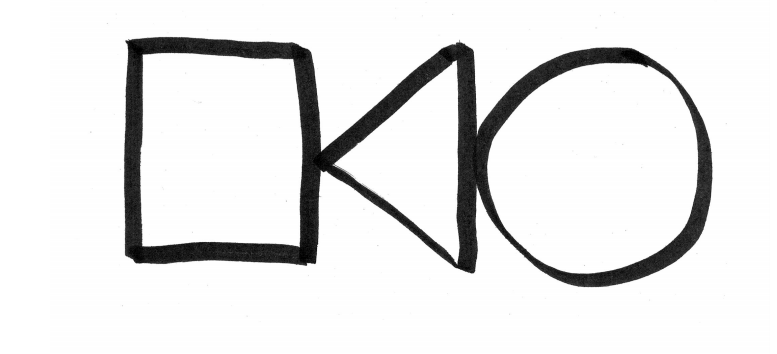
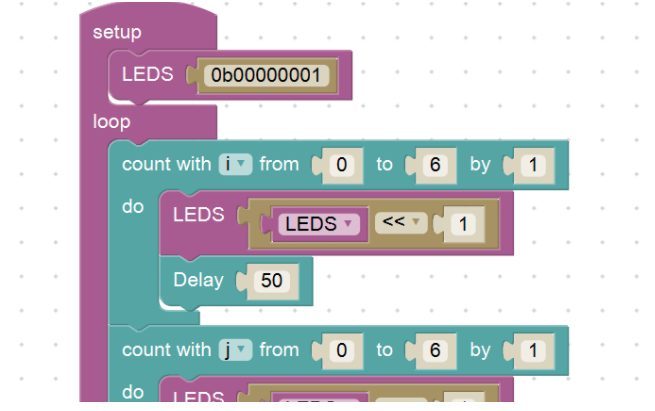

Do you remember the first time you felt like a scientist or an engineer? Yesterday, I had the pleasure of being one of the more than 300 volunteers of the [WeGoSTEM](http://www.wegostem.be/) project. Jacotte, Luc and myself showed the children Sint-Vincentius school how to build and program a simple drawing robot.

WeGoSTEM is an initiative by [Dwengo](http://dwengo.org/) and She Goes ICT to popularize Science, Technology, Engineering and Mathematics (STEM) to primary school children. The organizers place much emphasis on reaching out to all children. This includes not only white boys with well-educated parents, but also girls, children with different cultural backgrounds and children from socio-economical disadvantaged backgrounds. Everybody will have to deal with STEM at some point in their life. Science and technology are key tools to solve global problems from social inequality to climate change. We cannot afford that young people are not exploring and discovering their STEM talents because of a lack of opportunities.

At the start of our workshop, we asked the children what they thought a robot was. Could they give some examples of robots (including fictional robots such as Wall-E or real ones such as Roomba,...)? Then, we asked them what you need to build a robot (motors, a battery, mechanics, sensors, a microchip,...). At the end, we more or less settled on the fact that a robot is some kind of machine that you can tell (program) to do different things.

A robot has to be programmed and this is illustrated by an 'unplugged' exercise in which one child is a programmer and the other children are robots that have to be programmed. The programmer is asked to sit in front of the class and receives a drawing like the one below.

Without showing it to his or her friends, the programmer has to tell the robots exactly what they have to do in order to end up with the same picture. Some programmers simply order to draw a square, a triangle and a circle, resulting in a collection of drawings with the shapes in the wrong orientation, order and size. Others meticulously describe every stroke their robots have to put on paper. This results in much more consistent drawings, but takes much longer to explain. Conclusion: when programming you have to be specific and exact.

Then the real fun starts (although my classes already had plenty of fun during the previous activities): building their very own drawing robot! Every pair of children has little box containing everything they need to build a small motorized arm that can hold and move a marker. We did not provide them with detailed building instructions, merely with a drawing what the robot should look like. Most children have no problems to build the thing using some old-fashioned trail and error. When their robot is build, we show them how to program it using Dwenguino Blockly, a graphical programming language for the Arduino compatible [Dwenguino board](http://dwengo.org/tutorials/dwenguino). They can write their name on the LCD screen of the board, set the speed of their motors and, if they want to annoy you, make high-pitched beeping noises with the built-in speaker.

When they are set, the robot starts drawing vigorously on a sheet of paper: from relaxing curves to chaotic patterns. Everybody ended up with their very own robot-drawn artwork to remember their first they were truly an engineer!

This activity contained all the steps you have to do as an engineer: thinking about things, building something, figuring out why it does not work and enjoying the victory when it finally does. When we ended the activity, many children craved for more. Luckily, we were provided with a little book for the teacher filled with other STEM-related activities. We hope they will have fun doing them.

Are you a scientist or an engineer yourself? Do you also want to inspire children to do STEM? There are many initiatives were you can contribute to. And I guarantee you, they are not only fun for the children themselves!
