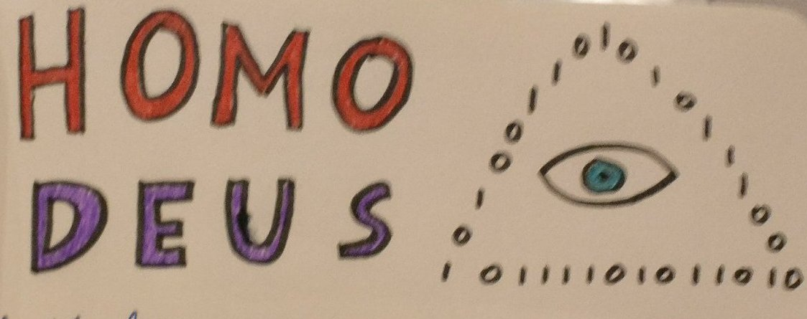

On two separate occasions after presenting my research, people came to me to recommend me Yuval Noah's [Homo Deus](https://www.goodreads.com/book/show/31138556-homo-deus?from_search=true). My example of using machine learning algorithms to recommend personalized medicines was apparently very much in line with the main message of this book. Intrigued, I added it to my reading list and would like to share some of my notes and thoughts about Homo Deus.

Departing from evolution, Homo Deus discusses what makes humans the dominant species on the planet. Our main successful trait is not the superior intelligence of an *individual*, rather it is our species' uncanny talent for *organizing* ourselves. To this end, we have developed a whole range of abstract tools to organize the masses: religion, writing, currency, nations, laws, economics etc. There is a Darwinian selection going on here: tools that are better in mobilizing people for a cause will eventually used more. These organizing processes have become so intertwined with our lives that we feel more dominated by human constructs such as our values, the law, religion rather than the laws of nature. We put ourselves in the hands of entities bigger than ourselves: be it God or the state.

In the latter couple of decennia, our lives are determined by new agents: computer algorithms. Companies such as Google, Amazon, Alibaba and Facebook determine what sites we visit, what goods we should buy, which advertisements are most relevant to us and which people we should like. And they are good at telling us what to do, because they use our data to do so. Noah coins the term [*Dataism*](https://www.ft.com/content/50bb4830-6a4c-11e6-ae5b-a7cc5dd5a28c) for this: using Big Data as a basis for society.

It is hard to argue with the 'unreasonable effectiveness' of data. Based on our likes, Facebook knows us better than our most intimate family and friends. In the very near future, it is likely that machines will outcompete most humans in challenging tasks such as driving a car or performing medical diagnoses. I have trouble giving an example of a human endeavor that could not be done effectively by a machine or algorithm in the next ten years. Even [art](https://deepart.io/), [playing Go well](https://deepmind.com/research/alphago/), [discovering physics equations](https://pdfs.semanticscholar.org/d689/6f372d41dd63ff39741713df012fcc680c13.pdf) or even [data science](http://www.ml4aad.org/automl/) are not safe from being automated. This is an evolution few people would have predicted two decades ago.

Basically, Dataism is about the decoupling of *intelligence* and *consciousness*. Though it seems that we are still very far from making a consciousness general-purpose hard AI, we are becoming very good at making AI for *specific* tasks. How our society will change when most jobs can be automated is an interesting question. It can definitely serve as an argument in favor of a basic income.

More philosophical, Noah presents Dataism as something ingrained in the very nature of our universe: data wants to be free and systems evolve to become more efficient in processing ever larger amounts of data. Though Homo Deus is not the first to suggest data and [information](https://www.goodreads.com/book/show/116623.Decoding_the_Universe) as principle of nature, I find it a bit of armchair physics, tailored to the hypes of our time. Nevertheless, it is fun to think about the world around us in such a way.

So, next time you are posting on the social media, swiping persons left our right or going through your mountain of unanswered mails, think about this: you are but a cog in the giant data-processing machine of the world.
