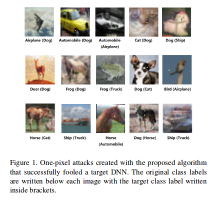
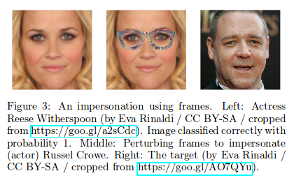
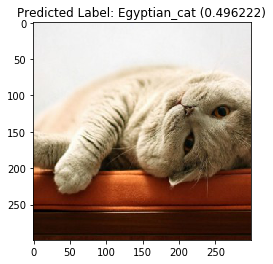
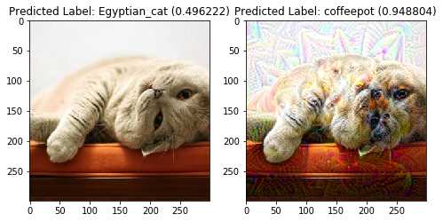

Everyone has heard the feats of Google's "dreaming" neural network. Today, we're going to define a special loss function so that we can dream adversarially-- that is, we will dream in a way that will fool the InceptionV3 image classifier to classify an image of a dreamy cat as a coffeepot.

[DeepDream](https://en.wikipedia.org/wiki/DeepDream) made headlines a few years ago for its bizarre images generated by neural networks. As with many scientific advancements, a flashy name won out over the precise name. "Dreaming" sounds more exotic than the more boring truth: "purposely maximizing the L2 norm of different layers". Anyway, the approach was later extended to [video](https://www.youtube.com/watch?v=oyxSerkkP4o) by researchers to more unsettling effects. How to "dream" has been covered at length, so for this post, I'm going to repurpose [code from the good people at Keras](https://github.com/keras-team/keras/blob/master/examples/deep_dream.py) and only focus on the adversarial side of dreaming. This modified code is included as an appendix below.

##  Adversarial Images

Adversarial images have been getting a lot of attention lately. Adversarial images are images that fool state of the art image classifiers but a human would easily classify as the proper class. At present, these images are only possible with access to the classifier you aim to fool, but that could always change in the future. Therefore, researchers are already exploring all the different ways one can exploit an image classifier. 

There have been several papers exploring these so-called attacks. The aptly named [One pixel attacks](https://arxiv.org/abs/1710.08864) change a single pixel to trick a classifier:


[Special glasses](https://www.cs.cmu.edu/~sbhagava/papers/face-rec-ccs16.pdf) have been used to cause a classifier to misclassify celebrities:


One can quickly imagine how this can go awry when self-driving cars need to identify obstacles (or pedestrians). With these publications in mind, I would like to walk through another approach that combines "dreaming" to create adversarial images.


## Setup


```python
from keras.applications import inception_v3
from keras import backend as K
import numpy as np
import matplotlib.pyplot as plt
%matplotlib inline

# Repurposed deepdream.py code from the people at Keras
from deepdream_mod import preprocess_image, deprocess_image, eval_loss_and_grads, resize_img, gradient_descent

K.set_learning_phase(0)

# Load the model and include the "top" classification layer
model = inception_v3.InceptionV3(weights='imagenet',
                                 include_top=True)
```

    Using TensorFlow backend.


## The Cat

Today, we're going to take this image of a lazy cat for our experiment. Let's see what InceptionV3 thinks right now:


```python
orig_img = preprocess_image('lazycat.jpg')
```


```python
top_predicted_label = inception_v3.decode_predictions(model.predict(orig_img), top=1)[0][0]
plt.title('Predicted Label: %s (%f)' % (top_predicted_label[1], top_predicted_label[2]))
plt.imshow(deprocess_image(orig_img))
```





The most likely class according to InceptionV3 is an Egyptian_cat. That's oddly specific (and wrong), but let's go with it.

## Select Fake Label

In this case, let's select a "coffeepot". 


```python
coffeepot = np.zeros_like(model.predict(orig_img))
coffeepot[0,505] = 1.
inception_v3.decode_predictions(coffeepot)
```


    [[(u'n03063689', u'coffeepot', 1.0),
      (u'n15075141', u'toilet_tissue', 0.0),
      (u'n02317335', u'starfish', 0.0),
      (u'n02391049', u'zebra', 0.0),
      (u'n02389026', u'sorrel', 0.0)]]


## Define the loss

Our loss will have a "dreaming" and "adversarial" component.

### Dreaming Component

To achieve "dreaming", we fix the weights and perform gradient ascent on the input image itself to maximize the L2 norm of a chosen layer's output of the network. You can also select multiple layers and create a loss to maximize with coefficients, but in this case we will choose a single layer for simplicity. 

The interesting part mathematically is as follows: define the input image as $$x_0$$ and the output of the $$n$$-th layer as $$f_n(x)$$. To dream, we perform the gradient ascent step:

\begin{equation}
x_{i+1} = x_{i} + \gamma \frac{\partial}{\partial x} \|f_{n}(x)\|^2
\end{equation}

where $$\gamma$$ is the learning rate and the absolute value represents the L2 norm. For our choice of $$f_n$$, we are not limited to activation functions. We could use the output before the activation as well as special layers like Batch Normalization as well. 


### Adversarial Component

For the "adversarial" piece, we will also add a component to the loss that will correspond to gradient descent on the predicted label, meaning each iteration we will modify the image to make the neural network think the image is the label we select.

One of the easiest ways to define this is to choose a label and minimize the loss between the true output for an image and the false label. Let us define the model's output softmax layer as $$f(x)$$ for an image $$x$$ and let's let $$o_{fake}$$ be the fake label. Let's assume we are using a categorical crossentropy loss $$\ell$$, but any loss would do. Then, we would want to perform the gradient descent step

\begin{equation}
x_{i+1} = x_i - \gamma \frac{\partial}{\partial x} \ell( f(x), o_{fake}).
\end{equation}

This iteration scheme will adjust the original image to minimize the loss function between the output of the model and the fake label, hence "tricking" the model.

### Final loss

If we add the previous two loss functions, see the final proper loss where we are taking the derivative:


\begin{equation}
2 x_{i+1} = 2 x_{i} + \gamma (\frac{\partial}{\partial x}  \|f_{n}(x)\|^2 -  \frac{\partial}{\partial x} \ell( f(x), o_{fake}) )
\end{equation}

After massaging the equation, we have the gradient *descent* rule

\begin{equation}
x_{i+1} = x_{i} - \frac{\gamma }{2} \frac{\partial}{\partial x} \left (\ell( f(x), o_{fake}) -  \|f_{n}(x)\|^2 \right ).
\end{equation}
So, our final loss function for adversarial dreaming to define in Keras is:

\begin{equation}
\ell_{\text{adv dream}} = \ell( f(x), o_{fake}) -  \|f_{n}(x)\|^2.
\end{equation}

For the final loss, we will use a linear combination of a few randomly selected layer output functions for better dreaming effects, but those are a small technical detail. Let's see the code:


```python
from keras import losses

input_class = K.zeros(shape=(1,1000)) # Variable fake class

# dreaming loss, choose a few layers at random and sum their L2 norms
dream_loss = K.variable(0.)
np.random.seed(1)
np.random.choice(model.layers[:-1], size = 5)
for x in np.random.choice(model.layers[:-1], size = 4):
    x_var = x.output
    dream_loss += np.random.uniform(0,2) * K.sum(K.square(x_var)) / K.prod(K.cast(K.shape(x_var), 'float32'))


# adversarial loss
adversarial_loss = losses.categorical_crossentropy(input_class, model.output)

# final loss
adversarial_dream_loss = adversarial_loss-dream_loss
```


```python
# Compute the gradients of the dream wrt the loss.
dream = model.input # This is the input image

grads = K.gradients(adversarial_dream_loss, dream)[0] # the signs will acheive the desired effect
grads /= K.maximum(K.mean(K.abs(grads)), K.epsilon()) # Normalize for numerical stability
outputs = [adversarial_dream_loss, grads]

# Function to use during dreaming
fetch_loss_and_grads = K.function([dream, input_class], outputs)
```

## Dreaming

The code to "dream" is straight forward. The image is shrunk to a smaller size and ran through a selected number of gradient descent steps. Then, the resulting image is upscaled with any detail the original image could have lost when resizing added back in. This is then repeated based on the number of "octaves" selected where during each octave, the image has a different size. The octave scale determines the size ratio between the different octaves. 

This is really just a more complicated way to say that the image is passed through the neural net for gradient descent at multiple increasing sizes. The octave concept is a nice geometric approach for deciding what those sizes will be that has been found to work well. Sometimes, additional jitter is added to the image on either each gradient descent step too.


```python
# Shamelessly taken from the Keras' example
step = 0.01  # Gradient ascent step size
num_octave = 5  # Number of scales at which to run gradient ascent
octave_scale = 1.2  # Size ratio between scales
iterations = 15  # Number of ascent steps per scale
max_loss = 100.

img = np.copy(orig_img)

if K.image_data_format() == 'channels_first':
    original_shape = img.shape[2:]
else:
    original_shape = img.shape[1:3]
successive_shapes = [original_shape]
for i in range(1, num_octave):
    shape = tuple([int(dim / (octave_scale ** i)) for dim in original_shape])
    successive_shapes.append(shape)
successive_shapes = successive_shapes[::-1]
original_img = np.copy(img)
shrunk_original_img = resize_img(img, successive_shapes[0])

for shape in successive_shapes:
    print('Processing image shape', shape)
    img = resize_img(img, shape)
    img = gradient_descent(img,
                          iterations=iterations,
                          step=step,
                          clz=coffeepot,
                          max_loss=max_loss,
                          loss_func = fetch_loss_and_grads)
    
    # Upscale
    upscaled_shrunk_original_img = resize_img(shrunk_original_img, shape)
    same_size_original = resize_img(original_img, shape)
    
    # Add back in detail from original image
    lost_detail = same_size_original - upscaled_shrunk_original_img
    img += lost_detail
    
    shrunk_original_img = resize_img(original_img, shape)
```

    ('Processing image shape', (144, 144))
    ('..Loss value at', 0, ':', array([ 13.78646088], dtype=float32))
    ...
    ('..Loss value at', 14, ':', array([ 5.75342369], dtype=float32))
    ('Processing image shape', (173, 173))
    ('..Loss value at', 0, ':', array([ 12.50799942], dtype=float32))
    ...
    ('..Loss value at', 14, ':', array([ 4.36679077], dtype=float32))
    ('Processing image shape', (207, 207))
    ('..Loss value at', 0, ':', array([ 12.14435482], dtype=float32))
    ...
    ('..Loss value at', 14, ':', array([-8.84395885], dtype=float32))
    ('Processing image shape', (249, 249))
    ('..Loss value at', 0, ':', array([ 6.44068241], dtype=float32))
    ...
    ('..Loss value at', 14, ':', array([-9.34126949], dtype=float32))
    ('Processing image shape', (299, 299))
    ('..Loss value at', 0, ':', array([ 1.45110321], dtype=float32))
    ...
    ('..Loss value at', 14, ':', array([-9.23139477], dtype=float32))


## Outcome


```python
f, axs= plt.subplots(1,2, figsize=(8,10))

top_predicted_label = inception_v3.decode_predictions(model.predict(orig_img), top=1)[0][0]
axs[0].set_title('Predicted Label: %s (%f)' % (top_predicted_label[1], top_predicted_label[2]))
axs[0].imshow(deprocess_image(orig_img))

top_predicted_label = inception_v3.decode_predictions(model.predict(img), top=1)[0][0]
axs[1].set_title('Predicted Label: %s (%f)' % (top_predicted_label[1], top_predicted_label[2]))
axs[1].imshow(deprocess_image(img))
```




As you can see, we accomplished our initial goal to dream in a directed adversarially way. There are many other approaches that can be attempted, and as you can see, this is a very popular avenue of research at the moment.

## Appendix: deepdream_mod.py

Here's the functions used in this post:


```python
# Modification of https://github.com/keras-team/keras/blob/master/examples/deep_dream.py

from keras import backend as K
from keras.applications import inception_v3
from keras.preprocessing.image import load_img, img_to_array
import numpy as np
import scipy

def preprocess_image(image_path):
    # Util function to open, resize and format pictures
    # into appropriate tensors.
    img = load_img(image_path)
    img = img_to_array(img)
    img = np.expand_dims(img, axis=0)
    img = inception_v3.preprocess_input(img)
    return img

def deprocess_image(x):
    # Util function to convert a tensor into a valid image.
    x=np.copy(x)
    if K.image_data_format() == 'channels_first':
        x = x.reshape((3, x.shape[2], x.shape[3]))
        x = x.transpose((1, 2, 0))
    else:
        x = x.reshape((x.shape[1], x.shape[2], 3))
    x /= 2.
    x += 0.5
    x *= 255.
    x = np.clip(x, 0, 255).astype('uint8')
    return x

def eval_loss_and_grads(x,clz, loss_func):
    outs = loss_func([x,clz])
    loss_value = outs[0]
    grad_values = outs[1]
    return loss_value, grad_values

def resize_img(img, size):
    img = np.copy(img)
    if K.image_data_format() == 'channels_first':
        factors = (1, 1,
                   float(size[0]) / img.shape[2],
                   float(size[1]) / img.shape[3])
    else:
        factors = (1,
                   float(size[0]) / img.shape[1],
                   float(size[1]) / img.shape[2],
                   1)
    return scipy.ndimage.zoom(img, factors, order=1)

def gradient_descent(x, iterations, step, clz=None, max_loss=None, loss_func=None):
    for i in range(iterations):
        loss_value, grad_values = eval_loss_and_grads(x, clz, loss_func)
        if max_loss is not None and loss_value > max_loss:
            break
        print('..Loss value at', i, ':', loss_value)
        x -= step * grad_values 
    return x
```
