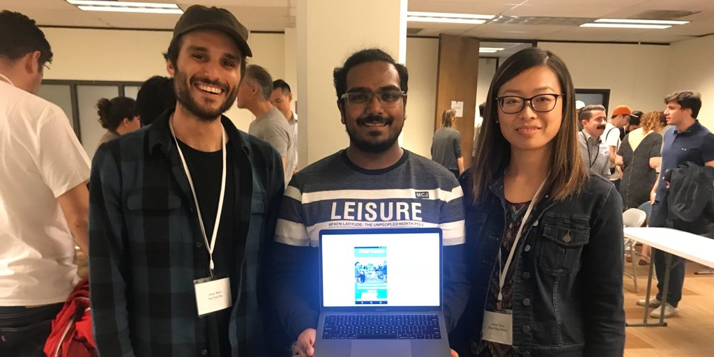

I had a lot of fun this weekend at the first [Hack Mental Health](https://www.hackmentalhealth.care/) hackathon hosted by the [California Institute of Integral Studies](https://www.ciis.edu/) in San Francisco, CA. <!--excerpt-->We created an app called [Peer Learn](https://devpost.com/software/peerlearn) which is a video app to connect two peers to work through a mental health exercise. We utilized the [Tokbox Api](https://tokbox.com/) to integrate video chat into our app, and built the app in React.

This was a unique hackathon in the sense that there was really only one full day of coding which had a coding freeze at around 10 PM, pushing back against the ethos of hackathons and tech culture in general where the norm is to throw back liters of Mountain Dew and stay up all night slouched over your laptop. While this definitely has a time and place in life (think college) it isn't a holistic approach to living life and it can honestly hinder you doing your best work if you completely overwork yourself. Hack Mental Health had multiple yoga sessions onsite, a guided meditation session, zumba class, and many other things to help hackers relax and take breaks during the day.

One of the most exciting features of our app is the integration of Tokbox's API to seamlessly match with another user to work on an exercise together. Once the user is matched then the Tokbox video component is loaded into both users pages, allowing them to see and chat with each other. Incorporating this API into our app was pretty easy considering none of us had ever seen the technology prior to working with it. We also had the help of one of Tokbox's employees, Manik Sachdev, who works as a Develeoper Evangelist at Tokbox and was giving lectures and helping teams out over the weekend. If you ever need to integrate video chat into your app, definitely consider looking into [Tokbox](https://tokbox.com/) as a solution.

On a non-technical related note, hearing some of the speakers who talked at the key-note and even some of the opinions the judges offered at the end were really inspiring to me. One person I found particularily engaging and really identified with her mission is [Kelsey Crowe](http://www.helpeachotherout.com/). She shared her incredibly touching story about why she chooses to do the work she does, which is "empathy work", essentially helping people be there for each other. In this day and age, I feel like people like her are especially important and working on our skills to be empathetic towards each other is huge, so thanks Kelsey for all the amazing work you and your organization does. 

We won an award for best use of the Tokbox API which was great! We were honored to be recognized for our work over the weekend and the folks at Tokbox were nice enought to donate $250 in our name to the Larkin Street Youth Shelter in San Francisco. I felt really inspired because this is the second hackathon I've been to, the first I wrote about [here](/Reactathon-2017) and I remember not being able to really contribute much because I was just getting started on my coding journey. It feels great to see the progress I've made over the past year manifest to contributing to a fully working prototype in less than a day! Heres to many more successful hacks in the forthcoming year! 

