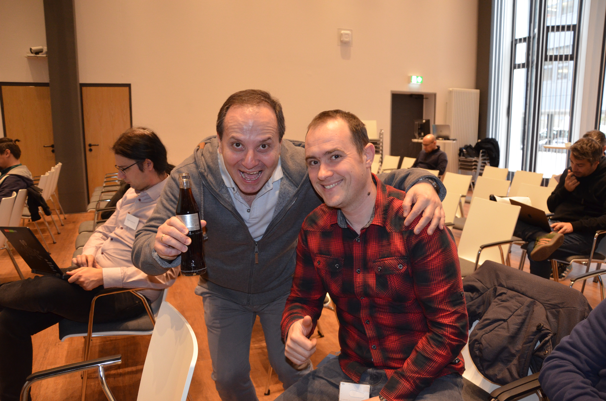
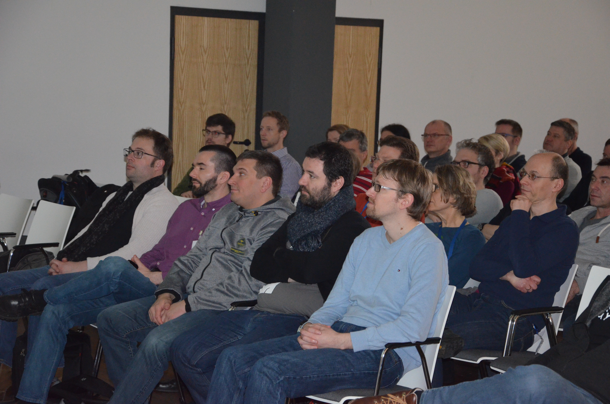

# The general feeling about TEC

We've gotten really good feedback from just about everybody for TEC Day this year, and - considering that everybody, from just about all the offices was there - that's awesome!

Here are the highlights.

# Great support

Not only were we supported by two superstars of the computing world - Uwe F. and Eberhard W. - I also got the impression that there was more of a "looking ahead to the future vibe” to the event this year, and, that the changes we made to the event improved on last year’s TEC Day quite a lot.

# Taking leave and saying welcome mat at the same time

It was also a day of firsts because we said farewell to our outgoing CTO and welcomed our incoming AT EXACTLY THE SAME TIME. I don't imagine that happens in most companies.

It was saddening to see Holger R. go after three great years of moving Haufe Group software engineering (and the Haufe Group) to the forefront of technology. He left us in a great position, and it was a must to send him off in the right way. At the same time ;), it's certain that we're going to keep moving ahead under the leadership of our new CTO Raul F.

# The talks
There were lots of talks - Uwe F. took on predicting where the future computing is going and what that means for developers today. Eberhard W. showed us how we need to look at Microservices and software architecture in general.

And in between, we held our own talks on
- Our evolving dev culture
- New ways to develop software
- How we dealt with technical debt
- Operating microservices environments
- Research on Natural Language Processing
- Process and Tools in creating design prototypes

# It spilled over to the Freiburg dev community!

The day was capped off by the Devs meetup where Uwe and Eberhard also joined the meetup, by both holding talks and talking directly with Freiburg devs.

I know I'm really excited to see how the Freiburg DevOps community is coming together and how it's grown over the last year and a half. Special thanks to DevsMeetup and to Reservix for providing the venue - Humboldtsaal - and catering!

# To summarize

If you didn't make it, be sure to check out the talks from both the day and the meet up at http://bit.ly/2rvXHuj.

Great talks, incredible conversations, superlative networking, the t-shirts were the coolest, and lots of food for thought about technology, mindset and culture in the computing profession. Perhaps most importantly, I would say everyone who attended is better prepared to –

Looking forward to seeing you at TEC Day 2019.
