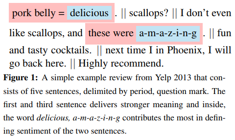
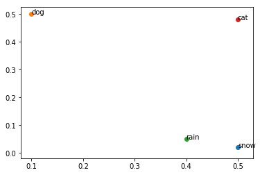
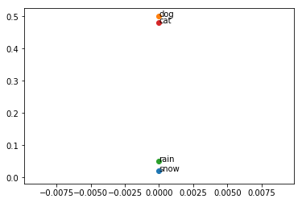

Attention has gotten plenty of attention lately, after yielding state of the art results in multiple fields of research. From [image captioning](https://arxiv.org/pdf/1502.03044.pdf) and [language translation](https://arxiv.org/pdf/1409.0473.pdf) to [interactive question answering](https://arxiv.org/pdf/1612.07411.pdf), Attention has quickly become a key tool to which researchers must attend. Some have taken notice and even postulate that [attention is all you need](https://arxiv.org/pdf/1706.03762.pdf). But what is Attention anyway? Should you pay attention to Attention? Attention enables the model to focus in on important pieces of the feature space. In this post, we explain how the Attention mechanism works mathematically and then implement the equations using Keras. We conclude with discussing how to "see" the Attention mechanism at work by identifying important words for a classification task.


Attention manifests differently in different contexts. In some NLP problems, Attention allows the model to put more emphasis on different words during prediction, e.g. from [Yang et. Al](https://www.cs.cmu.edu/~diyiy/docs/naacl16.pdf):



Interestingly, there is [increasing](https://arxiv.org/pdf/1506.07285.pdf) [research](https://arxiv.org/pdf/1503.08895.pdf) that calls this mechanism "Memory", which some claim is a better title for such a versatile layer. Indeed, the Attention layer can allow a model to "look back" at previous examples that are relevant at prediction time, and the mechanism has been used in that way for so called Memory Networks. A discussion of Memory Networks is outside the scope of this post, so for our purposes, we will discuss Attention named as such, and explore the properties apparent to this nomenclature. 


## The Attention Mechanism

The Attention Mechanism mathematically is deceptively simple for its far reaching applications. I am going to go over the style of Attention that is common in NLP applications. A good overview of different approaches can be found [here](http://ruder.io/deep-learning-nlp-best-practices/index.html#attention). In this case, Attention can be broken down into a few key steps:

1. MLP: A one layer MLP acting on the hidden state of the word
2. Word-level Context: A vector is dotted with the output of the MLP 
3. Softmax: The resulting vector is passed through a softmax layer
4. Combination: The attention vector from the softmax is combined with the input state that was passed into the MLP

Now we will describe this in equations. The general flavor of the notation is following the [paper](https://www.cs.cmu.edu/~diyiy/docs/naacl16.pdf) on Hierarchical Attention by Yang et. Al, but includes insight from the notation used in [this paper](https://arxiv.org/pdf/1612.07411.pdf) by Li et. Al as well. 

Let $$h_{t}$$ be the word representation (either an embedding or a (concatenation) hidden state(s) of an RNN) of dimension $$K_w$$ for the word at position $$t$$ in some sentence padded to a length of $$M$$. Then we can describe the steps via

\begin{equation} u_t = \tanh(W h_t + b)\end{equation}
\begin{equation} \alpha_t = \text{softmax}(v^T u_t)\end{equation}
\begin{equation} s = \sum_{t=1}^{M} \alpha_t h_t\end{equation}

If we define $$W\in \mathbb{R}^{K_w \times K_w}$$ and $$v,b\in\mathbb{R}^{K_w}$$, then $$u_t \in \mathbb{R}^{K_w}$$, $$\alpha_t \in \mathbb{R}$$ and $$s\in\mathbb{R}^{K_w}$$. (Note: this is the multiplicative application of attention.) Then, the final option is to determine Even though there is a lot of notation, it is still three equations. How can models improve so much when using attention? 


### How Attention Actually Works (Geometrically)

To answer that question, we're going to explain what each step actually does geometrically, and this will illuminate names like "word-level context vector". I recommend reading my [post](http://srome.github.io/Visualizing-the-Learning-of-a-Neural-Network-Geometrically/) on how neural networks bend and twist the input space, so this next bit will make a lot more sense. 

#### The Single Layer MLP

First, remember that $$h_t$$ is an embedding or representation of a word in a vector space. That's a fancy way of saying that we pick some N-dimensional space, and we pick a point for every word (hopefully in a clever way). For $$N=2$$, we would be drawing a bunch of dots on a piece of paper to represent our words. Every layer of the neural net moves these dots around (and transforms the paper itself!), and this is the key to understanding how attention works. The first piece

\begin{equation}u_t = tanh(Wh_t+b)\end{equation}

takes the word, rotates/scales it and then translates it. So, this layer rearranges the word representation in its current vector space. The tanh activation then twists and bends (but does not break!) the vector space into a manifold. Because $$W:\mathbb{R}^{K_w}\to\mathbb{R}^{K_w}$$ (i.e., it does not change the dimension of $$h_t$$), then there is no information lost in this step. If $$W$$ projected $$h_t$$ to a lower dimensional space, then we would lose information from our word embedding. Embedding $$h_t$$ into a higher dimensional space would not give us any new information about $$h_t$$, but it would add computational complexity, so no one does that. 

#### The Word-Level Context Vector

The word-level context vector is then applied via a dot product:
\begin{equation}v^T u_t\end{equation}
As both $$v,u_t\in \mathbb{R}^{K_w}$$, it is $$v$$'s job to learn information of this new vector space induced by the previous layer. You can think of $$v$$ as combining the components of $$u_t$$ according to their relevance to the problem at hand. Geometrically, you can imagine that $$v$$ "emphasizes" the important dimensions of the vector space.

Let's see an example. Say we are working on a classification task: is this word an animal or not. Imagine you have a word embedding defined by the following image:


```python
%matplotlib inline
import matplotlib.pyplot as plt


vectors = {'dog' : [.1,.5], 'cat': [.5,.48], 'snow' : [.5,.02], 'rain' : [.4, .05] }

for word, item in vectors.iteritems():
    plt.annotate(word, xy=item)
    plt.scatter(item[0],item[1])
```





In this toy example, we can assume that the x-axis component of this word embedding is NOT useful for the task of classifying animals, if this was all of our data. So, a choice of $$v$$ might be the vector $$[0,1]$$, which would pluck out the $$y$$ dimension, as it is clearly important, and remove the $$x$$. The resulting clustering would look like this:


```python
# Here we apply v, which zeros out the first dimension
for word, item in vectors.iteritems():
    plt.annotate(word, xy=(0,item[1]))
    plt.scatter(0,item[1])
```





We can clearly see that $$v$$ has identified important information in the vector space representing the words. This is what the word-level context vector's role is. It picks out the important parts of the vector space for our model to focus in on. This means that the previous layer will move the input vector space around so that $$v$$ can easily pick out the important words! In fact, the softmax values of "dog" and "cat" will be larger in this case than "rain" and "snow". That's exactly what we want.

The next layer does not have a particularly geometric flavor to it. The application of the softmax is a monotonic transformation (i.e. the importances picked out by $$v^Tu_t$$ stay the same). This allows the final representation of the input sentence to be a linear combination of $$h_t$$, weighting the word representations by their importance. There is however another way to view the Attention output...

### Probabilistic Interpretation of the Output

The output is easy to understand probabilistically. Because $$\alpha=[\alpha_t]_{t=1}^M$$ sums to $$1$$, this yields a probabilistic interpretation of Attention. Each weight $$\alpha_t$$ indicates the probability that the word is important to the problem at hand. There are some versions of attention ("hard attention") which actually will sample a word according to this probability only return that word from the attention layer. In our case, the resulting vector is the expectation of the important words. In particular, if our random variable $$X$$ is defined to take on the value $$h_t$$ with probability $$\alpha_t$$, then the output of our Attention mechanism is actually $$\mathbb{E}[X]$$.

# The Data

To demonstrate this, we're going to use data from a recent [Kaggle competition](https://www.kaggle.com/c/jigsaw-toxic-comment-classification-challenge/) on using NLP to detect toxic comments. The competition aims to label a text with 6 different (somewhat correlated) labels: "toxic", "severe_toxic", "obscene", "threat", "insult", and "identity_hate". We will expect the Attention layer to give more importance to negative words that could indicate one of those labels have occured. Let's do a quick data load with some boilerplate code...


```python
import numpy as np
import pandas as pd
from keras.preprocessing.text import Tokenizer
from keras.preprocessing.sequence import pad_sequences
```


```python
train=pd.read_csv('train.csv')
train=train.sample(frac=1)
list_classes = ["toxic", "severe_toxic", "obscene", "threat", "insult", "identity_hate"]
y = train[list_classes].values
```


```python
# Example of a data point
train.iloc[159552]
```


    id                                                07ea42c192ead7d9
    comment_text     "\n\nafd\nHey, MONGO, why dont you put a proce...
    toxic                                                            0
    severe_toxic                                                     0
    obscene                                                          0
    threat                                                           0
    insult                                                           0
    identity_hate                                                    0
    Name: 2928, dtype: object


More NLP boilerplate to tokenize and pad the sequences:


```python
max_features = 20000
maxlen = 200

list_sentences = train['comment_text'].values

# Tokenize
tokenizer = Tokenizer(num_words=max_features)
tokenizer.fit_on_texts(list(list_sentences))
list_tokenized_train = tokenizer.texts_to_sequences(list_sentences)

# Pad
X_t = pad_sequences(list_tokenized_train, maxlen=maxlen)
```

## Keras Architecture

There are many [versions](https://gist.github.com/cbaziotis/7ef97ccf71cbc14366835198c09809d2) of attention out there that actually implements a custom Keras layer and does the calculations with low-level calls to the Keras backend. In my implementation, I'd like to avoid this and instead use Keras layers to build up the Attention layer in an attempt to demystify what is going on.

#### Attention Implementation

For our implementation, we're going to follow the formulas used above. The approach was inspired by [this repository](https://github.com/philipperemy/keras-attention-mechanism/blob/master/attention_lstm.py).


```python
from keras.layers import Activation, Concatenate, Permute, SpatialDropout1D, RepeatVector, LSTM, Bidirectional, Multiply, Lambda, Dense, Dropout, Input,Flatten,Embedding
from keras.models import Model
import keras.backend as K

class Attention:
    def __call__(self, inp, combine=True, return_attention=True):
        # Expects inp to be of size (?, number of words, embedding dimension)
        
        repeat_size = int(inp.shape[-1])
        
        # Map through 1 Layer MLP
        x_a = Dense(repeat_size, kernel_initializer = 'glorot_uniform', activation="tanh", name="tanh_mlp")(inp) 
        
        # Dot with word-level vector
        x_a = Dense(1, kernel_initializer = 'glorot_uniform', activation='linear', name="word-level_context")(x_a)
        x_a = Flatten()(x_a) # x_a is of shape (?,200,1), we flatten it to be (?,200)
        att_out = Activation('softmax')(x_a) 
        
        # Clever trick to do elementwise multiplication of alpha_t with the correct h_t:
        # RepeatVector will blow it out to be (?,120, 200)
        # Then, Permute will swap it to (?,200,120) where each row (?,k,120) is a copy of a_t[k]
        # Then, Multiply performs elementwise multiplication to apply the same a_t to each
        # dimension of the respective word vector
        x_a2 = RepeatVector(repeat_size)(att_out)
        x_a2 = Permute([2,1])(x_a2)
        out = Multiply()([inp,x_a2])
        
        if combine:
        # Now we sum over the resulting word representations
            out = Lambda(lambda x : K.sum(x, axis=1), name='expectation_over_words')(out)
        
        if return_attention:
            out = (out, att_out)
                   
        return out
```

### Model Architecture

We are going to train a Bi-Directional LSTM to demonstrate the Attention class. The Bidirectional class in Keras returns a tensor with the same number of time steps as the input tensor, but with the forward and backward pass of the LSTM concatenated. Just to remind the reader, the standard dimensions for this use case in Keras is: (batch size, time steps, word embedding dimension). 


```python
lstm_shape = 60
embed_size = 128

# Define the model
inp = Input(shape=(maxlen,))
emb = Embedding(input_dim=max_features, input_length = maxlen, output_dim=embed_size)(inp)
x = SpatialDropout1D(0.35)(emb)
x = Bidirectional(LSTM(lstm_shape, return_sequences=True, dropout=0.15, recurrent_dropout=0.15))(x)
x, attention = Attention()(x)
x = Dense(6, activation="sigmoid")(x)

model = Model(inputs=inp, outputs=x)
model.compile(loss='binary_crossentropy',
              optimizer='adam',
              metrics=['accuracy'])

attention_model = Model(inputs=inp, outputs=attention) # Model to print out the attention data
```

If we look at the summary, we can trace the dimensions through the model.


```python
model.summary()
```

    __________________________________________________________________________________________________
    Layer (type)                    Output Shape         Param #     Connected to                     
    ==================================================================================================
    input_31 (InputLayer)           (None, 200)          0                                            
    __________________________________________________________________________________________________
    embedding_31 (Embedding)        (None, 200, 128)     2560000     input_31[0][0]                   
    __________________________________________________________________________________________________
    spatial_dropout1d_31 (SpatialDr (None, 200, 128)     0           embedding_31[0][0]               
    __________________________________________________________________________________________________
    bidirectional_37 (Bidirectional (None, 200, 120)     90720       spatial_dropout1d_31[0][0]       
    __________________________________________________________________________________________________
    tanh_mlp (Dense)                (None, 200, 120)     14520       bidirectional_37[0][0]           
    __________________________________________________________________________________________________
    word-level_context (Dense)      (None, 200, 1)       121         tanh_mlp[0][0]                   
    __________________________________________________________________________________________________
    flatten_30 (Flatten)            (None, 200)          0           word-level_context[0][0]         
    __________________________________________________________________________________________________
    activation_11 (Activation)      (None, 200)          0           flatten_30[0][0]                 
    __________________________________________________________________________________________________
    repeat_vector_29 (RepeatVector) (None, 120, 200)     0           activation_11[0][0]              
    __________________________________________________________________________________________________
    permute_31 (Permute)            (None, 200, 120)     0           repeat_vector_29[0][0]           
    __________________________________________________________________________________________________
    multiply_28 (Multiply)          (None, 200, 120)     0           bidirectional_37[0][0]           
                                                                     permute_31[0][0]                 
    __________________________________________________________________________________________________
    expectation_over_words (Lambda) (None, 120)          0           multiply_28[0][0]                
    __________________________________________________________________________________________________
    dense_55 (Dense)                (None, 6)            726         expectation_over_words[0][0]     
    ==================================================================================================
    Total params: 2,666,087
    Trainable params: 2,666,087
    Non-trainable params: 0
    __________________________________________________________________________________________________


### Training


```python
model.fit(X_t, y, validation_split=.2, epochs=3, verbose=1, batch_size=512)
```

    Train on 127656 samples, validate on 31915 samples
    Epoch 1/3
    127656/127656 [==============================] - 192s 2ms/step - loss: 0.1686 - acc: 0.9613 - val_loss: 0.1388 - val_acc: 0.9639
    Epoch 2/3
    127656/127656 [==============================] - 183s 1ms/step - loss: 0.0939 - acc: 0.9708 - val_loss: 0.0526 - val_acc: 0.9814
    Epoch 3/3
    127656/127656 [==============================] - 183s 1ms/step - loss: 0.0492 - acc: 0.9820 - val_loss: 0.0480 - val_acc: 0.9828


    <keras.callbacks.History at 0x7f5c60dbc690>


## Identifying The Words the Model Attends

Because we stored the output of the softmax layer, we can identify what words the model identified as important for classifying each sentence. We'll define a helper function that will print the words in the sentence and pair them with their corresponding Attention output (i.e., the word's importance to the prediction).


```python
def get_word_importances(text):
    lt = tokenizer.texts_to_sequences([text])
    x = pad_sequences(lt, maxlen=maxlen)
    p = model.predict(x)
    att = attention_model.predict(x)
    return p, [(reverse_token_map.get(word), importance) for word, importance in zip(x[0], att[0]) if word in reverse_token_map]
```

The data set from Kaggle is about classifying toxic comments. Instead of using examples from the data (which is filled with vulgarities...), I'll use a relatively benign example to show Attention in action:


```python
# This example is not offensive, according to the model.
get_word_importances('ice cream')
```


    (array([[0.03289272, 0.00060764, 0.00365122, 0.00135027, 0.00818442,
             0.00286318]], dtype=float32),
     [('ice', 0.24796312), ('cream', 0.18920079)])


```python
# This example is labeled ALMOST labeled toxic, but isn't, due to the word "worthless".
get_word_importances('ice cream is worthless')
```


    (array([[0.4471274 , 0.00662996, 0.07287972, 0.00910207, 0.09902474,
             0.02583557]], dtype=float32),
     [('ice', 0.028298836),
      ('cream', 0.024065288),
      ('is', 0.041414138),
      ('worthless', 0.8417008)])


```python
# This example is labeled toxic and it's because of the word "sucks".
get_word_importances('ice cream sucks')
```


    (array([[0.9310674 , 0.04415609, 0.64935035, 0.02346741, 0.4773681 ,
             0.07371927]], dtype=float32),
     [('ice', 0.0032987772), ('cream', 0.003724447), ('sucks', 0.9874626)])


# Discussion

Attention mechanisms are an exciting technique and an active area of research with new approaches being published all the time. Attention has been shown to help achieve state of the art performance on many tasks, but it is also has the obvious advantage of explaining important components of neural networks to a practitioner. In an academic setting, Attention proves very useful for model debugging by allowing one to inspect the predictions and their reasoning. Moreover, having the option available to indicate why a model made a prediction could be very important to fields like healthcare where predictions may be vetted by an expert.
