# Hackathon - A festival for geeks
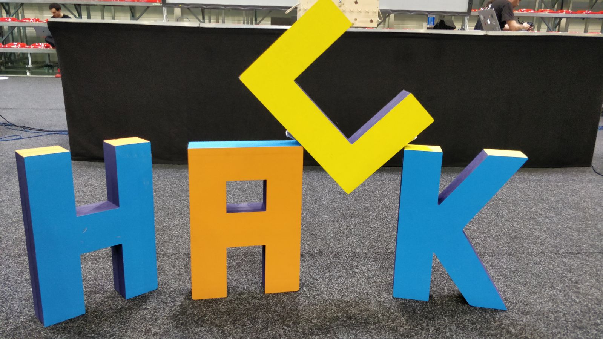

Recently a team from Haufe group participated in the HackTM18 Hackathon in Timisoara Romania and within this article I want to share my experiences and passion about this great event with you.  

Someone at hackTM said to me: "This is a festival for geeks". And it is.  
You have to imagine a Hackathon as a huge LAN-Party, but instead of gaming you write code.  
Well some guys actually played games all the time, but let's keep this aside.  

### About the author
My name is Felix Jablonski.  
I am a computer science student at the University of Freiburg.  
Since 2018 I am working at Haufe Group in the software engineering department.  
Traveling to our office in Romania to participate in the HackTM has been a great experience for me.  

### What is a Hackathon?
In a Hackathon a lot of nerds and geeks, but also technology interested or economically motivated entrepreneurs meet to hack around with new technologies and ideas.  

"Hacking" around means on the one hand to learn new technologies and possibilities you missed before and on the other hand to use well known technologies in a different way.  

You can try new things you always wanted to try out.  
Not to mention, that this ends up in a buzzword collection most of the time (Machine learning, Blockchain, IoT...) ;)  

The main part of a Hackathon is to work on a project, that you came up with, from scratch:  

You want to build an app, that notifies users about being close to each other?  
Why not? Sound fun..Let's do it.  

You want to build an app, that detects the grumpiest face in a group picture?  
Sure! Let's do it.  

### RRP - Really rapid prototyping
A good slogan for a Hackathon could be "learning by doing" or "just do it".  
The point is, that you don't have to know how it works exactly...you will figure it out.  
So what you are actually doing is RRP - Really rapid prototyping.  

You have like 48 hours from the pitch of your idea to the final product, which may involve team building.  
Working together is crucial for success, but a good project structure is too.  

If you don't practice modularity you simply will not have enough time to finish your project.  
One way to go is to split your work into the components of your architecture.  

For example one does machine learning, one the app and one the middle-ware.  

However interface architecture between the components is typically nothing more, than a sheet of paper or yelling over the table:  
"I will give you this and require that...Nod if you agree".  

It is important to use high-level APIs for your Prototype.  
Don't focus on the implementation details of a voice recognition service you use. Just use it.  
Setting up some CI/CD pipeline is worth a look too, because you want to deploy fast.  

### The passion for tech and software
What I like the most about Hackathons is to talk to other friendly and skilled people about their passion and their projects.  
Sharing the same passion and drive is a great feeling together with meeting new people and learn new skills from them.  

For example I've talked to two guys, who wrote a 3D third person game from scratch in C# and Unity about how they did it and what you have to consider while doing so, as I was always interested in learning about this.  
  
Another example about the passion for software and/or technical projects in a Hackathon is the dedication to the Hackathon project itself.  
Most of the participants haven't slept, coded for 17h straight on Saturday and fell asleep under the table.  
Let's say you saw people being delighted by a nice interface description or code, that simply works.  

### Pitching your project
Most Hackathons have some kind of competition.  
Pitching your project and presenting the result is crucial for success.  

Because this is a hack don't worry about faking data or mocking stuff to some point.  
That is ok if you need it to show a smooth pitch (not if your product is not ready or even developed).  

For example data for a heat map of cars, that would cost you too much time to generate can be faked.  
But please don't show a mock-off of your project, because nothing works at all.  

### Can my work profit from participating?
What makes a Hackathon interesting from a developer point of view is, that you can (and sometimes have to) ignore best practices.  
You are trying to find hacks and not the best solution.  

So focus on going fast, but remember that it still should run stable!  

This disruptive potential is great for opening your mind to new things.  
You can even understand why those best practices are good for you, in case you run into problems!  

**To sum up the technical part**:  
If you are a geek, you will have lots of fun. If you are only interested in new stuff you will too.  

### For the economic and recruiting motivated people...
... a Hackathon has a lot to offer too.  
First of all you have a ton of skilled and passionated developers and engineers you can get in contact with.  

Second you can use the combined work-power to do something you always wanted to do, but couldn't because you can't code.  

If you want to acquire new potential employees a good start is to send your devs to talk to them. Geeks might catch other geeks well when communicating in a Hackathon environment ;)  

### Food
How do so many people survive three days in front of their PCs?  
Free food and drinks is always a highlight of a Hackathon.  

HackTM even had its own currency.  
They had a smoothie place, some baristas and food trucks, ice creme, and so on.  

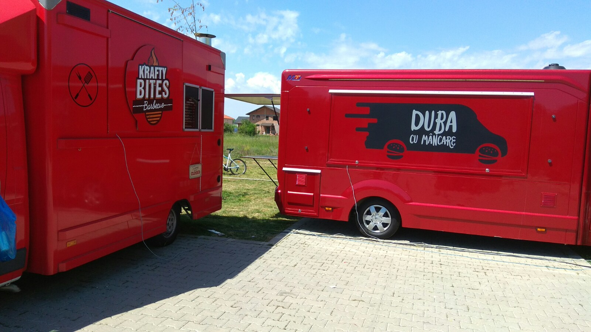
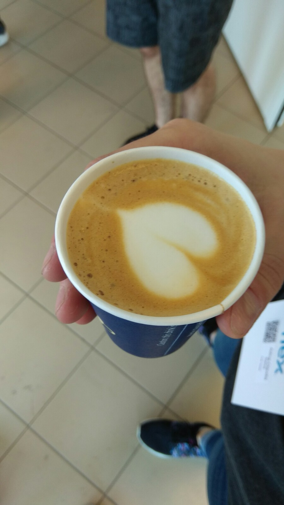      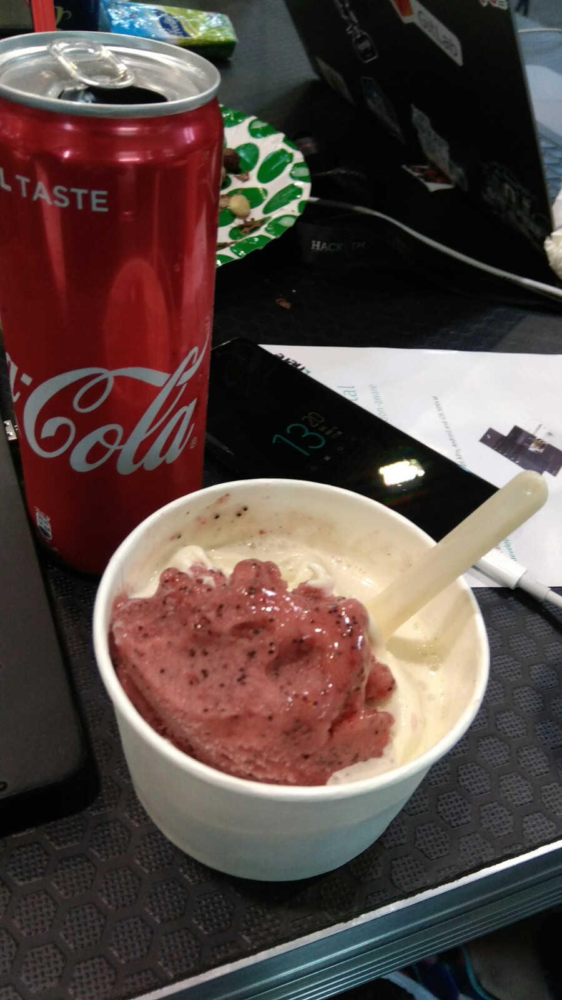

# Our project
Now you know what a Hackathon is in general.  
Here is my report of our project at hackTM 2018 in Timisoara Romania  

## Preparations
What do you need to do before starting a project at a Hackathon?  
- Find a team there or bring your own  
- Find an idea  
- Find a team name (We took Fantastic-five)  
- Discuss what environment makes sense (CI/CD) but be really short on that one  

## We met on Thursday in order to get a project idea
After some discussion we found it has to be something with machine learning and image recognition.  

As there is a plant called "Ragweed" or "Ambrosia" that is a plague in the country, because it is highly allergic and causes Asthma,  
we decided to make a reporting tool for it so the authorities can remove it.  

Later on we had the idea to extend the features from only ragweed to also detecting trash and potholes in the streets.  

## Our idea
*"Shamy Amy" helping out the city one issue at a time.*  
We created a native mobile application, that is capable of reporting issues such as Ragweed, trash or potholes just by taking pictures of it.  

Basically you click on "Report", it takes a picture of the thing and tells you if it has detected something.  
We had a react native app for iPhone and Android up and running.  

The app was capable of showing a heat-map together with the latest reported issues too.  
The heat-map and issue overview was also available as a web front-end.  
### Technical aspects
We set up a node.js middle-ware in order to connect the components and I wrote a python back-end for the machine learning / image detection part.  
The back-end was essentially a wrapper around multiple trained docker container where each of them runs a neuronal network trained on one kind of issue.  

Also the back-end uses a third party (let's call it) API (I just "reverse engineered" their site ^^), which can detect plants by images.  
Fortunately all ML back-ends provided an API call with an URL to a picture. So the middle-ware just had to tell the back-end the blob storage link on azure.  

In the end we had a sendgrid set up to send emails "to the authorities"  

The project is open source and available here: https://gitlab.com/fantastic-five  

## Technologies we used
- React.js
- React native
- Azure VMs as Docker host
- Azure Blob storages
- Node.js
- Heroku for deployment
- Docker
- gitlab as source repo
- Machinebox for image detection

## Special thank to machinebox.io!
Machinebox.io provides high level ML back-ends inside Docker containers.  
I've asked them for an unlimited license for the Hackathon on Friday and they gave us a partner license on Saturday, because they really liked our idea.  
So a **HUGE** thanks to them.  

## Do you guys mind good software development practices?
Yes we did. Our project is open source and spitted up in modules.  
Every part is self containing and callable via a lean API interface.  

## Day 1 (Friday):
On Friday we set up our PCs and acquired some food while listening to the organizational things presented on stage.  

Other teams focused on team building and team finding.  
This is when you pitch your general idea the first time to the other participants and try to convince them to join your team.  

The network connection has been prepared for the next two days too.  

After the presentation we had time to check out some goodies like stickers or cookies from the sponsors.  
At this point we pitched our idea to the sponsors, participants and the media.  

### Architecture and team setup
Before coding we spitted up our team into components and defined the interface and tools we want to use.  
1. Front-end with heat-map in React  
2. Native app for iPhone and Android in React native  
3. Node.js middle-ware  
4. Back-end with machine learning  

We agreed on the use of easy components (preferable high level tools over own implementation even if result is not so good)  

The day ended at 2 o'clock in the morning.  
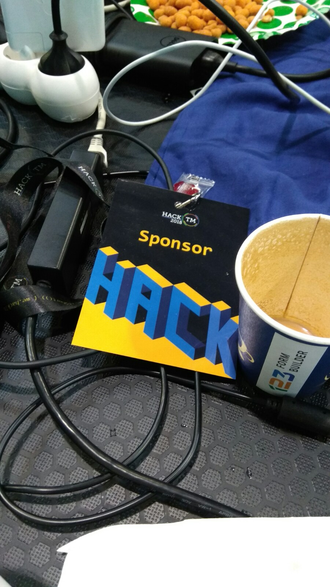
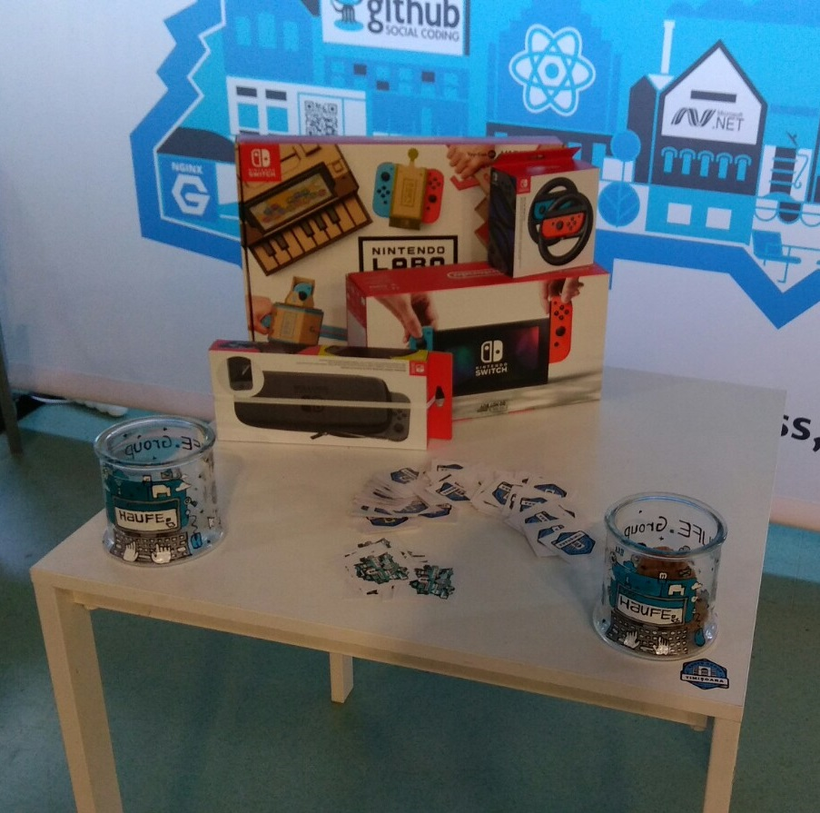  

## Day 2 (Saturday):
**"Let's code!"**  
Saturday was our main coding day.  
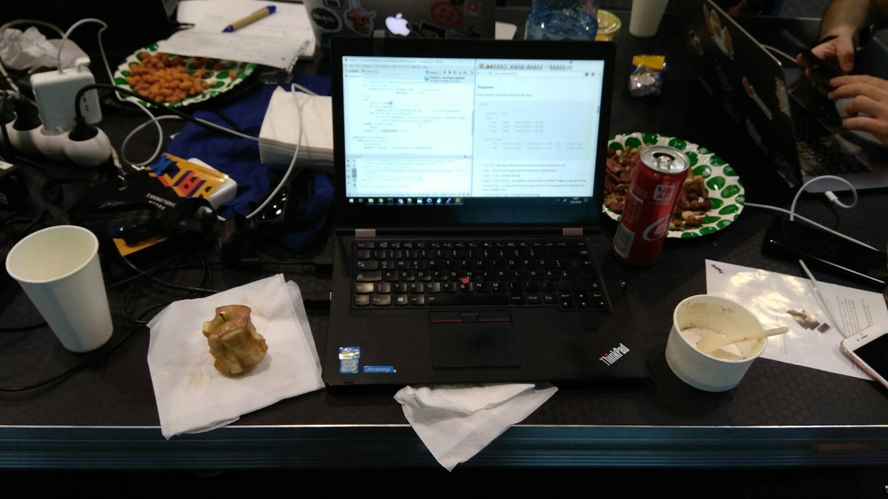  
We arrived at 9/10 o'Clock in the morning and stayed until 3 o'Clock in the next morning.  
Summed up to 17h of Coding.  

As it is important to stay hydrated we drank some coffee, smoothies and ate lots of burgers and pizza.  
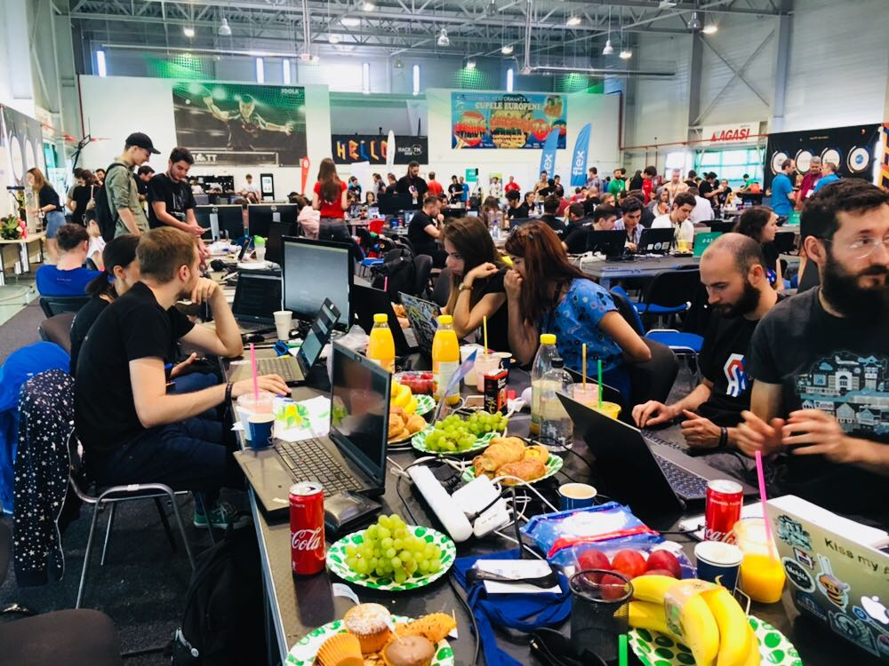  

On Saturday all the optional Workshops and presentations took place.  
For example "How to pitch your product" or "Where to get funds for a startup".  

My part was to train and build the machine learning back-end for our service.  

So what I did was to create training data and filter it out,  
setup a Docker host for the back-end system and wrote a Python Wrapper for all image detection instances in order to connect them to the middle-ware.  

After everything was set up I ran the training steps with my pictures.  

Around 10 o'Clock in the night we put all the components finally together and tried our service.  

## Day 3 (Sunday):
Sunday was the **"Pitch day"**  
We arrived at 9 o'Clock and finished off our project in 2 hours.  
For example I tweaked the machine learning parameter.  

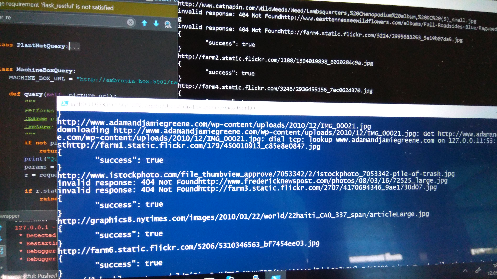  
  

There were 40 judges around, who had an app to rate the projects with an algorithm, that "uses science".  

From 12 o'Clock on the day has been "pitch, pitch, pitch"  
We set up some images of ambrosia and a pile of trash at our place.  
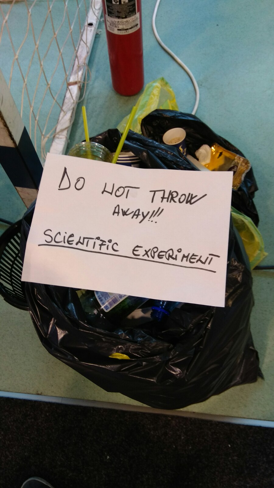  
We also tried pictures of grass or wheat to proof, that our algorithm can detect what is not ambrosia.  

We needed to sell our project like it is the best in the world (which it is), answer questions and show opportunities for the future.  

Some judges focused on the economical or society aspects, others on technical implementation and some on the future features, that can be implemented into the app.  

The pitching process also involves radio and TV interviews and creating a presentation for the final pitch in front off all participants (if you reach the top 10).  
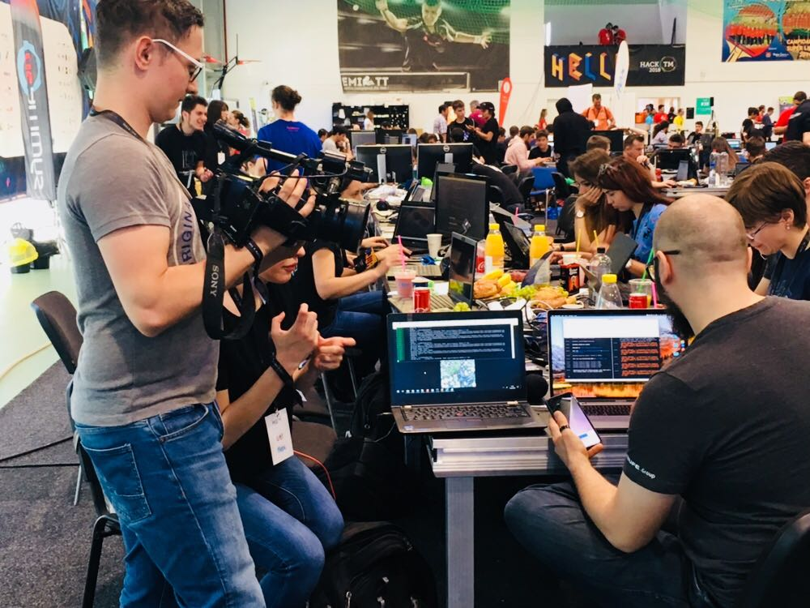  

This is also the chance to visit other projects and teams during their pitch.  

We managed to get into the top 10, which means we can present our project on stage and participate in the public voting for the grand prize.  

#### Our outcome: 
4th place out of 60 and we won the "Best community and administration app".  

A look at voting page source code shows, that we were 4 public votes away from the 1st place and had 97/100 points from the jury.  
Also we were second in the "Best webapp" track.  

Not to forget the fun we had  

# Summary
The HackTM18 and Hackathons in general are lots of fun.  
You don't need to be a geek to participate, but you have to be aware, that most of the participants are ;)  

If you like to share yours and enough their passion about software, projects, technology and teamwork (and food) you should definitely consider participating!  

Although you might end up with less than 8h of sleep on the whole weekend.  

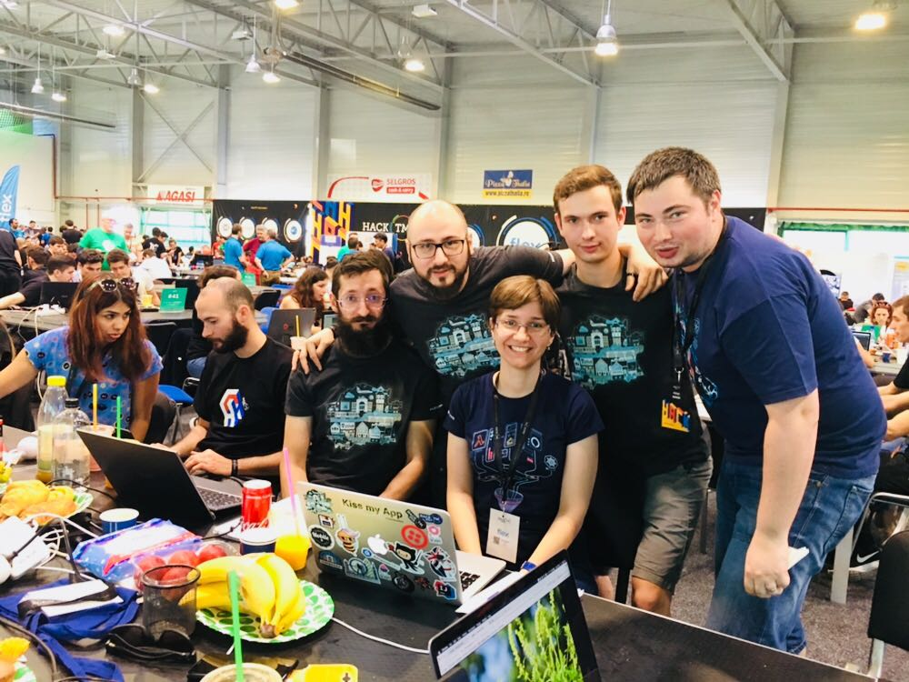
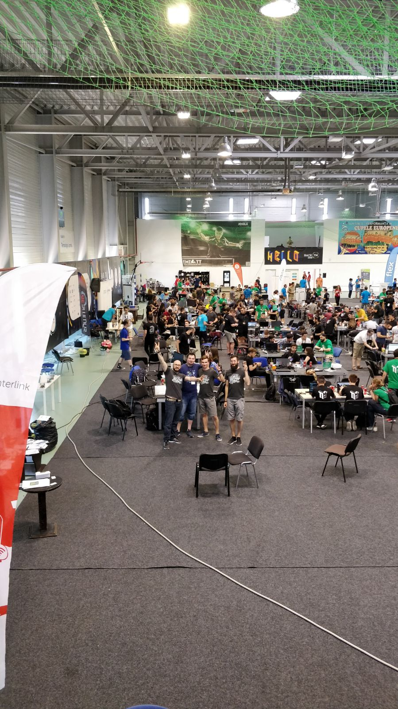