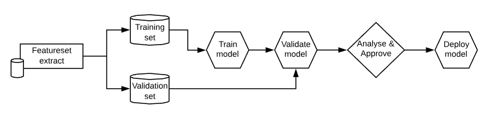
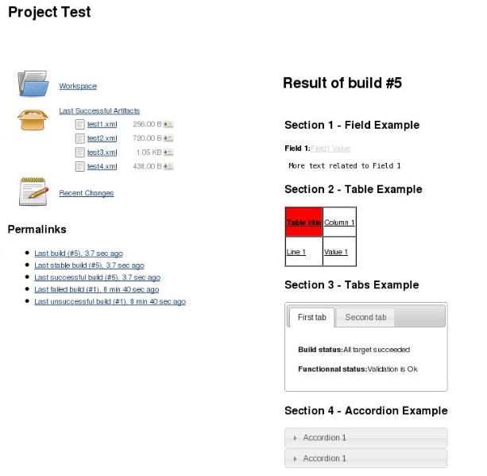
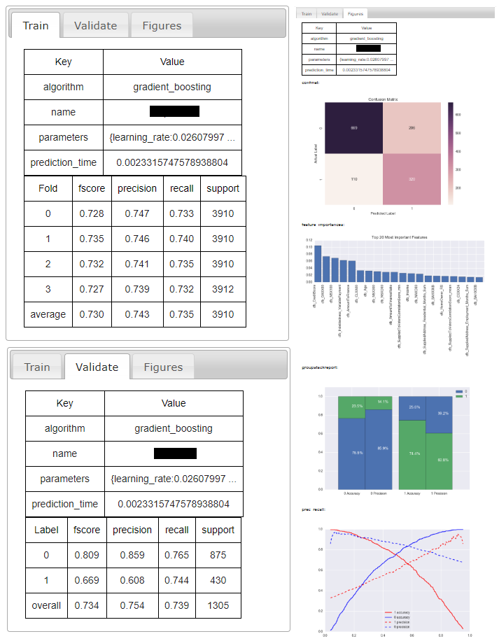
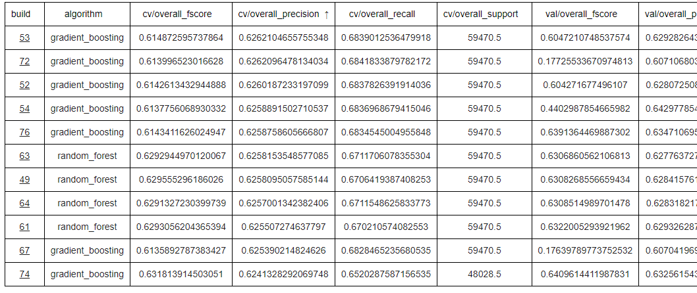

## Small Data, Big Value
In today's world of Big Data, clustered computing, Hadoop, Spark, Tensorflow, Cloud machine learning platforms and NoSQL databases, I often feel that the little guy of data science is forgotten. The little guy that I'm referring to is the small data problem, with only a small number of features, a small number of training instances and a small amount of data centers required to do the processing. Just because this kind of problem is not Big Data, does not mean it is not Big Value. Indeed, most of our data science challenges never really extend to solving large scale data problems, but are more concerned with handling moderate amounts of data in order to model complex business and process problems.

<!--more-->

We started out doing our data science on laptops and sharing work and results via e-mail, but its quite hard to keep track of results and methodically investigate the use of different tools and techniques in this way. Furthermore, once you start training models on a regular basis, you soon have so many files in your `~/data-science` directory that you don't know what to do with them. This, to me, is today's problem of small data - how do we do data science on a small scale in a reliable, repeatable and well documented way, without resorting to massive platforms that are aimed at processing vast quantities of data. 

The answer? Was hard to find! There seems to be relatively little information out there on how similar companies face this challenge. As we started recruiting data scientists into our team, I once asked how their previous company had addressed this problem and the response was: *"they just used shell scripts"*. However, in this day and age, we felt that *"just using shell scripts"* was little better than the `~/data-science` directory.

As a result, we started searching for better ways of managing, automating and reporting on our data science activities. We soon decided to start using build/CI servers to do our data science, since these platforms are easily accessible to software engineers, good at doing stuff in a pipeline and geared towards saving the results of the stuff they've done. We tried a few different options, including Bamboo (which we used for building software anyway) and Go CD, but soon settled on Jenkins, an open-source member of the old-guard of CI servers. Its tried, its tested and its highly extensible through a community of thousands of plugins. Its also fundamentally just an automation engine, built around the central concept of a "job", which is just a unit of work that can run scripts, save results (or artifacts as their known in the CI world) and trigger other jobs.

So, that's where we started: Jenkins as a data science platform. However, using Jenkins as-is was just the start. Jenkins is fundamentally a very simple automation server that allows you to configure jobs through a simple web interface. The results of the jobs/builds can be saved as artifacts to be downloaded or used later or by other jobs. Jobs can trigger other jobs to create simple pipelines. Let's consider a straightforward data science pipeline that you might want to automate without the shell script or `~/data-science` methods:

Its fairly easy to create jobs for each of these steps and chain them together in a pipeline. The first few steps you might want to automatically trigger each other, and the last couple you might want manual input on. However, for each of these steps you're likely to want to drill in to the details and find out what happened, what the results were like, how some charts or metrics fell out, or any number of custom things. This is where, with a few nifty plugins, you can turn Jenkins from a general purpose build server into an all-singing, all-dancing, data science machine!

## Turning Jenkins into a Data Science machine
### Summary Display Plugin
The [Summary Display Plugin](https://wiki.jenkins.io/display/JENKINS/Summary+Display+Plugin) for Jenkins allows you to add rich, customisable and interactive output reports for each of your jobs:

This is perfect for displaying the results of your model building or validation run, including charts showing your model's performance and even for summarising multiple models. However, the only difficulty with this plugin is that you need to generate a declarative XML file that describes the contents of the report. Whilst this is relatively straightforward, it can be cumbersome for generating complicated reports.

### Jenkins Data Science Summary
To overcome this problem, we wrote a simple command line tool for generating compliant XML files for common use cases. This package is available on [PyPi](https://pypi.org/project/jdss/) and can be installed with `pip install jdss`. This transformed our mundane JSON results files and manual analysis of models into a lean, mean, data-science machine:

We even used the same technique to build "summary jobs" which displayed metrics for historic models, to let us do things like compare models in a grid and sort them by precision, accuracy, etc:

## The Perfect Data Science Platform?
So, could this be the perfect small data platform? No, probably not.

However, it is leaps and bounds better than `~/data-science`, or `./do-data-science.sh`. Its graphical, intuitive, easy to use, and great for showing stakeholders what we're doing. Indeed, when we have review meetings with senior members of this business, we no longer prepare presentations in advance, we just show them the latest model builds and talk them through the charts - it has helped open out a common dialogue about data science with the business.

Our use of Jenkins is still a work in progress, but we're now much faster at building models and reviewing the results. Most importantly, we now spend more time doing data science, and less time worrying about the logistics of building models.
