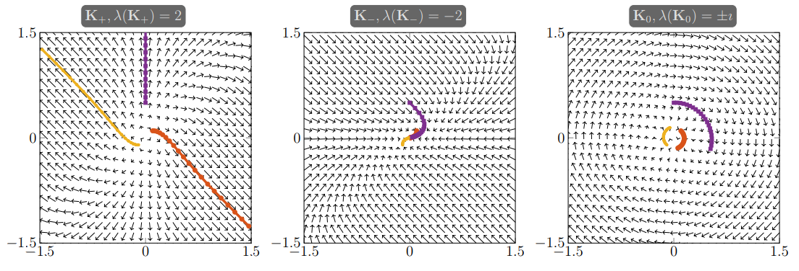
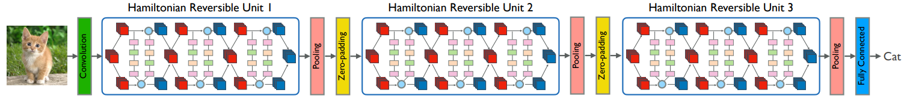
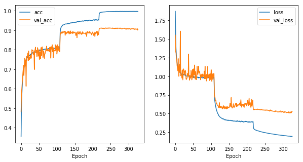

The current state of the art in image classification is thanks to residual layers. Introduced by [Microsoft Research](https://arxiv.org/pdf/1512.03385.pdf), the residual layer adds the output of the activation function to the input of the layer. This seemingly minor change has led to a rethinking of how neural network layers are designed. In this post, we will discuss the mathematics behind why residual networks work so well and explore other additions one can make to acheive near SOTA performance with a small memory footprint or even create arbitrarily deep neural networks.

## Residual Layers

The residual layer is actually quite simple: add the output of the activation function to the original input to the layer. As a formula, the $$k+1$$th layer has the formula:
\begin{equation} x_{k+1} = x_{k} + F(x_{k})\end{equation}
where $$F$$ is the function of the $$k$$th layer and its activation. For example, $$F$$ might represent a convolutional layer with a relu activation. This simple formula is a special case of the formula:
\begin{equation} x_{k+1} = x_{k} + h F(x_k),\end{equation}
which is the formula for the [Euler method](https://en.wikipedia.org/wiki/Euler_method) for solving ordinary differential equations (ODEs) when $$h=1$$. (Fun fact: the Euler method was the approach suggested by Katherine Johnson in the movie Hidden Figures). 

Let's take a quick detour on ODEs to appreciate what this connection means. Consider a simplified ODE from physics: we want to model the position $$x$$ of a marble. Assume we can calculate its velocity $$x^\prime$$ (the derivative of position) at any position $$x$$. We know that the marble starts at rest $$x(0)=0$$ and that its velocity at time $$t$$ depends on its position through the formula:
\begin{equation} x^\prime(t) = f(x) \end{equation}
\begin{equation}x(0) = 0.\end{equation}
The Euler method solves this problem by following the physical intuition: my position at a time very close to the present depends on my current velocity and position. For example, if you are travelling at a velocity of 5 meters per second, and you travel 1 second, your position changes by 5 meters. If we travel $$h$$ seconds, we will have travelled $$5h$$ meters. As a formula, we said:
\begin{equation}x(t+h) = x(t) + h x^\prime(t),\end{equation}
but since we know $$x^\prime(t) = f(x)$$, we can rewrite this as
\begin{equation} x(t+h) = x(t) + h f(x).\end{equation}
If you squint at this formula for the Euler method, you can see it looks just like the formula for residual layers! 

## Implications for Neural Network Design

This observation has meant three things for designing neural networks:
1. New neural network layers can be created through different numerical approaches to solving ODEs, e.g. [Lu et al. 2017](https://arxiv.org/pdf/1710.10121.pdf) paper.
2. The possibility of arbitrarily deep neural networks, e.g. [Chang et al. 2017](https://arxiv.org/pdf/1709.03698.pdf) paper.
3. Training of a deep network can be improved by considering the so-called stability of the underlying ODE and its numerical discretization, e.g. [Haber and Ruthotto 2017](https://arxiv.org/pdf/1705.03341.pdf) study.

These are all very exciting ideas, but the second two are particularly interesting-- and intimately connected. The reason one can create arbitrarily deep networks with a finite memory footprint is by designing neural networks based on stable ODEs and numerical discretizations. 

### The Importance of Stability

Rather than solely using the weights to define transformations (i.e. features), the dynamics of the underlying ODE are explicitly considered for determining features. Some implementations use multiple "ODE blocks" (my term, not standard) using different $$F$$'s, with each block responsible for 5-10+ layers of the final network. This means that the input will propagate according to the ODE for 5-10 time steps, and the trajectory helps to determine the learned features. The concept of stability comes into play here. Put simply, an ODE is stable if small perturbations of the initial position result in small perturbations of the final (asymptotic) position. However, there are stable ODEs that push all solutions to a single point, which is also not helpful for creating features.

For neural networks, the most important style of ODE to consider is the following:
\begin{equation} x^\prime(t) = \sigma( K x(t) + b):=F(x)\end{equation}
where $$\sigma$$ is the activation function of a layer, $$K$$ the matrix representing the weights of the layer and $$b$$ the bias term. (Note, convolutional transformations can be represented by a matrix as well).

The stability of a (linear) system of ODEs is determined by eigenvalues of the Jacobian of $$F$$. The important thing to know is that after some calculations one can show that eigenvalues of the Jacobian of $$F$$ are determined by the weight matrix $$K$$ in this case.

One way to understand the dynamics of an ODE are phase diagrams. Phase diagrams are plots of the direction of motion of a system at a given point indicated by an arrow. Then, some trajectories of the ODE are plotted to visualize what would happen given an initial condition. Here's a plot from [Haber and Ruthotto 2017](https://arxiv.org/pdf/1705.03341.pdf) analyzing trajectories of the above $$ODE$$ after 10 steps given different eigenvalues for a $$K\in\mathbb{R}^{2\times2}$$:



From stability theory, the authors knew positive (real) eigenvalues for $$K$$ would lead to a non-stable ODE which would not be ideal for learning features, and likewise, negative (real) eigenvalues would collapse all initial conditions to a single point. Zero-valued eigenvalues would lead to a dynamical system that doesn't move at all! They suggest to use matrices whose real part is zero but have an imaginary component leading to the plot on the right. This can be done by designing the matrix to have these imaginary eigenvalues.

This theory has led to researchers proposing network designs that are inherently stable, either by construction via the weights (ex. using antisymmetric matrices) or choice of ODE. This is a very new approach for neural networks and it is exciting to see mathematical theory taking center stage. For a more in depth analysis, see [Haber and Ruthotto 2017](https://arxiv.org/pdf/1705.03341.pdf).

### Arbitrary Depth

As we can see from the formula:
\begin{equation} x_{k+1} = x_k +hF(x_k) \end{equation}
the $$k+1$$th layer is defined by applying $$F$$ (the weights and activation) and then adding it to $$x_k$$. If you fix $$F$$ for multiple layers, you can effectively have unlimited layers with only the memory footprint required to store the weights of $$F$$.


Major libraries today today (i.e. [Tensorflow](http://download.tensorflow.org/paper/whitepaper2015.pdf)) rely on symbolic gradient calculations (and in some cases "automatic differentation") for their SGD updates. As these are calculated off of the computational graph, even such arbitrarily deep networks could create large graphs resulting in memory issues. One solution would be to train a model on larger hardware and then create the neural network evaluation function in a separate implementation which only loads one set of weights into memory per each layer. Then, an arbitrarily deep network could fit on much smaller hardware. It is possible that a new implementation could be built to train arbitrarily deep nets on hardware with small memory footprints by combining the chain rule / back propogration in a more componentwise fashion, but it would increase training time. 


## Keras Implementation 

At a high level, our approach will combine arbitrary depth with stable propogation. We will reuse each layer multiple times to maximize our depth while keeping our memory footprint small. Stability will be guaranteed by the underlying ODE we will use.

For stability we will follow the approach is first suggested in [Haber and Ruthotto 2017](https://arxiv.org/pdf/1705.03341.pdf). The idea is to use a Hamiltonian system that is designed to be stable. This equation will be used as the underlying ODE:

\begin{equation}
\frac{\partial}{\partial t}
\left( \begin{array}{c}{y\\\ z}\end{array}  \right)(t) =
\sigma\left ( \left ( 
\begin{matrix} 0 & K(t) \\\
 -K(t)^T & 0 \end{matrix}
 \right )
 \left( \begin{array}{c}{y\\\ z}\end{array}  \right)(t)
 +
 b(t) \right );
  \left( \begin{array}{c}{y\\ z}\end{array}  \right)(0)=
   \left( \begin{array}{c}{y_0\\\ 0}\end{array}  \right).
\end{equation}

There is a lot here, so let's do it step by step: first, $$K$$ and $$b$$ represent the weights and bias terms respectively for our convolutional layer and its bias term. (Note: a convolution can be represented as a matrix, which we use here.) They could depend number of times $$t$$ you pass your input $$y(0)=y_0$$ through the layer. The $$z$$ represents an auxilary variable introduced to improve the stability of the system, but practically $$z$$ will represent the additional filters we add through zero padding. In particular, we will take an image that has been transformed into a 4D tensor and double (say) the number of channels through zero padding. Then, our layer will define $$y$$ as the non-zero channels and $$z$$ as the zero channels. This is a practice known as "channel-wise partition" for $$y$$ and $$z$$ and the concept first appeared in [Dinh et al. 2016](https://arxiv.org/pdf/1605.08803.pdf). 

The reason for adding this $$z$$ is twofold. First, zero padding takes the place of using additional features in a convolutional layer. Instead of making a new Conv2D layer with double the filters, we'll simply double the channels of the tensor through zero padding. Second, by introducting $$z$$, we can make our dynamical system stable, because the Jacobian of this equation has negative real eigenvalues. This is proven in the [Haber and Ruthotto 2017](https://arxiv.org/pdf/1705.03341.pdf). The Jacobian depends on the eigenvalues of the matrix 
\begin{equation}
 \left ( 
\begin{matrix}{} 0 & K(t) \\\
 -K(t)^T & 0 \end{matrix}
 \right ),
\end{equation}
and by construction, this matrix is antisymmetric ($$A^T = -A$$) which implies any real eigenvalues of the matrix are $$0$$. This yields that the forward propogation of this dynamical system will be stable, which will imply stability in training. 

By leveraging the same concept behind arbitrary depth we can reduce the memory footprint of the network. We do this by reusing a layer multiple times, relying on the propogation of the ODE to learn more complicated features. To clarify, we do this by running an image through the layer, and then passing the output back into the layer. So then, a single layer can be "unrolled" in this fashion to actually represent multiple layers. In our case, $$t$$ will indicate the number of times we have passed the image through the layer. The key to this trick is to define $$K(t)\equiv K$$ and $$b(t)\equiv b$$ for all $$t$$.

### Code

We implement this by extending the convolutional layer in Keras. The important piece to keep in mind is that $$K$$ is implemented as a convolution and $$K^T$$ is a transposed convolution using the same weights. Then, we implement the Euler forward method for both $$y$$ and $$z$$, and then pass them back into the convolutional layers until we meet the number of unrolls, stored in the "unroll_length" variable. The Euler forward step in our case looks like this:
\begin{equation}
y(t+h) = y(t) + h \sigma( K z(t) + b_1(t) )
\end{equation}
\begin{equation}
z(t+h) = z(t) + h \sigma( -K^T y(t) + b_2(t) ).
\end{equation}
It's important to choose a small enough $$h$$ for stability to hold-- which you can accomplish through trial and error on a validation set. To train the network below, we set $$h=.15$$.

Here we replicate functions of final classes for illustrational purposes. The full class definitions can be found [here](https://github.com/srome/keras-ode/blob/master/keras_ode/layers.py).


```python
class HamiltonianConv2D(Conv2D):

def call(self, inputs):
    h=self.h
    tmp, otmp = tf.split(inputs, num_or_size_splits=2, axis=-1) # Channel-wise partition for y and z

    for k in range(self.unroll_length):

        y_f_tmp = K.conv2d(
        otmp,
        self.kernel,
        strides=self.strides,
        padding=self.padding,
        data_format=self.data_format,
        dilation_rate=self.dilation_rate)

        x_f_tmp = -K.conv2d_transpose(
            x=tmp,
            kernel=self.kernel,
            strides=self.strides,
            output_shape = K.shape(tmp),
            padding=self.padding,
            data_format=self.data_format)


        if self.use_bias:
                y_f_tmp = K.bias_add(
                    y_f_tmp,
                    self.bias,
                    data_format=self.data_format)
                x_f_tmp = K.bias_add(
                    x_f_tmp,
                    self.bias2,
                    data_format=self.data_format)


        # Euler Forward step
        tmp = tmp + h*self.activation(y_f_tmp)     
        otmp = otmp + h*self.activation(x_f_tmp)  

    out = K.concatenate([tmp,otmp], axis=-1)
    return out
```

We also have to implement the zero padding for adding channels to our tensors. This is done via the following layer:


```python
class ChannelZeroPadding(Layer):

    def call(self, x):
        return K.concatenate([x] + [K.zeros_like(x) for k in range(self.padding-1)], axis=-1)
```

    Using TensorFlow backend.


# Training

In the original [ResNet paper](https://arxiv.org/pdf/1512.03385.pdf) implementation section, they select a batch size of 256 for 64000 mini batch updates. In my implementation, my computer could not handle that large of a batch, so I use a batch size of 256/8=32 and multiply the number of mini batch updates by 8 to ensure my training sees each data point the same number of times. I adopt a similar learning rate decay schedule to the the paper, outlined in the experiments section: I will divide the learning rate by 10 at iterations 32000 and 48000.

There are also some differences when training SOTA residual networks compared to (say) the current standard for reinforcement learning, which I found surprising. They are (in Keras lingo):
  - SGD with momentum has become the standard optimizer rather than adaptive learning rate methods like RMSProp and Adam. Here's a whole [post](https://shaoanlu.wordpress.com/2017/05/29/sgd-all-which-one-is-the-best-optimizer-dogs-vs-cats-toy-experiment/) writing about how surprising this is.
  - The He Normal (he_normal) initialization is used rather than Xavier uniform (glorot_uniform).
  - The learning rates (.1-.001) are an order of magnitude larger than in reinforment learning (.000025 and smaller).
  - Usually only a single fully connected dense layer after the convolutional layers.
  - No dropout is utilized. Networks are trained only with l2 regularization.
  
I follow the standards in the image classification community for my training regiment, which includes a data generation pipeline that perturbs the input images. The notebook for the full training code and all hyperparameters in Keras can be found [here](https://github.com/srome/keras-ode/blob/master/examples/training.ipynb). 

### Network Definition

The final network is comprised of 5 ODE-inspired "units" made up of iterations of the layer define above. The approach is similar to the architecture found in this image below from [Chang et al. 2017](https://arxiv.org/pdf/1709.03698.pdf):



You can see that the units are followed by (Average) Pooling and Zero Padding as we defined in the previous section. For some of our units, we skip the pooling layer to be able to get more channels without shrinking the image too much.


```python
model.summary()
```

    _________________________________________________________________
    Layer (type)                 Output Shape              Param #   
    =================================================================
    input_1 (InputLayer)         (None, 32, 32, 3)         0         
    _________________________________________________________________
    conv1_pad (ZeroPadding2D)    (None, 38, 38, 3)         0         
    _________________________________________________________________
    conv2d_1 (Conv2D)            (None, 32, 32, 16)        2368      
    _________________________________________________________________
    batch_normalization_1 (Batch (None, 32, 32, 16)        64        
    _________________________________________________________________
    activation_1 (Activation)    (None, 32, 32, 16)        0         
    _________________________________________________________________
    hamiltonian_conv2d_1 (Hamilt (None, 32, 32, 16)        592       
    _________________________________________________________________
    average_pooling2d_1 (Average (None, 16, 16, 16)        0         
    _________________________________________________________________
    channel_zero_padding_1 (Chan (None, 16, 16, 64)        0         
    _________________________________________________________________
    hamiltonian_conv2d_2 (Hamilt (None, 16, 16, 64)        9280      
    _________________________________________________________________
    channel_zero_padding_2 (Chan (None, 16, 16, 128)       0         
    _________________________________________________________________
    hamiltonian_conv2d_3 (Hamilt (None, 16, 16, 128)       36992     
    _________________________________________________________________
    channel_zero_padding_3 (Chan (None, 16, 16, 256)       0         
    _________________________________________________________________
    hamiltonian_conv2d_4 (Hamilt (None, 16, 16, 256)       147712    
    _________________________________________________________________
    average_pooling2d_2 (Average (None, 8, 8, 256)         0         
    _________________________________________________________________
    channel_zero_padding_4 (Chan (None, 8, 8, 512)         0         
    _________________________________________________________________
    hamiltonian_conv2d_5 (Hamilt (None, 8, 8, 512)         590336    
    _________________________________________________________________
    average_pooling2d_3 (Average (None, 4, 4, 512)         0         
    _________________________________________________________________
    channel_zero_padding_5 (Chan (None, 4, 4, 1024)        0         
    _________________________________________________________________
    hamiltonian_conv2d_6 (Hamilt (None, 4, 4, 1024)        2360320   
    _________________________________________________________________
    average_pooling2d_4 (Average (None, 1, 1, 1024)        0         
    _________________________________________________________________
    flatten_1 (Flatten)          (None, 1024)              0         
    _________________________________________________________________
    dense_1 (Dense)              (None, 10)                10250     
    =================================================================
    Total params: 3,157,914
    Trainable params: 3,157,882
    Non-trainable params: 32
    _________________________________________________________________


For comparison, the ResNet 50 implementation in Keras has 25,636,712 parameters and 168 layers.

# Training Results

For training, I will use the typical data augmentation techniques and they can be seen in the [notebook](https://github.com/srome/keras-ode/blob/master/examples/training.ipynb). 



The final accuracy on the test set is  is 90.37%.

# Discussion

For simplicity, I used the Euler forward method for discretizing the ODE. This is based on numerical quadrature:

\begin{equation} x^\prime(t) = f(x) \Rightarrow \int_t^{t+h} x^\prime(z)\,dz = \int_t^{t+h} f(z)\,dz\Rightarrow x(t+h)-x(t) = \int_t^{t+h} f(z)\,dz.\end{equation}
In other words, 
\begin{equation} x(t+h) = x(t) + \int_{t}^{t+h}f(z)\,dz \approx x(t) + hf(t).\end{equation}
The $$\approx$$ sign comes from a simple numerical quadrature (integration) rule. Other rules have been used to discretize ODEs like the midpoint rule or the leapfrog rule. Other rules can be better approximations to the integral which lead to better approximations to the ODE. For Hamiltonian systems, the Verlet rule is used which leads to the approach in [Chang et al. 2017](https://arxiv.org/pdf/1709.03698.pdf). 

