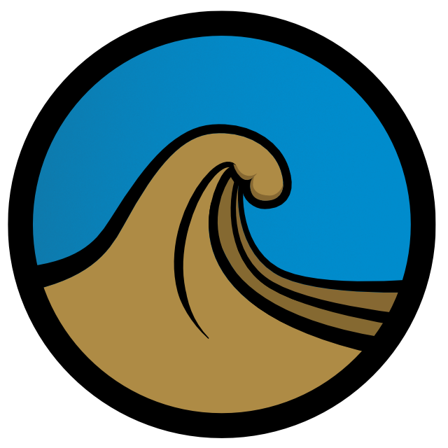
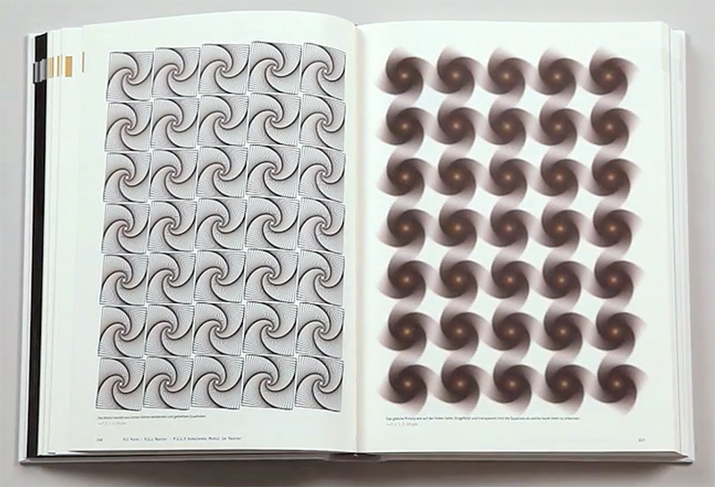

About a year and a half ago, I designed a logo for a project I intend to work on. It'll be a tiny, activity-focused social site revolving around mountainboarding (as all I do is related to that).
It's still not 100% finalized, as I will probably change colors and some of the details of the shape.
Anyway here it is:

At some point, I thought about animating it and using that animation instead of a dull spinner. And then I let the idea rest for a while.

Recently, I picked up a book from 2010 called [Generative Design](http://www.generative-gestaltung.de/1/lang/en). In it there are all kinds of gems:

<iframe class="centered" src="http://player.vimeo.com/video/15658375?title=0&amp;byline=0&amp;portrait=0&amp;color=ffffff" width="550" height="310" frameborder="0" webkitallowfullscreen="" mozallowfullscreen="" allowfullscreen=""></iframe>

I was going over the book normally and stumbled upon this page:

This section was about generating complex drawing based on simple shapes. In this case, you take a simple square and over many iterations, you rotate it, scale it down and draw it again. After some 15-20 iterations, an interesting shape starts emerging: 4 interlocked little waves... that kind of look like my logo. Hmmm...

So I set out to play with Canvas to try and recreate the drawing. Easy enough: draw a square in the middle of the canvas, translate the origin to the center of the square, and then do the following a bunch of times:
* rotate the canvas
* scale the square down
* draw it

<figure class="manikin content-surge">
    <iframe src="http://logo-generation.surge.sh/simple-black.html" frameborder="0" width="500" height="550"></iframe>
    <figcaption>Basic wave generation through rotation and scaling of a square</figcaption>
</figure>

Then I thought I'd need to add some color to it in order to generate some actual colored waves: I had to ditch the square and use lines instead, so that they could be made of different colors:

<figure class="manikin content-surge">
    <iframe src="http://logo-generation.surge.sh/four-offsets.html" frameborder="0" width="500" height="550"></iframe>
    <figcaption>Fully customizable wave generation!</figcaption>
</figure>

So at this point I think I reached the end of what was possible without adding a crap ton of custom scripts. The logo tends to have a fair amount of details that don't translate directly to simple drawing commands.

I probably won't be keeping this logo so this animation is probably not necessary but I'll keep it close.