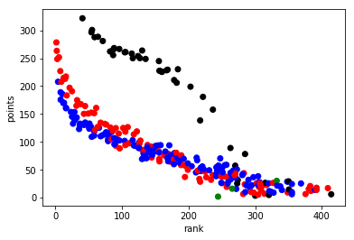
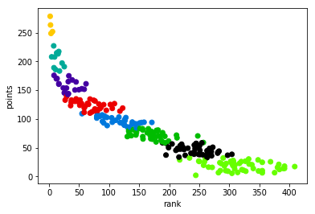
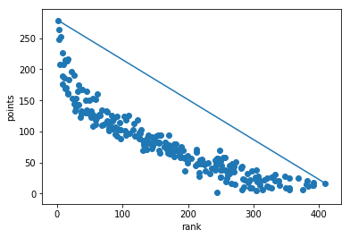
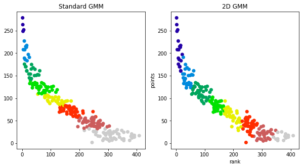
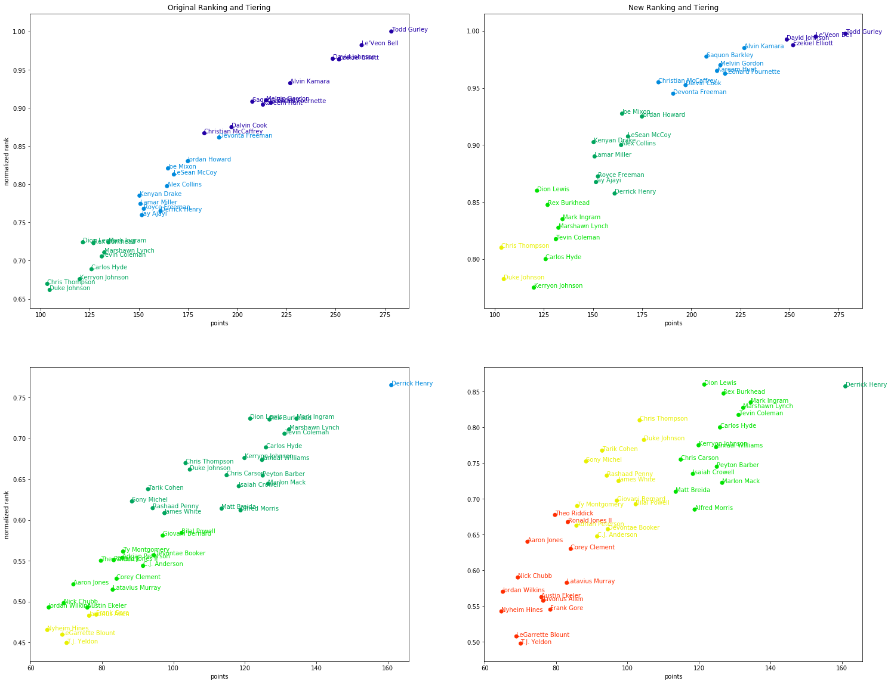
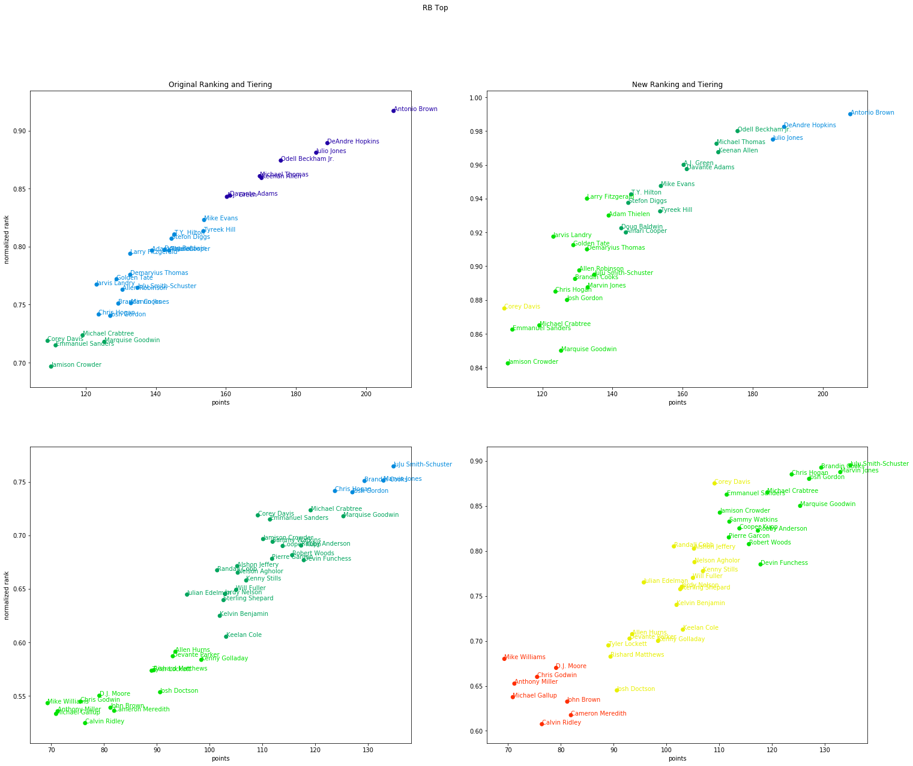

Using clustering algorithms on Fantasy Football players is a popular technique. There was even a piece in the [New York Times](https://www.nytimes.com/2013/10/11/sports/football/turning-advanced-statistics-into-fantasy-football-analysis.html?version=meter+at+5&module=meter-Links&pgtype=article&contentId=&mediaId=&referrer=https://www.google.com/&priority=true&action=click&contentCollection=meter-links-click) using Gaussian Mixture Models to collect players into so-called "tiers". One drawback is that the approach relies on (average) point projections but ignores external factors to the game that are harder to measure and/or model. In this post, we explore a modification to the GMM approach to take into account these immeasurables through expert rankings.

Points are not the only defining factor in a game of football. Statistics did not predict the Eagles would win Superbowl LII, and in fact, most projections undercut the Eagles the entire year. There was something missing in the data-- perhaps unmeasurable-- that made the final difference. Now, even though fantasy football is solely based on points, point projection models are (understandably) not based on these unmeasurable quantities. What if Nick Foles is on a hot streak? What if Tom Brady has an injured hand and tries to catch a pass? What if the Patriots are still cheating but lose anyway? Sports fans however have taken these things into account for years through their gut feelings. Before you storm off citing "unscientific" methods, hear me out. Many aggregation sites look at the average of rankings given by experts. These rankings (as we will see below) are not ordered by total point projections. Sometimes, they are defined by them, but not always. 

If these gut feelings satisfy a few assumptions, the central limit theorem still implies that their average will converge to a true ranking (hand waive, hand waive). If we want to understand "hot streaks" or "momentum" quantitatively, we would have to model them explicitly and introduce a new source of bias. Instead we average the rankings in hope that those individual sources of bias wash out and we are left with something reasonable to base decisions off of. The following analysis compares clustering raw player points (as suggested by the NYTimes article) with taking into account points and expert rankings. We will use data from FantasyPros.com.

In order to not "double dip" in the data, I'm going to use two separate expert sources for my projections vs. my rankings in order to get multiple opinions on the ranking.

## Exploration

The first thing we're going to do is explore the data and see what the relationship looks like between points and rankings. The data contains projections for the overall points in a season for each player from one group of experts and an average ranking *from a second group of experts*.


```python
import pandas as pd
d=pd.read_csv('overall.csv')
df= pd.concat([pd.read_csv(x).iloc[1:] for x in ['qb.csv','wr.csv','rb.csv']])
df.head()
```


<div>
<style scoped>
    .dataframe tbody tr th:only-of-type {
        vertical-align: middle;
    }

    .dataframe tbody tr th {
        vertical-align: top;
    }

    .dataframe thead th {
        text-align: right;
    }
</style>
<table border="1" class="dataframe">
  <thead>
    <tr style="text-align: right;">
      <th></th>
      <th>ATT</th>
      <th>ATT.1</th>
      <th>CMP</th>
      <th>FL</th>
      <th>FPTS</th>
      <th>INTS</th>
      <th>Player</th>
      <th>REC</th>
      <th>TDS</th>
      <th>TDS.1</th>
      <th>Team</th>
      <th>YDS</th>
      <th>YDS.1</th>
    </tr>
  </thead>
  <tbody>
    <tr>
      <th>1</th>
      <td>587.0</td>
      <td>58.9</td>
      <td>376.1</td>
      <td>2.5</td>
      <td>321.7</td>
      <td>9.2</td>
      <td>Aaron Rodgers</td>
      <td>NaN</td>
      <td>33.8</td>
      <td>2.1</td>
      <td>GB</td>
      <td>4,166.6</td>
      <td>309.3</td>
    </tr>
    <tr>
      <th>2</th>
      <td>583.7</td>
      <td>27.7</td>
      <td>383.8</td>
      <td>2.4</td>
      <td>300.8</td>
      <td>8.7</td>
      <td>Tom Brady</td>
      <td>NaN</td>
      <td>32.5</td>
      <td>0.9</td>
      <td>NE</td>
      <td>4,597.1</td>
      <td>41.0</td>
    </tr>
    <tr>
      <th>3</th>
      <td>532.3</td>
      <td>90.4</td>
      <td>325.1</td>
      <td>2.5</td>
      <td>296.6</td>
      <td>12.5</td>
      <td>Russell Wilson</td>
      <td>NaN</td>
      <td>26.0</td>
      <td>3.2</td>
      <td>SEA</td>
      <td>3,827.4</td>
      <td>503.2</td>
    </tr>
    <tr>
      <th>4</th>
      <td>510.8</td>
      <td>76.7</td>
      <td>309.0</td>
      <td>2.7</td>
      <td>288.5</td>
      <td>16.0</td>
      <td>Deshaun Watson</td>
      <td>NaN</td>
      <td>27.4</td>
      <td>3.5</td>
      <td>HOU</td>
      <td>3,781.0</td>
      <td>442.1</td>
    </tr>
    <tr>
      <th>5</th>
      <td>512.9</td>
      <td>120.0</td>
      <td>299.5</td>
      <td>2.2</td>
      <td>287.8</td>
      <td>14.5</td>
      <td>Cam Newton</td>
      <td>NaN</td>
      <td>22.4</td>
      <td>5.0</td>
      <td>CAR</td>
      <td>3,487.2</td>
      <td>620.6</td>
    </tr>
  </tbody>
</table>
</div>


```python
d.head()
```


<div>
<style scoped>
    .dataframe tbody tr th:only-of-type {
        vertical-align: middle;
    }

    .dataframe tbody tr th {
        vertical-align: top;
    }

    .dataframe thead th {
        text-align: right;
    }
</style>
<table border="1" class="dataframe">
  <thead>
    <tr style="text-align: right;">
      <th></th>
      <th>Rank</th>
      <th>WSID</th>
      <th>Overall</th>
      <th>Team</th>
      <th>Pos</th>
      <th>Bye</th>
      <th>Best</th>
      <th>Worst</th>
      <th>Avg</th>
      <th>Std Dev</th>
      <th>ADP</th>
      <th>vs. ADP</th>
    </tr>
  </thead>
  <tbody>
    <tr>
      <th>0</th>
      <td>1.0</td>
      <td>NaN</td>
      <td>Todd Gurley</td>
      <td>LAR</td>
      <td>RB1</td>
      <td>12.0</td>
      <td>1.0</td>
      <td>7.0</td>
      <td>1.9</td>
      <td>1.3</td>
      <td>1.0</td>
      <td>0.0</td>
    </tr>
    <tr>
      <th>1</th>
      <td>2.0</td>
      <td>NaN</td>
      <td>Le'Veon Bell</td>
      <td>PIT</td>
      <td>RB2</td>
      <td>7.0</td>
      <td>1.0</td>
      <td>9.0</td>
      <td>2.5</td>
      <td>1.8</td>
      <td>2.0</td>
      <td>0.0</td>
    </tr>
    <tr>
      <th>2</th>
      <td>3.0</td>
      <td>NaN</td>
      <td>David Johnson</td>
      <td>ARI</td>
      <td>RB3</td>
      <td>9.0</td>
      <td>1.0</td>
      <td>11.0</td>
      <td>3.3</td>
      <td>2.0</td>
      <td>3.0</td>
      <td>0.0</td>
    </tr>
    <tr>
      <th>3</th>
      <td>4.0</td>
      <td>NaN</td>
      <td>Antonio Brown</td>
      <td>PIT</td>
      <td>WR1</td>
      <td>7.0</td>
      <td>1.0</td>
      <td>11.0</td>
      <td>4.4</td>
      <td>1.7</td>
      <td>5.0</td>
      <td>1.0</td>
    </tr>
    <tr>
      <th>4</th>
      <td>5.0</td>
      <td>NaN</td>
      <td>Ezekiel Elliott</td>
      <td>DAL</td>
      <td>RB4</td>
      <td>8.0</td>
      <td>1.0</td>
      <td>18.0</td>
      <td>5.8</td>
      <td>2.9</td>
      <td>4.0</td>
      <td>-1.0</td>
    </tr>
  </tbody>
</table>
</div>


```python
dd=d.merge(df, left_on='Overall', right_on='Player')
dd = dd[~dd.Avg.isnull()] # remove null projections
def get_color(x):
    try:
        if 'WR' in x:
            return 'b'
        if 'RB' in x:
            return 'r'
        if 'TE' in x:
            return 'g'
        if 'QB' in x:
            return 'black'
        if 'K' in x:
            return 'o'

        return 'y'
    except:
        return 'c'


plt.scatter(dd.Avg, dd.FPTS, c=dd.Pos.apply(get_color))
plt.ylabel('points')
plt.xlabel('rank')
```


    Text(0.5,0,u'rank')





As you can see, the quarterbacks (in black) clearly are separate from the other positions in terms of how they're pointed vs. ranked. The most interesting positions to look at are the running backs (red) and wide receivers (blue). You can see there's almost a linear relationship between the ranking and the number of points scored, which you would expect. A high scoring player should be ranked highly and most ranking algorithms use projected points as a large factor. However, there is still a curve to the trend of rank vs. points and that means that the ranking algorithms had more factors than purely points. The question is: Can we identify additional insight from this picture to improve our team?

## Standard GMM Clustering

We're going exclude QBs for the analysis.

```python
n_cluster = 8
gm = GaussianMixture(n_components = n_cluster,random_state=7)
gm.fit(dt[['FPTS']])

cluster=gm.predict(dt[['FPTS']])

from matplotlib import cm
import numpy as np
plt.scatter(dt.Avg, dt.FPTS, c=[cm.spectral(k/float(n_cluster)) for k in cluster])
plt.ylabel('points')
plt.xlabel('rank')
```





Look at the edges of the clusters. It's a flat line because the approach ignored that many of those players have vastly different ranks. In the lower tiers, that won't matter too much, but especially in the higher and mid tiers it's an important dimension to think about. 


## Rank-Aware GMM Clustering

Now, let's do the analysis again but this time consider the ranking. We will calculate a new rank based off the point totals and the average expert ranking, and then we will cluster based on both the point projection and the original ranking. 

To obtain a new ranking, I'm going to orthogonally project the data onto the line connecting the worst player to the best player:


```python
rankbest=dt.loc[0][['Avg','FPTS']].values # best person clearly
ranklast=dt.loc[288][['Avg','FPTS']].values # worst person

plt.plot([rankbest[0],ranklast[0]],[rankbest[1],ranklast[1]])
plt.scatter(dt.Avg, dt.FPTS)
plt.ylabel('points')
plt.xlabel('rank')
```




This is a somewhat ad-hoc decision and it was a decision based on looking at the data. You could also use a less geometric approach.

The standard way to project a vector $$u\in\mathbb{R}^n$$ onto $$v\in\mathbb{R}^n$$ is as follows:

$$$$\frac{u\cdot v}{v\cdot v} v:= cv$$$$

You simply scale $$v$$  by $$c\in\mathbb{R}$$ to represent $$u$$ projected onto $$v$$. Now, $$c$$ is the player's new "rank".


```python
# Project the data and calculate c
to_proj = rankbest-ranklast
vals = dt.loc[:288][['Avg','FPTS']].values - ranklast
c = np.dot(vals, to_proj)/ np.dot(to_proj, to_proj) 
```


```python
dt['original_clusters'] = cluster
```

The calculation on the two dimensional data is more straightforward.


```python
gm.fit(dt[['Avg','FPTS']])
dt['gmm2d_cluster'] = gm.predict(dt[['Avg','FPTS']])
```





We have adjusted the colors to match between the two plots.

We all know who the best players are and they're not a surprise. By clustering by points, you'll always see the best players on top-- but everyone knows their top draft picks. We're trying to find a sound tie breaker for the later draft rounds.. It's clear from the plots that the standard GMM approach is missing some of the considerations from the experts (found in their ranking). The question as to which rank aware approach is better is an open question, but to my eyes, I like that the 1D GMM approach drops appears keep lower ranked players in their own cluster. 

# Exploring the Clusters

Next, we will plot the ranking and tier against projected points as the original New York Times article does to show the different insights you would get from our two dimensional approach vs. the standard approach. 



Click [here](../images/ffgmm/output_23_0.png) to enlarge the image.



Click [here](../images/ffgmm/output_24_0.png) to enlarge the image.


# Discussion

Now, when a person has a different rank vs. other players with the same points, you can see that it effects their tiering. In the bottom right plot for wide receivers, you can see a completely different tiering. To obtain a final ranking, you would sort via the tiers followed by the normalized rank.

One interesting point is that this approach may allow you to identify over valued players because the rank, tier, and point projections aren't deterministically linked. Look at the bottom right plot for wide recivers. You can see Corey Davis is included in the yellow group even though his rank is much higher than the other players. After a quick google, the [Bleacher Report](https://bleacherreport.com/articles/2793567-fantasy-football-2018-cheatsheet-draft-rankings-and-sleepers-to-target) states that "...Corey Davis ... no longer [qualifies as a sleeper] as [his] stocks have ascended. If anything, [he's] in danger of getting overdrafted over the weekend.". This insight is not clear from the original ranking/tiers.

Similarly, it also appears to draw different cutoffs as to who are "elite" players. This approach to ranking puts the top three wide receivers in a tier of their own where the original approach implies the first ~10 wide receivers are equivalent. This method would tell you to prioritize drafting the top 3 wide receivers over the others if you are able to.

As always, analytics for fantasy football are more of an art than science due to the limited data, but I hope this approach shows you an alternative way to use Gaussian Mixture Models to combine information about players into tiers.


