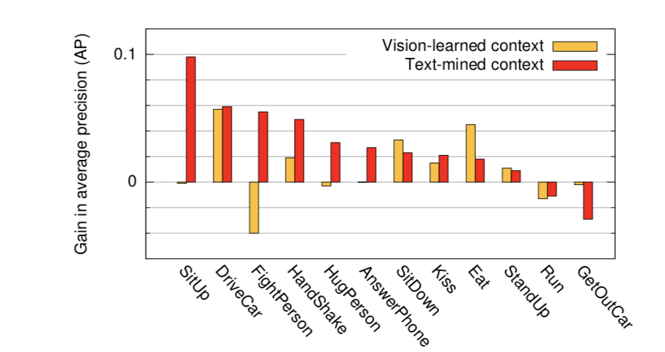
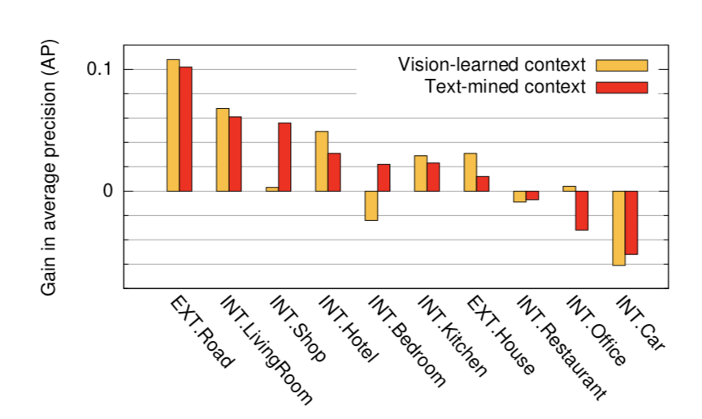

2018/10/11

In this post, the paper "Actions in Context" is investigated and summarized.

*Marcin Marszalek, Ivan Laptev, Cordelia Schmid. Actions in Context. CVPR 2009 - IEEE Conference on Computer Vision Pattern Recognition, Jun 2009, Miami, United States. IEEE Computer Society, pp.2929-2936, 2009.*

## Summary:

In “Actions in Context”, 3 researchers  from the Institution INRIA examines the relation between scenes from videos and actions taking place within these scenes. The main challenge they give is to see the impact of using script text on action recognition. 

To achieve this, scenes and script texts taken from several movies are used as input data. 
Each scene with its script is trained by a text classifier algorithm to retrieve the action taking place during this scene. After that, these actions (i.e. AnswerPhone, DriveCar, etc.) are verified so that their labels will be correct for the test set.

The scenes labeled with an action are categorized with respect to their relevance as knowing the relation between scenes and actions would strengthen the classification performance. 

Scenes, scripts and actions are fed into the model as training data. The model consists of two parts: video representation for scene and action recognition and the classification for scene and actions. For video representation, different bag-of-features components are employed (Harris Detectors, HoF& HoG& SIFT Descriptors). For the classification model, SVM is chosen to learn actions from scene context and video. Different kernel types are implemented and compared with respect to their performance. 
Finally, there are two conclusions drawn from the results. First, the performance of action recognition with and without using scene context is compared and it is observed that scene context has a significant impact on action recognition. The performance comparison for some actions can be observed from Figure 1.

*Figure 1. Comparison of scene text mining and vision methods in action recognition.*

Secondly, the performance of scene recognition by using script test is compared with the classical computer vision approach for scene recognition. In this case, the script mining approach gives good results but cannot catch the classical vision approach. The results are available in Figure 2.

*Figure 2. Comparison of scene text mining and vision methods in scene recognition.*
  
    
      
        
          
*Created by*

- *Emre Doğan*

- *Dersu Giritlioğlu*

- *Gözde Nur Güneşli*

