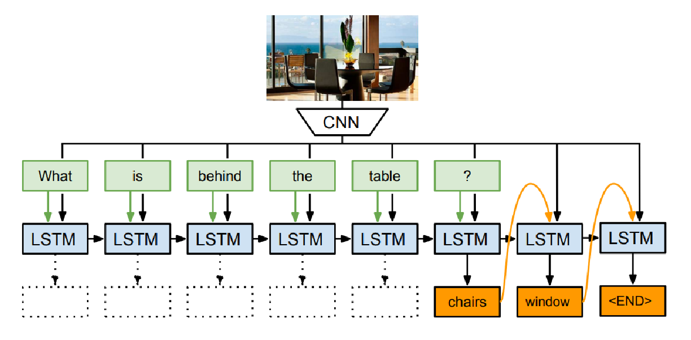

2018/10/25

       In this post, we will investigate the work of Malinowski et al.* named as "Ask your neurons: A neural-based approach to answering questions about images." for the visual question answering task. Visual question answering is a task which is similar to our project, involving both the computer vision and natural language processing areas. It requires text generation based on language and visual features. The expected model should be able to understand visual scenes and the questions, and ultimately predict sequence of words as answers. 

       Their model (*Figure 1*) consists of a Convolutional Neural Network (CNN) to obtain image features and a Long Short Term Memory Unit (LSTM) which is a derivative of Recurrent Neural Networks (RNN). The features from the CNN and words from the question are the inputs to the LSTM. 

*Figure 1.The Neural-Image-QA model of Malinowski et al.*

	Although there have been studies before for this task using Neural Networks (NN), the model of Malinowski et al. is the first one having an end-to-end deep learning approach. They use one-hot-encoded representation for words, without the need of any semantic parsing or any meaning representation. Thus, “grounding” of the words are learned by model. Also, using LSTM for sequence to sequence prediction task provides the benefit of having variable length of words both in the input and the output. 
	
	They make experiments on their dataset *DAQUAR* with the mentioned model and a non-visual (Language-only) version of it. Their method, even the language-only version, clearly improves the results comparing the earlier best method.

       

* Malinowski, Mateusz, Marcus Rohrbach, and Mario Fritz. "Ask your neurons: A neural-based approach to answering questions about images." Proceedings of the IEEE international conference on computer vision. 2015.

          
*Created by*

- *Emre Doğan*

- *Dersu Giritlioğlu*

- *Gözde Nur Güneşli*

