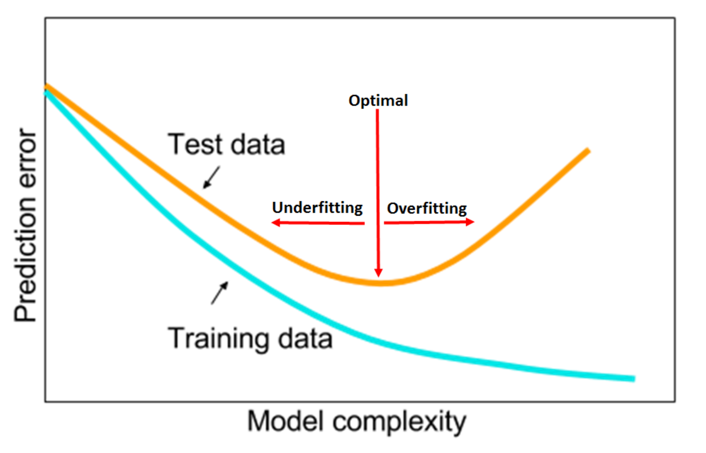
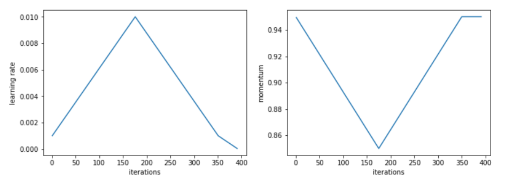

In his most recent [work](https://arxiv.org/abs/1803.09820), Leslie N. Smith gives extremely useful practical advice on how to train neural networks and tune the most important hyper-parameters. In his experiments, Smith was able to improve the current State of The Art (SoTA) results on a number of datasets and network combinations, including the popular CIFAR-10, CIFAR-100, MNIST, and ImageNet.

Smith argues that Learning Rate (LR), Momentum, batch size, and weight decay should be tuned syncronously to find the best configuration that minizimes the validation loss and maximize validation accuracy. Such intuitive remark has however not been followed by many researchers in the recent past due to the computational cost associated with such strategies. An extensive grid search across a 4-dimensional hyper-parameters space would, in fact, be extremely expensive ― especially for the average user who doesn't have at his disposal a cluster of GPUs for running his experiments.

Leslie Smith goal is therefore to both shade a light on the intrinsic dependencies between them and present a good heuristic to rapidly identify the best hyper-parameters. In addition to that, Smith also gives easy to follow rule of thumbs regarding good hyperparameters to use when approaching a new dataset or architecture, and hints on how to improve on the initial hyper-parameter configuration. In this paper, Smith also introduces what he calls the 1cycle policy, a strategy to train neural networks which shows superconvergence capabilities in many datasets if hyper-parameters are correctly chosen.

### Underfitting and Overfitting

Smith points out how, to minimize the prediction error, we need to identify the sweetspot between underfitting and overfitting.

He argues that hyper-parameter configurations which more rapidly reduce the validation loss in the first few epochs and plateau are generally best, since:

1. Empirically reach, at least as good as any other configuration, lower validation loss
2. Dramatically reduce computing time ― that can therefore be allocated to experiment othere things

Smith stresses multiple times how large values for the learning rate are desiderable since they reduce underfitting and, at the same time, help to regularize the training. At the same time, Smith remind the reader that if the LR is too large, the training will diverge. To quickly identify reasonable minimum and maximum boundary values for the Learning Rates with only a few epochs, Smith suggest to use the "LR range test", which he proposed in [previous work](https://arxiv.org/abs/1506.01186). 

### The 1cycle policy

Such policy requires the coordinated change of Learning Rate and [Momentum](https://en.wikipedia.org/wiki/Stochastic_gradient_descent#Momentum) during training time. During the course of over [1,000 experiment](https://mlconf.com/interview-with-leslie-n-smith-phd-senior-research-scientist-at-the-us-naval-research-laboratory-by-reshama-shaikh-program-committee-member/) Smith noticed how a 1 cycle strategy where in the first half we increase the LR while decrease Momentum, to then revent the trends in the second half of the cycle, seems to perform particularly well.

In Smith experiments, such policy outperforms in terms of validation score any other previously known training policy, and achives optimal results in a fraction of the necessary epochs. 

### Batch size, weight decay, and dropout

Small batch sizes, weight decay, and dropout are other popular techniques to regularize neural networks. Smith argues that these regularization techniques should be limited, in favour of using larger learning rates. Larger learning rate, in fact, provide as good regularization properties and, additionally, allow convergence in a shorter number of iterations.

Smith suggest to use the largest batch size allowed by our server and to try a few different combinations of weight decay and dropout comparing the results using the "LR range test".

### Generalization to different network architectures and dataset

Finally, Smith explores how his recommendations generalize to different network architectures and datasets. Interestingly, he shows how his recommendations hold not just for shallow and residual networks but algo in deep architectures like densenets, and hyper-densenets. He also shares [the code](https://github.com/lnsmith54/hyperParam1) necessary to improve the results presented in numerous studies while also considerably reducing training time. This is extremely important to further validate the hypothesis that the 1cycle policy is the best currently known general strategy to optmize both shallow and deep networks.

### Conclusions

The recent work of Leslie N. Smith has been fundaments to democratize deep learning and achieving SoTA results on single and multi-GPU configurations. The "LR range test", 1cycle policy,  and the heuristics to tune Learning Rate, Momentum, batch size and weight decay presented in this paper are advancing what previously presented in the literature.
