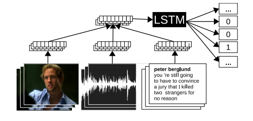
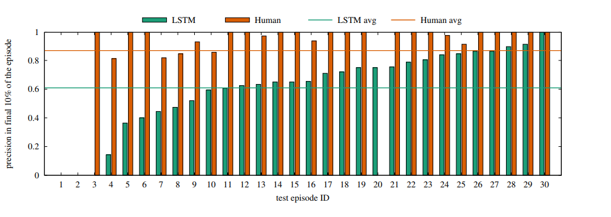
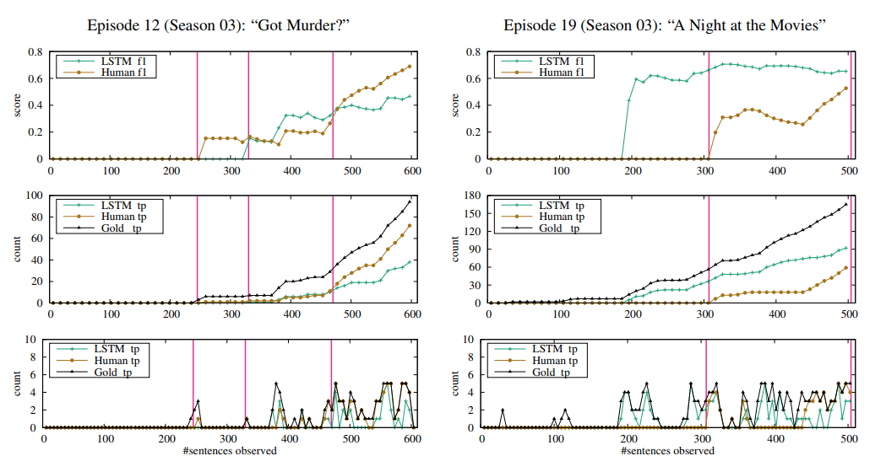
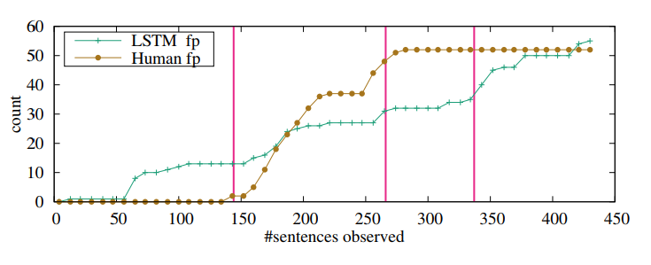

2018/11/15

In this post, the paper "Whodunnit? Crime Drama as a Case for Natural Language Understanding" is investigated and summarized.

Frermann, L., Cohen, S. B., & Lapata, M. (2018). Whodunnit? Crime Drama as a Case for Natural Language Understanding. Transactions of the Association of Computational Linguistics, 6, 1-15.

## Summary:

In this study, Frermann et al. pose an interesting (and novel) question in the field of natural language understanding. Can an NLP model be a detective and identify the correct perpetrator of a crime scene?

For this problem, they develop a new dataset based on 39 episodes of the TV series “CSI: Crime Scene Investigation”, containing gold-standard perpetrator as well as three viewers’ guesses about the perpetrator during each episode. The task is approached as an incremental inference problem. The guesses are collected in time, so they change while the episode continues revealing more information. The model is also trained and tested with this incremental approach. The main task is to decide whether the words which refer to a person (e.g. you,me, Peter, Catherine, strangers, victims) refer to a perpetrator or not. 

They use a combination of various modalities (text, audio, video) for their model. An overview of their model can be seen on *Figure 1*.

*Figure 1: Overview of the model. The model receives input in the form of text, images, and audio. Each modality is mapped to a feature representation. Feature representations are fused and passed to an LSTM which predicts whether a perpetrator is mentioned (label l = 1) or not (l = 0).*

They analyze the differences between model and human behavior.
to study how humans and models alike make decisions over time.

*Figure 2: Precision in the final 10% of an episode, for 30 test episodes from five cross-validation splits. Scores per episode and global averages (horizontal bars) are shown. Episodes are ordered by increasing model precision*
  

*Figure 3: Human and LSTM behavior over the course of two episodes (left and right). Top plots show cumulative f1; true positives (tp) are shown cumulatively (center) and as individual counts for each interval (bottom). Statistics relating to gold perpetrator mentions are shown in black. Red vertical bars show when humans press the red button to indicate that they (think they) have identified the perpetrator.*
            

*Figure 4: Cumulative counts of false positives (fp) for the LSTM and a human viewer for an episode with no perpetrator (the victim committed suicide). Red vertical bars show the times at which the viewer pressed the red button indicating that they (think they) have identified the perpetrator.*
            

*Created by*

- *Emre Doğan*

- *Dersu Giritlioğlu*

- *Gözde Nur Güneşli*

