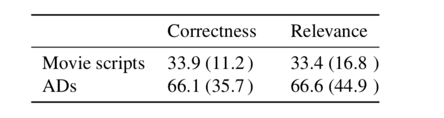
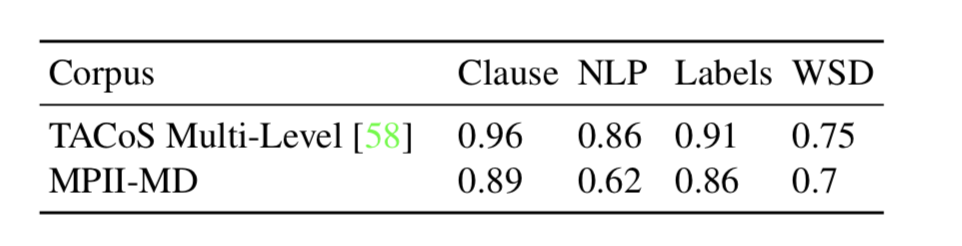

2018/11/22

In this post, the paper “A Dataset for Movie Description” is investigated and summarized.

*A. Rohrbach, M. Rohrbach, N. Tandon and B. Schiele, "A dataset for Movie Description," 2015 IEEE Conference on Computer Vision and Pattern Recognition (CVPR), Boston, MA, 2015, pp. 3202-3212.*

## Summary:

The main purpose of the authors is to present a novel dataset of movies with aligned descriptions consisting of ADs (Audio Descriptions of the movies for blind and visually impaired people) and movie scripts.

It is stated that the related studies on this topic have been done mostly in image data also known as image description. There have been some significant improvements in this area due to the Convolutional Neural Networks. But a similar improvement could not be observed in video description due to the lack of a well-organized corpus for video datasets. Even the studies on video description only consider the movie scripts which does not give satisfying in description. What this paper proposes as different from the others is to consider both movie scripts and audio descriptions.

To collect these audio descriptions, the authors use special movie editions for visually impaired people. In this type of movies, the descriptions are vocalized during the movie. To be able to distinguish these descriptions from the original sounds of the movie, they use the spectral characteristics (by Fast Fourier Transform). After converting them to text, the authors first aligned these descriptions and the scripts with the videos manually. Then, they try to develop a method to automate this process by using some visual features and semantic parsing. 

At the end, they conclude with two facts:

- Comparison of AD vs Script Data: Videos aligned with the AD and scripts are evaluated by some paid people (Amazon Mechanical Turk). The results are given in Table 1. The ADs are clearly more successful than the scripts.

*Table 1. Human Evaluation of Movie Scripts and ADs*

- Evaluation of Semantic Parsing and Visual Features: Some different approaches for semantic parsing has been used and the results are given in Table 2. These results are promising for the future but not explained in a detailed way in this paper.

*Table 2. Performance of Different Sematic Parsers*

Finally, this paper proposes a new dataset which can be very useful in the future studies. As there is a necessity of the video data aligned with descriptions, this study will absolutely fill this gap. But the semantic parsing and visual feature usage parts are not explained in a clear way.

*Created by*

- *Emre Doğan*

- *Dersu Giritlioğlu*

- *Gözde Nur Güneşli*
