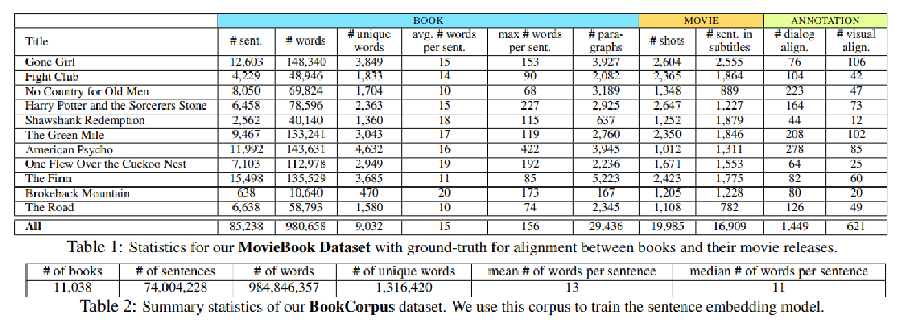
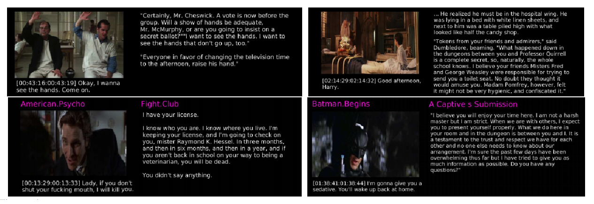
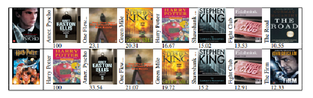

2018/12/05

In this post, the paper "Aligning Books and Movies: Towards Story-like Visual Explanations by Watching Movies and Reading Books" is investigated and summarized.

Zhu, Y., Kiros, R., Zemel, R., Salakhutdinov, R., Urtasun, R., Torralba, A., & Fidler, S. (2015). Aligning books and movies: Towards story-like visual explanations by watching movies and reading books. In Proceedings of the IEEE international conference on computer vision (pp. 19-27).

## Summary:

In this paper, Zhu et al. investigate the movie book alignment problem with the aim to ground visual data with detailed descriptions available in books. This is an important problem because a successful solution for this problem can provide rich descriptive explanations for visual content.

They propose an approach that computes several similarities between shots in movies and dialogs and sentences in the book. They use a sentence embedding model trained unsupervised from a large corpus of books, used to compute similarities between sentences. Then, they extend the image-text neural embeddings to video, and propose a context-aware alignment.

The statistics for MovieBook dataset which they collect using 11 movies and corresponding books, and BookCorpus dataset (11,038 books from the web) are in the tables below:

 
Examples of their results for the movie to book alignment task can be seen on *Figure 1* on top. They also find the best matching paragraph for a shot from all the books, shown at the bottom of the figure.

*Figure 1: Movie clip descriptions via the book: (top) Alignment of the movie to the book, a shot and its corresponding paragraph from the book, (bottom) for a shot the best matching paragraph from a corpus of books. 
*
            

*Figure 2: *

*Created by*

- *Emre Doğan*

- *Dersu Giritlioğlu*

- *Gözde Nur Güneşli*

