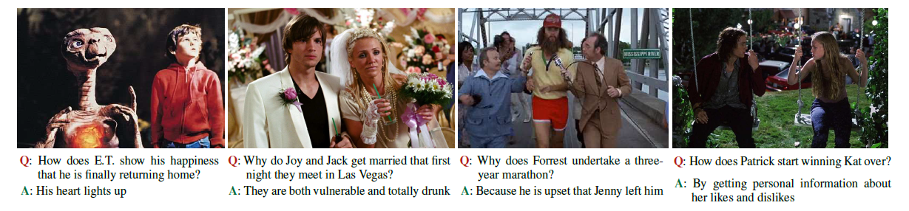
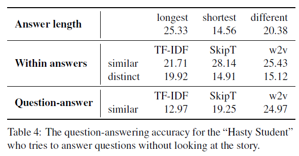
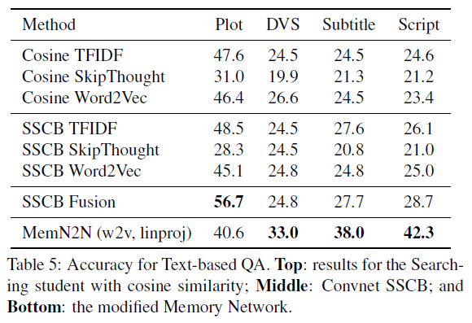
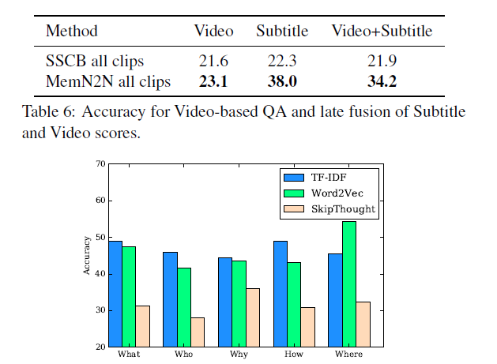

2018/12/13

In this post, the paper "MovieQA: Understanding Stories in Movies through Question-Answering" is investigated and summarized.

*Makarand Tapaswi, Yukun Zhu, Rainer Stiefelhagen, Antonio Torralba, Raquel Urtasun, Sanja Fidler; The IEEE Conference on Computer Vision and Pattern Recognition (CVPR), 2016, pp. 4631-4640*

## Summary:

In this paper, Tapaswi et. al. created a comprehensive Question-Answer dataset called MovieQA, which includes around 15000 questions for 408 films. In earlier examples of QA datasets, we have seen “what, where, how many” etc. questions which cannot obtain high level information from the scene. Whereas in this work, questions are not trivial and can be any type (why, who, how etc.) as can be seen in Figure 1. Each of the questions has 1 true and 4 false answers associated, just like a quiz. The model is fed by plots, videos, subtitles, scripts, DVS’s at the same time for learning the events in the film in detail.

*Figure 1. “How” and “why” examples*

Plots written by fans are used while gathering the quizzes. Video clips are not used independently in order to understand “why” something happened, so, dialogs are utilized together with these videos. With the help of DVS the non-dialog parts are also covered more strongly. If there is anything missing, scripts would come and help, and the dataset would be consisting of a very strong information pile of the film. Dataset formed by annotators creating questions, providing correct and wrong answers to them and time-stamping (i.e. matching the question with a beginning and an end time).

While answering the questions, the authors tried to wear the shoes of a student answering a test. First, they became the hasty student who did not read/watch the whole story. Then, a searching student who tries to relate the question and the answer to a subset of the story. Add some features to this student such as a “convolutional brain” (SSCB) and lastly, created memory network for more complex QA’s.
Two students using different methods with different sources resulted in several different conclusions but to summarize, as far as I see the results below, one should select method, student type, and source type accordingly if there is a specific type of question. But for a general task, if we can obtain the plot and use SSCB fusion model, we would probably reach a nice state.

*Figure 4. Accuracy for different feature representations of plot sentences with respect to the first word of the question.*

*Created by*

- *Emre Doğan*

- *Dersu Giritlioğlu*

- *Gözde Nur Güneşli*
