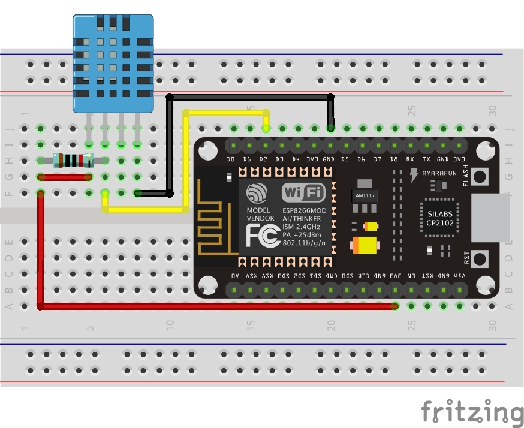
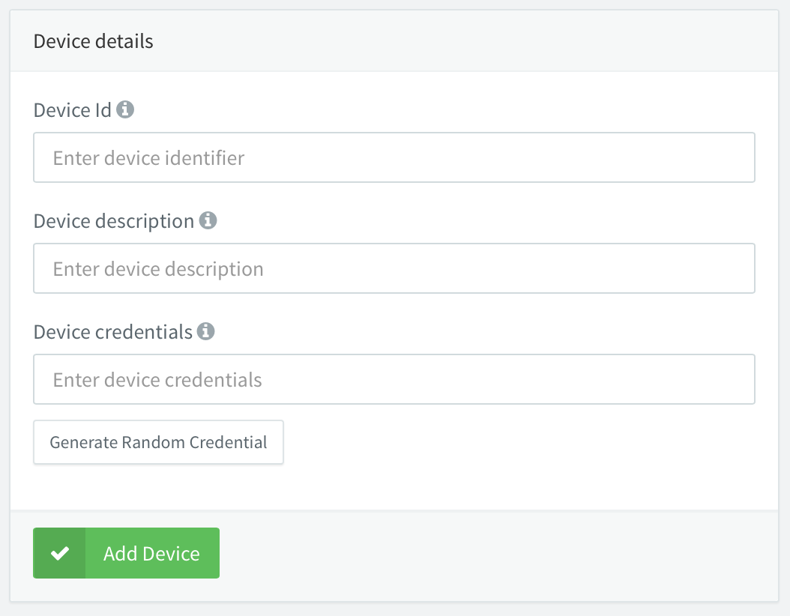
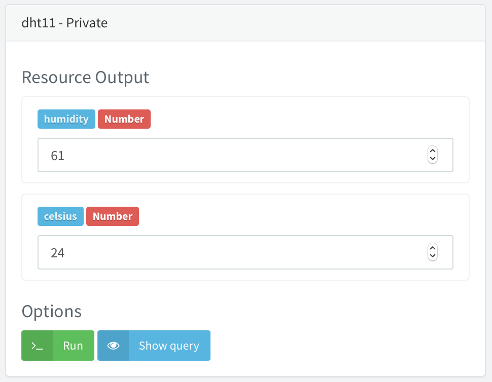
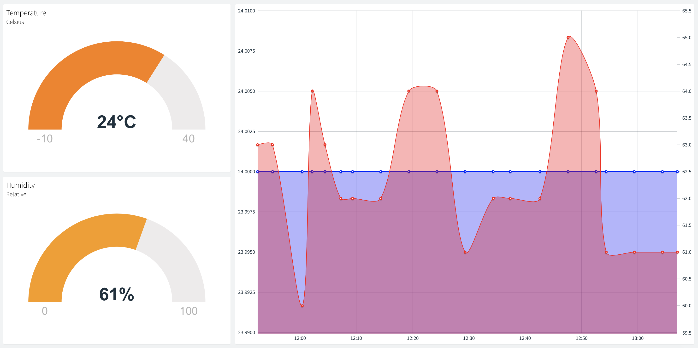

A simple system for collecting and transmitting data to be stored and analysed. Data is collected by a DHT11 combinded temperature and humidity sensor attached to a NodeMCU unit. It is transmitted to the thinger.io IoT platform where it can be displayed using a graphical dashboard.

## Components
* Board: ESP8266 NodeMCU
* Sensors: DHT11 (temp + humidity)
* Software: Arduino (C++)

### NodeMCU
Based the ESP8266 wireless module, the NodeMCU adds a range of GPIO pins and interfacing capabalities. It can be programmed using Lua, Micropython and even Arduino sketches meaning there is large community support and documentation for the platform.


### DHT11
Combining both a temperature and humidity sensor, the DHT11 allows basic monitoring of environmental conditions. Wtih a measurement range of 0-50°C and 20-95%, it is ideal for most basic applications. Although it has lower accuracy than a DHT22 or DS18B20, its low cost makes it ideal for initial prototypes. Readings are accessed via a single data pin, and accepts both 3.3V and 5V DC.


### Arduino
Primarily designed for use with the Arduino range of microcontrollers, the IDE also includes support for third-party boards such as the ESP8266. The board can be installed through the board manager by simply including the URL of the source code. Arduino sketches are written in a variant of C++, and there is vast array of guides for setting up and running Arduino sketches on the device, integrating it with numerous pieces of hardware.

## Services
These mostly accomodate the transmission, storage and visulaisation of data using APIs and cloud platforms to greatly simplify the process. 

### [thinger.io](https://thinger.io)
Another IoT sevice, Thinger.io allows the connection of multiple devices including Linux (e.g. RPi), SigFox, ARM mBed and Arduino including the NodeMCU. It features dashboards, data buckets and enpoints to allow the collection, storage and visualisation of data.


Connecting a the NodeMCU to the service is very simple, requring only a few lines of code:
```
#include <SPI.h>
#include <ESP8266WiFi.h>
#include <ThingerWifi.h>

ThingerWifi thing("username", "deviceId", "deviceCredential");

void setup() {
	thing.add_wifi("wifi_ssid", "wifi_credentials");
}

void loop() {
	thing.handle();
}
```

## Solution
### Hardware
The NodeMCU and DHT11 are installed on a breadboard and connected using jumper wires. It is important that a pullup resistor should be added between the VCC and DATA pins, 10kOhm is sufficient. Note that the third pin is on the DHT is not used. The pins are connected as follows:

NodeMCU | DHT11
------------ | -------------
VCC | 3V3 (1)
D2 | DATA (2)
GND | GND (4)



### Software
This NodeMCU use the CP2102 serial chip, and once the necessary serial drivers have been [downloaded](https://www.silabs.com/products/development-tools/software/usb-to-uart-bridge-vcp-drivers) and installed, as well as [Arduino support for the NodeMCU](http://arduino.esp8266.com/stable/package_esp8266com_index.json
), the board can be accessed from the Arduino IDE by selecting it in the tools tab. There are a number of Arduino packages that are required, and can be installed via the library manager in the IDE. The system uses the DHT, Adafruit Unified Sensor and thinger.io packages.

Before installing the software on the NodeMCU, a new device must first be added in the thinger.io cloud console. Be sure to make a note of the 'device credentials' as this cannot be retrieved later.



The initial setup sketch can now be written and uploaded to the NodeMCU, after the device details and WiFi information has been included.

```
#include <SPI.h>
#include <ESP8266WiFi.h>
#include <ThingerWifi.h>

ThingerWifi thing("username", "deviceId", "deviceCredential");

void setup() {
	thing.add_wifi("wifi_ssid", "wifi_credentials");
}

void loop() {
	thing.handle();
}
```

Once the device has successfully established a connection to the cloud console, we can add the details of the DHT11 sensor. The DHT library must be included at the top of the sketch, and the sensor is defined by specifying the DHT model and the pin which it is connected to.

```
// Import libraries
#include <SPI.h>
#include <ESP8266WiFi.h>
#include <ThingerWifi.h>
#include "DHT.h"

// Define and initialise the sensor
#define DHTPIN D2
#define DHTTYPE DHT11
DHT dht(DHTPIN, DHTTYPE);

// Setup device details
ThingerWifi thing("username", "deviceId", "deviceCredential");

void setup() {
	// Setup WiFi
	thing.add_wifi("wifi_ssid", "wifi_credentials");
	// Define the 'thing' with a name and data direction
	thing["dht11"] >> [](pson& out){
		// Add the values and the corresponding code
		out["humidity"] = dht.readHumidity();
		out["celsius"] = dht.readTemperature();
	};
}

void loop() {
  thing.handle();
}
```

Once the sketch has been uploaded, the values of the DHT11 are available via the API explorer on the device in the cloud console.



As a device resource, this data can now be accessed via a dashboard, databucket or endpoint to be logged and visualised in a variety of ways.

