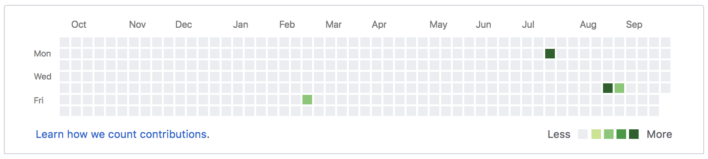

Last week we were learning about scraping data off of the internet, natural language processing, and tree/forest classifiers. There are multiple ways of scraping data off of the internet. You could use an API (Application Program Interface - a tool made by the programmers of the website to help other programmers interact with their data or other aspects of the site) or you might just pull the pure HTML of site. I'm going to try to summarize what I've gleaned and give a rundown on how to do some HTML web scraping here.

I want to see how many times I've committed on GitHub over the past year. If you aren't familiar with Github, they show this information on a nice color-coded chart where the darker the shade is, the more commits you have. (I feel obligated to state that I have barely been using Github and I'm currently using a Github Enterprise account so the number is going to be disappointingly small.)



Since I'm taking the information from the webpage itself instead of any API they might have, I'm going to want to take the HTML. To do this, we're going to need the requests library. So let's import a few things to start.

```python
import requests
```

Using the requests library, we can query a url and save the entire HTML response that we get back. The `.get()` method sends a "GET" request to the website. This is what your web browse of choice is doing every time you enter a url or click on a link. The difference here is that we are going to store the HTML response, as opposed to displaying it rendered.

```python
url = 'https://www.github.com/gerket'
res = requests.get(url)
```

To make sure that we have gotten a good response, we need to see what the status code is. We can do this by checking `res.status_code`. We're looking for something in the 200's, preferably 200 itself, as that is the standard success response 'OK.' A list of the different status codes and their assorted meanings can be found [here](https://en.wikipedia.org/wiki/List_of_HTTP_status_codes).

Once we verify the response, we need to figure out what we want to pull from the data.  Using Google Chrome's developer tools we can look at the individual elements of the page and find out what tags and attributes correspond to the data we want. Let's try to pull out the number of commits I've had over the past year. 

If you right-click on an object on the webpage and hit Inspect, we can see that element in the HTML. We can use this to see exactly what elements we want to scrape. Right-click and Inspect a square within the contributions graph and you should have something like this highlighted:

```python
<g transform="translate(312, 0)">

    <rect class="day" width="10" height="10" x="-11" y="12" fill="#ebedf0" data-count="0" data-date="2018-02-19"></rect>
    <rect class="day" width="10" height="10" x="-11" y="0" fill="#ebedf0" data-count="0" data-date="2018-02-18"></rect>
    <rect class="day" width="10" height="10" x="-11" y="24" fill="#ebedf0" data-count="0" data-date="2018-02-20"></rect>
    <rect class="day" width="10" height="10" x="-11" y="36" fill="#ebedf0" data-count="0" data-date="2018-02-21"></rect>
    <rect class="day" width="10" height="10" x="-11" y="48" fill="#ebedf0" data-count="0" data-date="2018-02-22"></rect>
    <rect class="day active" width="10" height="10" x="-11" y="60" fill="#7bc96f" data-count="1" data-date="2018-02-23"></rect>
    <rect class="day" width="10" height="10" x="-11" y="72" fill="#ebedf0" data-count="0" data-date="2018-02-24"></rect>
</g>
```

This gives us some interesting information. We know that each row of boxes is a `<g>` tag with multiple `<rect>` tags, each representing a certain day. We can tell what day specifically by looking at the `data-date` attribute of each. We can further look at the attributes to get more information that we might want. For example, we know that the first box,

```python
<rect class="day" width="10" height="10" x="-11" y="12" fill="#ebedf0" data-count="0" data-date="2018-02-19"></rect>
```

is representing February 19th, 2018. We also know that I didn't commit anything on that day because of the `'data-count'` attribute. So how do we use this information to actually do something?

Good question! We're going to need another library. BeautifulSoup is a useful library that allows you to search through HTML and find whatever you're looking for. Let's import it.

```Python
from bs4 import BeautifulSoup
```

We want to get all of the different `'data-count'`s from each box so that we can add them up and get the number of commits that I've had. To do this we're going to have to find all of the `<g>` tags and all of the different `<rect>` tags within those.

```Python
total = 0
soup = BeautifulSoup(res.content, 'lxml')

for column in soup.find_all('g'):
    for day in column.find_all('rect'):
        total = total + int(day.attrs['data-count'])

print(total)
```

A few things are going on here. First, we made a soup object out of the HTML. We can use this to get what we want out of the data. Next, we're finding all of the different `<g>` tags and then finding all of the different `<rect>` tags within each of those. Then we're adding the `'data-count'` number to the total number of commits using the `.attrs[attribute_name]`. We had to cast the count because it is stored as a string in the HTML. By casting it as an int, we can use Integer functions and add them all up.  Once we've gotten every single count, we print out the result! 12 as of September 5th 2018. That's uh .. way less than it should probably be. Guess I need to start a side-project or something after I finish this course.

See you next time!
