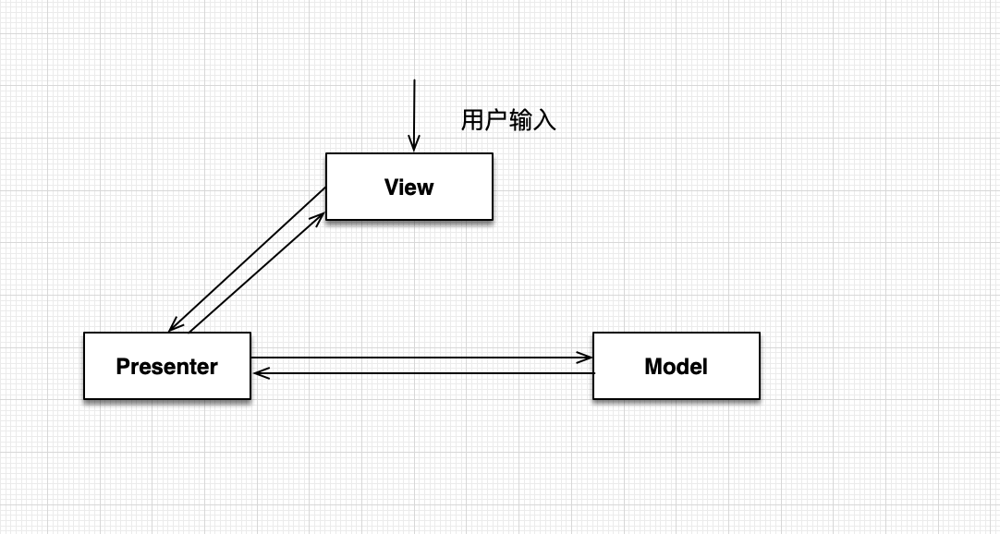
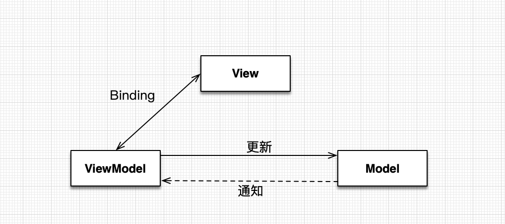
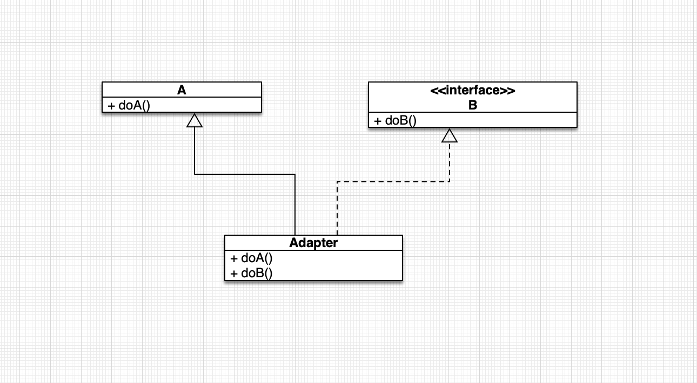
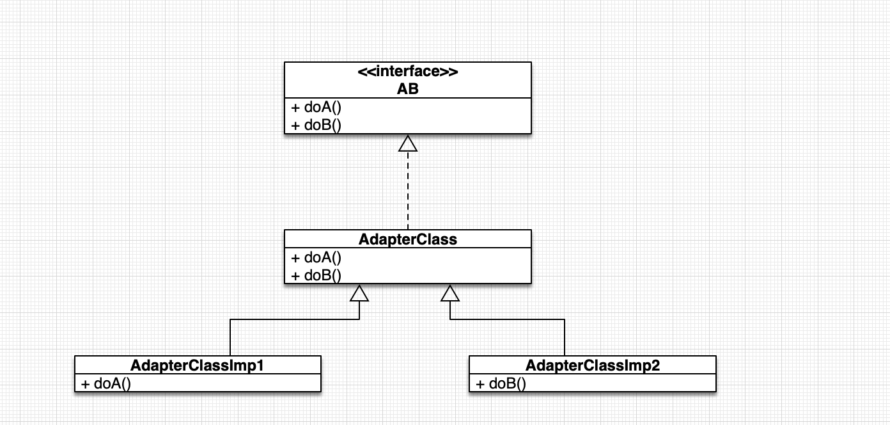
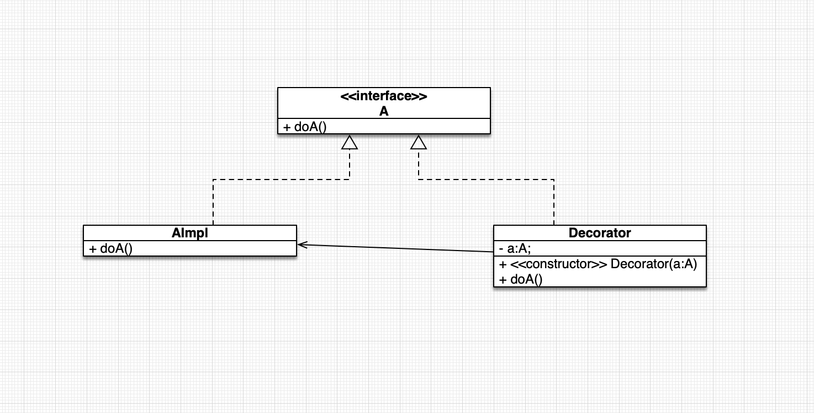
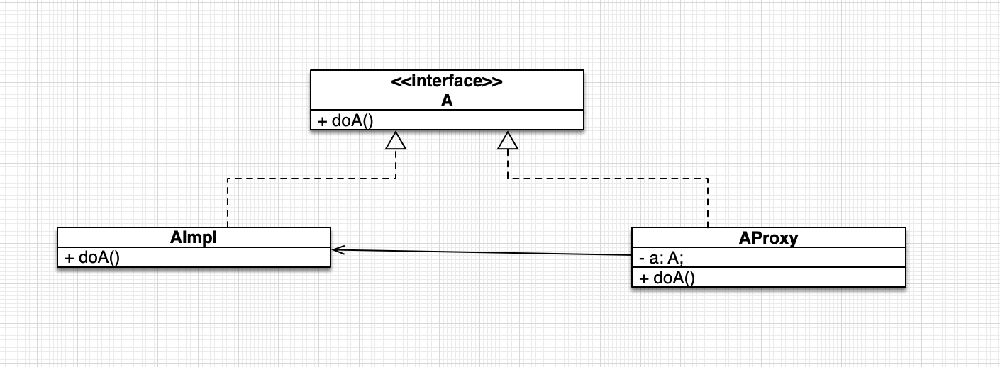
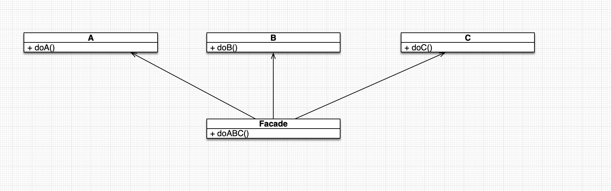
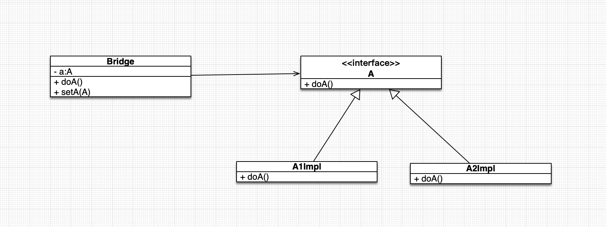
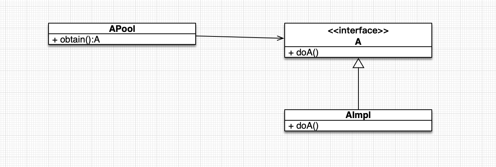
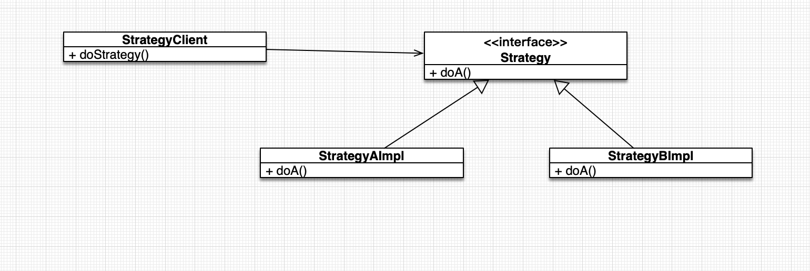

### 2.14.1 MVC & MVP & MVVM
1. MVC
  - Controller - 转发请求, 处理请求, 控制View & Model, Android上对应`Activity`, 处理数据、业务和UI
  - View - 展示 & 交互, Android上对应XML布局文件
  - Model - 程序功能（算法等）、数据（数据库相关）, Android上对应实体模型(数据获取、存储、数据状态变化)
  - 优点
    - 简化程序修改和扩展
    - 提高复用
  - 缺点
    - iOS Controller 类容易过大, 容易混淆View和Controller


2. MVP
  - Presenter - 事件处理, 检索Model数据, 与View沟通, Model & View桥梁, Android上对应对应View和Model间的交互和业务逻辑
  - View - 展示, Passive View, Android上对应`Activity`和XML, 负责绘制和用户交互
  - Model - 业务逻辑 & 数据模型, Android上对应实体模型
  - 优点
    - 简化程序修改和扩展
    - 提高复用
    - View & Model 完全分离
  - 缺点
    - Presenter容易臃肿



3. MVVM
  - ViewModel 显示数据 & 处理用户交互, Android上对应完成View和Model间的交互, 负责业务逻辑
  - View - 展示, Android上对应`Activity`和XML
  - Model - 存储内容, Android上对应实体模型
  - Binder - 声明性数据和命令绑定

  

### 2.14.2 设计模式

1. 工厂模式
2. 单例模式(饿汉、懒汉等)

```java
// 懒汉/懒加载..
// 性能高（无锁）, 线程安全, JVM ClassLoader保证安全的模型
public class Sample {
  private static class LazyHolder {
    private static final Sample INSTANCE = new Sample();
  }

  public static Sample getInstance() {
    return LazyHolder.INSTANCE;
  }
}
```

3. 建造者模式

`构建复杂/混合类型对象`
4. 原型模式
提供拷贝方法

浅拷贝
`Object#clone`只拷贝基本数据类型

深拷贝

  1. 实现`Serializable`序列化
  2. `Object#clone`逐个变量深拷贝

5. 适配器模式
解决两个接口/类不兼容问题

- 类适配器(对象适配器)
`class A`和`class B`接口"不兼容", 使用`Adapter`可以访问A类和B类的方法

  

- 接口适配器

解决不想实现所有接口...

  

6. 装饰模式

需要在`class A`的`doA`增加功能..参考`InputStream`的设计, 缺点是一直叠加功能, 使用很恶心..

```java
A a = new A();
Decorator decorator = new Decorator(a);
decorator.doA();

```

  

7.代理模式

对`AImpl(RealSubject)`进行访问权限控制...

  

8. 外观(Facade)模式

优点降低耦合度, 缺点是不符合开不原则, 修改麻烦

  

9. 桥接模式

  

10. 享元模式

实现内存共享, 减少内存的使用..



11. 策略模式

灵活替换不同策略, 即实现（算法）



12. 观察者模式

订阅对象操作/状态, 发生变化时, 可以收到通知.


### 2.14.3 模块化&路由&插件化
1. 模块化
2. 插件化

### 2.14.4 AOP（切面编程）

### 2.14.5 DI (依赖注入)
