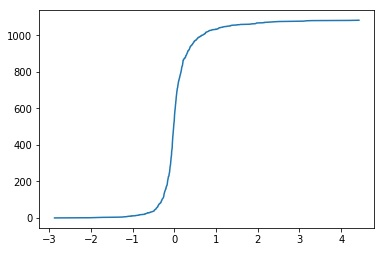

## Demystifying the Language of German Reference Letters with NLP - Part 1

It is a legal obligation in Germany for all companies to provide reference letters for everyone leaving the company. A reference letter is essentially an evaluation, a final certificate, which an employee gets before leaving a company or changing supervisors and serves as a qualification for the next employer by proving two things: did this person really work for the company in the past, and, how good from the company's perspective did she or he perform.

## It's complicated

Now, the last part is tricky. German law and common practice limit the degree of criticality allowed in reference letters. Loosely speaking, expressing sentiment in reference letters may only vary from good to exceptionally excellent. So, in terms of school grades:

| US       | DE         | REF  |
| :---------:|:----------:| :----|
| A | 1.0 | Awesome / Sehr gut |
| B | 2.0 | Good / Gut |
| C | 3.0 | Sufficient / Befriedigend |
| D | 4.0 | D is for Diploma / Ausreichend
| F | 5/6 |

Here are the variations of the same sentence based on its (German) grade:

1.0 - He was always able to find excellent solutions for all problems. 

2.0 - Even for difficult problems, he is already able to come up with good solutions after a short period and always achieves good results.

3.0 - Even for difficult problems, he is already able to come up with good solutions during the preparation of his bachelor thesis and always achieves satisfactory results.

4.0 - Even for difficult problems, he is already able to come up with satisfactory solutions during the preparation of his bachelor thesis and always achieves satisfactory results.

## Mastering reference-speak and the risk of WYOS (writing your own sentence)

People, who write German letters of reference in Germany, must master a special, secret language to say what they really mean about employee performance. One way to be faster about writing these letters is to have a repository of reuse sentences. But, even with a large amount of pre-defined sentences onboard, we will never be able to satisfy all possible specific needs and formulations our customers might require.

So, if a suitable boilerplate sentence isn’t found, authors must write it on their own. The problem occurs when the new sentence is not precisely formulated in accordance with the examples given above, it might change the overall grade of the reference letter. 

Let’s say our author/manager aims to keep a high overall grade for a reference. To do this, she wants to emphasize one more valuable skill in the letter in addition to all the standard texts. If this sentence is not formulated correctly, this change might have the unintended effect of downgrading the whole text. Until now, we were not able evaluate new sentences without human intervention. But with Machine Learning, it becomes possible.

## Machine Learning to predict how good, bad, or ugly a text really is

Thinking about the data we could use for training future ML models and realized that we had a data fortune in the form of pre-defined sentences with assigned grades, which had been created by our Editorial Department. 

In Machine Learning vocabulary, we had (instead of “sentences”) - a “dataset”, and (instead of “assigned grades”) - “labels”. So, we’ve got a labeled dataset, which we can use for supervised Machine Learning. Great!

## Experiment 1 - Sentiment analysis

For the first experiment, we decided to try to detect if a new sentence has a positive or negative connotation, without assigning any certain grade to it. So, an outcome for a given sentence should be ↗️ or ↘️.

### Data preparation

Before starting with a model, we needed to clean the data. After separating English and German sentences, removing general sentences with no grades assigned, dropping duplicates and empty values, we had ~4700 sentences to play with. 

After further analysis, the number boils down to 1100+ unique sentences. The reason is that every sentence is written using two genders and two tenses. Although it clearly limits our corpus, we don’t filter these grammar variations. In the end, it should increase prediction accuracy and eliminate gender biases. 

### Cleansing

We did several things here to make the data more suitable for machine processing:
We did several things here to make the data more suitable for machine processing:
-	We removed all placeholders (things like {Titel} and {Name}) from templates;
-	We removed all punctuation because most of the time it doesn’t carry any additional information;
-	We removed stop words.  
Stop words are words, which make sentences for human beings flow smoothly. Although they are important for humans, often they don’t bring any additional meaning to sentences. Examples of stop words are: ‘is', ‘a', ‘the’ in English and ‘der’, ’sind’, ‘und’ in German.  
One thing to consider here is to exclude some words like ’sehr’ from the stop words list, because in the context of reference letters, such words may appear only in excellent 1.0 grade references, albeit in casual language such words might be used in both ways for ‘very bad’ and ‘very good’.  

- We performed word stemming.  
Ultimately, we want to do lemmatization. Lemmatization is a process of bringing different words or forms of words with the same essential meaning to one. For example, ‘give’-‘gave’-‘given’ results in just ‘give’.   
Stemming in contrast just blindly chops off word endings and suffixes to reduce form variations of the same sense. Thus, ’possibilities’ and ‘possibility’ are reduced to ‘possibiliti’. While lemmatization is more sophisticated and precise algorithm, it is not provided yet for German language from de-facto standard library NLTK for natural language manipulations.

### Pre-processed data

As a result of cleansing, a sentence like

-	Ihre Arbeitsergebnisse sind sowohl qualitativ als auch quantitativ immer gut.

turns into

-	Ihr Arbeitsergebniss sowohl qualitativ quantitativ immer gut

Splitting dataset into negative and positive halves

As it was explained earlier, we have 4 different grades for each sentence. Let’s assume that grades in the range from 1 to 2 are positive, and grades from 3 to 4 are negative. The whole dataset is split in two halves.

### Vectorization

To enable machine to comprehend natural language we need to convert our text to numbers. There are numerous algorithms to do it. For now, we stuck to the basic one called CountVectorizer from the SciKit package. This "converts a collection of text documents to a matrix of token counts” (https://scikit-learn.org/stable/modules/generated/sklearn.feature_extraction.text.CountVectorizer.html).  

### Training

To keep things simple, we use LogisticRegression from SciKit linear models. This approach sets a threshold between two categories (positive and negative in our case) and assigns new data based on its commonalities with a training data to either of these two categories. The Logistic Regression function is represented in the image below:

## Evaluating the model

Below is the example of two, analyzed sentences. Our function basically takes a sentence sentiment score and assigns the text to the negative or positive category. If the value is positive, the sentiment is positive as well, and vice versa.

### Positive example

``Seine Kenntnisse setzte er jederzeit zielgerichtet und äußersterfolgreich in die Praxis um.``

``Total sentence score: 1.338196427322984``

``Sentiment: positive``

### Negative example

``Er beherrschte Arbeitsgebiet entsprechend Anforderungen``

``Total sentence score: -0.14055050424445684``

``Sentiment: negative``

Test sentences were taken from here (https://www.arbeitszeugnisse.de/arbeitszeugnis-formulierungen/arbeitszeugnis-erstellen/).

## Results

We got a model, which identifies a sentiment of a new, unseen sentence, written with respect to the reference letter language. 

The results are promising, and we continue to work on this use case further by improving the model and by applying other approaches and algorithms. If it’s good enough, maybe we can deliver it as a feature to our customers that facilitates reference editing and creation of new templates.

This is only the beginning, so buckle up and stay with us to follow our natural language processing / machine learning endeavor.

