## This little silver box

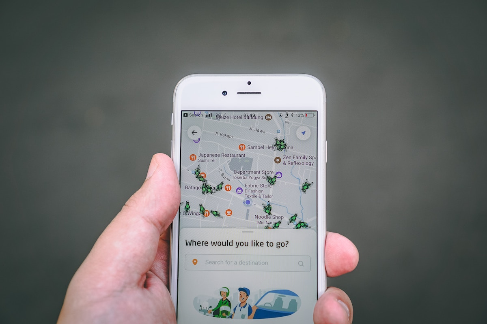
> Photo by Fikri Rasyid on Unsplash

What is your phone really doing?  

More specifically, what are the apps installedo n your phone really doing?  
Do they just sit there? Do they constantly send data to thir servers? 
Do you even know what is sending data where and how often?

I had to answer this question recently for a little pet project. 

I had no intention of rooting my phone, nor did I have unlimited time to 
tinker with its internals (I still need it during the day).

So? How do I do it?

Enter [Wireshark][1]. 
<!--more-->

## Jaws

> Photo by David Clode on Unsplash

Wireshark is a communication packet analysis tool. It has been around for 20 
years now and supports monitoring of almost any computer protocol known to man.  
From Ethernet to Bluetooth to Token Ring and beyond. 
It can filter packets, correlate, introspect, import, export, book cinema tickets, you name it! 

How to install it?  
Very easily, with an installer for Mac and Windows.

You have installed Wireshark on your computer and you are thinking... 

## And now what?

> Photo by Franck V. on Unsplash

There are 2 ways to capture your mobile phone's traffic2 that 
the amateur guy writing this could quickly think of

* Capture wifi traffic  
Your phone and your laptop are part of the same wifi network.

* Mobile phone uses your PC as access point  
Your phone connects to your laptop/machine to access the internet. (if 
your phone and OS support this)

Let's see them in more detail.

### Capture wifi traffic

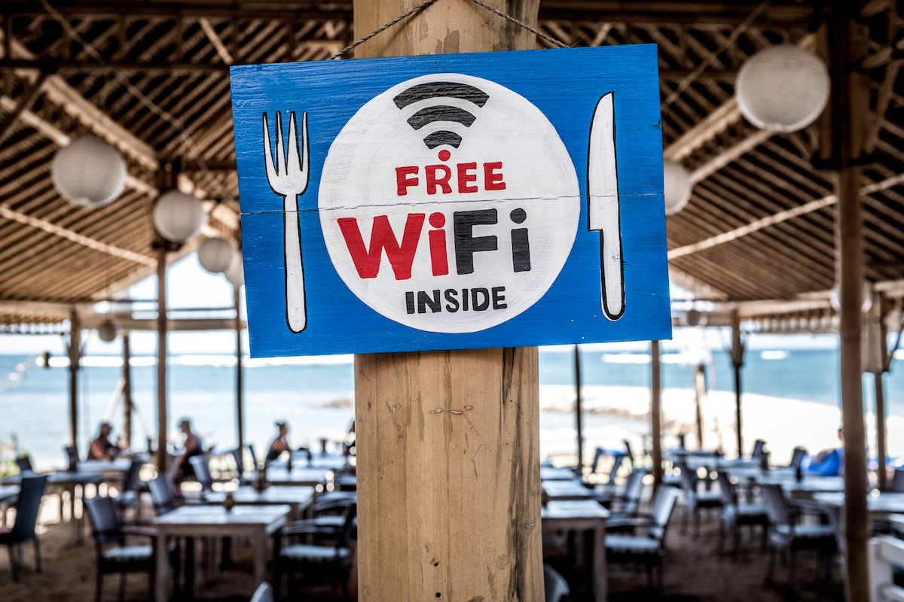
> Photo by Bernard Hermant on Unsplash

To put it in very simplistic words, wireless network is just radio; anyone 
can listen in. However, if it is a password-protected network, then you need the 
wifi password to actually understand who is doing what.

[IEEE 802.11][2] (a.k.a. WLAN, a.k.a. wifi) is the protocol for wireless 
network communications. Packets and 
traffic at this low level can be useful to trouble-shoot network problems. 
E.g. some device is flooding your local airwaves, packets keep dropping off,...  
You need to know what you are doing and looking at at this low level. 

Depending on your laptop and wireless card, you may need to tweak things 
to actually get some meaningful traffic. 

Let's see an example. All screenshots and settings are from a MacBook Pro, 
running MacOS Mojave and Wireshark 3.0.0. Your settings and UI may differ
slightly. 

**What is my laptop's IP?**

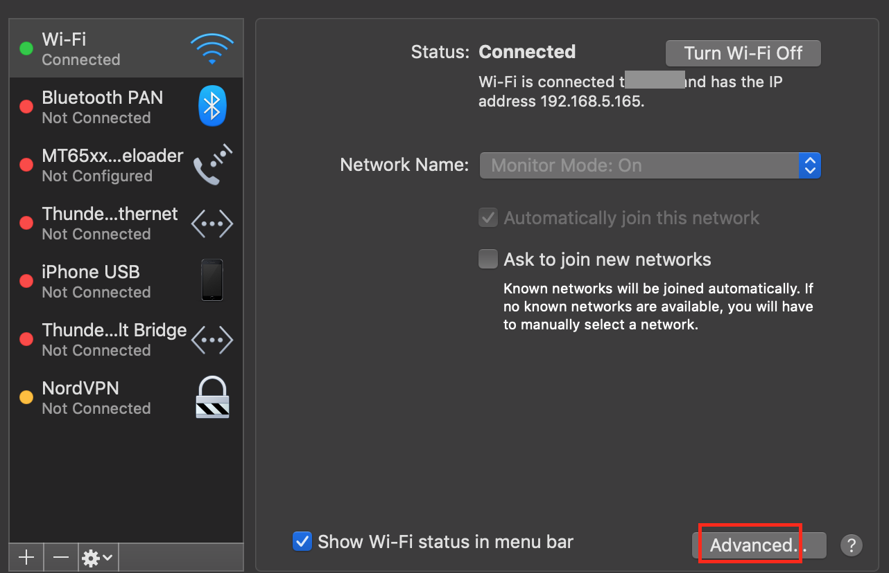  
In the settings screen of your wireless adaptor, select your wifi.

  
Then note down your own IP. You will need this later on.

**What is my phone's IP?**

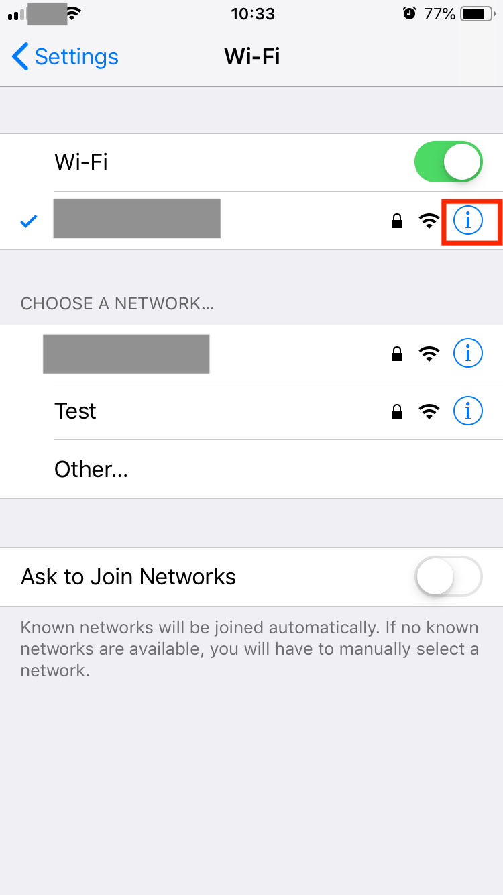  
In the wireless networks of your phone's settings screen , select your wifi.

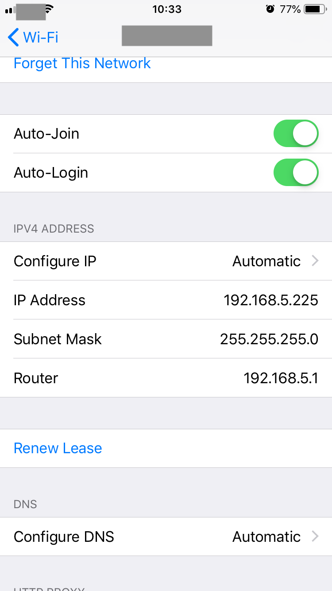  
Then note down your phone's IP. You will need this later on.

**Launch Wireshark**

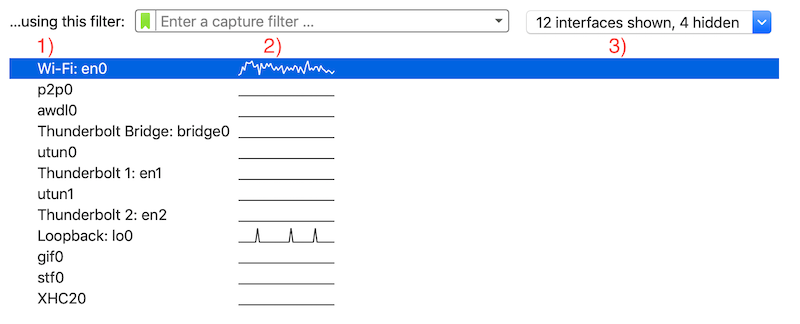  
Launching Wireshark, you will see   
1. A list of all potential sources of traffic
1. If they are currently active or not
1. A drop-down allowing you to show/hide sources  

**Fine-tune capture**

Before we start we will need to fine-tune things a bit.  

  
Select your wireless source and click the settings button

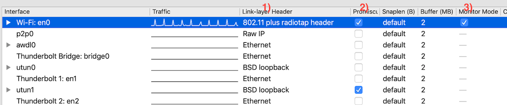  
In the `Input` tab  
1. Select `802.11 plus radiotap`
1. `Promiscuous` mode, i.e. capture all traffic flying around
1. ...and be in `Monitor` mode

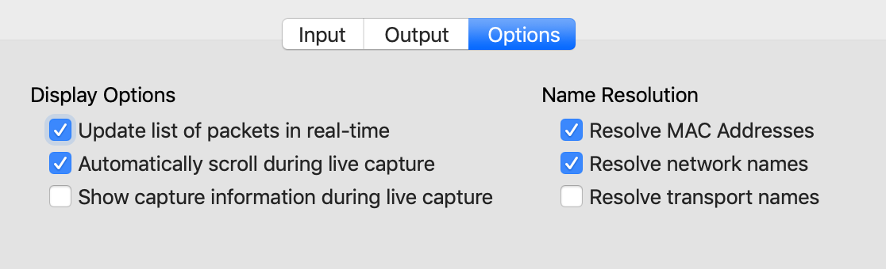  
In the `Options` tab  
* `Resolve MAC addresses`: As Wireshark encounters network traffic identifying 
hardware it starts remembering and showing the names of devices
* `Resolve network names`: On a similar manner, it remembers and shows 
host names (www.foobar.com), rather than IPs (2.1.1.234)

**Wifi settings**

There is one last thing to capturing wifi traffic: being able to decrypt it. 

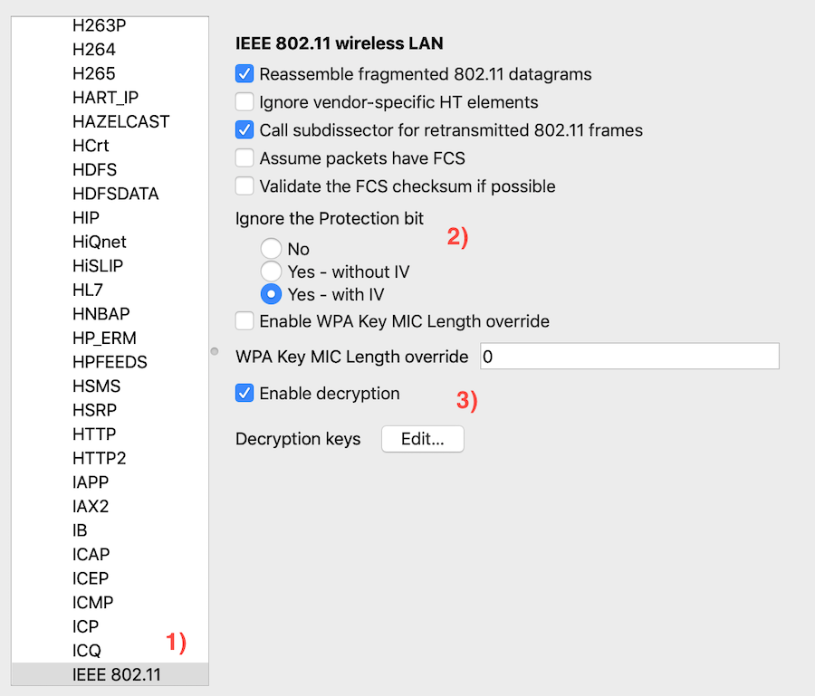  
Go to the `Preferences` menu  
1. In the `Protocols` list, find `IEEE 802.11`
1. Select `Yes - with IV` (you may need a different setting for your machine!)
1. (Only if your wifi has a password) `Enable deryption` and click `Edit`

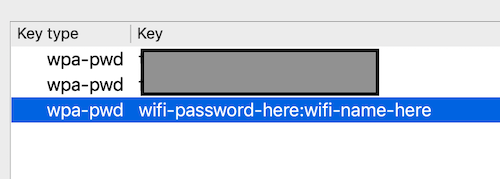  
Select `WEP` (really old) or `WPA` (most likely), according to your wifi's settings.  
The format of typing the wifi password is `password:wifiName`, e.g. 'superman3:Netgear-3e45'.  
This way you can have settings for more than one wireless network. 

**Start capture**

Double-click the Wireless adapter from the list to start capturing traffic.

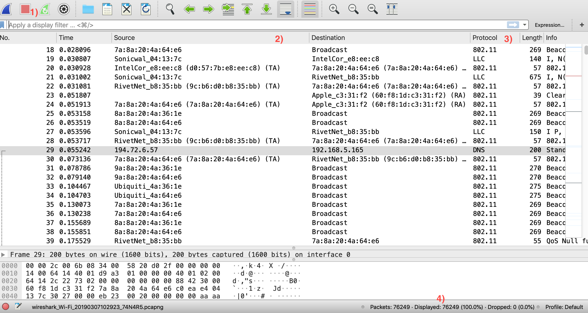  
1. The top-left buttons allow you to start/stop/restart capture
1. Each packet has an identified source and destination
1. ...according to its recognized protocol. This will help you identify 
what you are looking for
1. Finally, bottom-right you can see the packets captured. 

Unless you are in a really-really quiet network (home alone, no other 
devices), you will need to filter information.

**Ignore 802.11 management packets**

  
You can focus only on IP packets by filtering for that protocol.  
Wireshark has a [query language and thousands of fields to filter on][3]. 

**Ignore my laptop's traffic**   

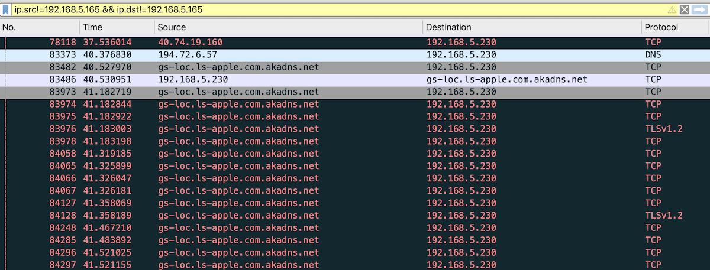  
You can further filter by ignoring your own machine's traffic (from and to).  
Or you can just filter for the traffic from/to your mobile phone.  
These are the IPs we noted down earlier. 

You will now start seeing traffic coming in with locl and remote host names.

**Are we ready to hack now?**

Well, almost there!

The last thing to start properly seeing your phone's (or any device's) traffic is 
to 'witness' a full [EAPOL handshake][4].  
In plain English, the device has to (re-)join the wifi while you are capturing
and you get all 4 packets of the handshake.

In the case of a phone that means switching on the wifi, when coming out
of sleep mode. Even then there is chance that your device renegotiates and you have to 
switch off/on again.

### PC as gateway

> Photo by Parth Vyas on Unsplash

The above is too much work.  
A couple of planets need to align, plus the network needs to be quiet, esp.
if you are [grasping at straws][5].

An easier way is to use your laptop as a gateway, if your OS supports it.  
In plain English, share your laptop's internet connection with your phone 
(rather than the other way around).

**Share laptop connection**

After enabling your laptop's Bluetooth connection...

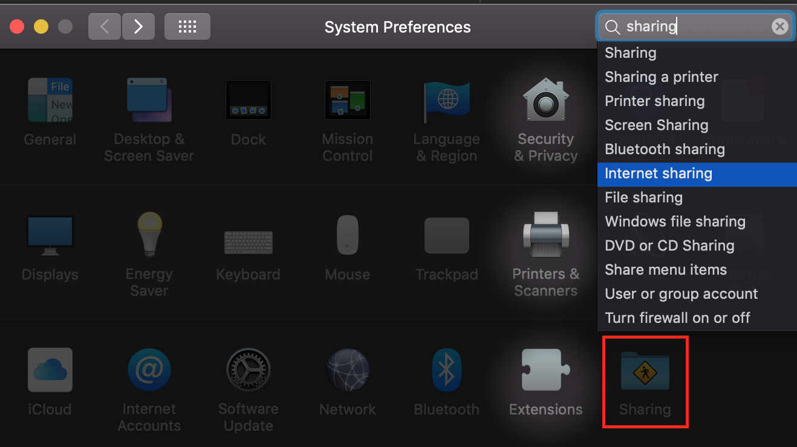  
In your Settings dialog, find the `Sharing` section.  

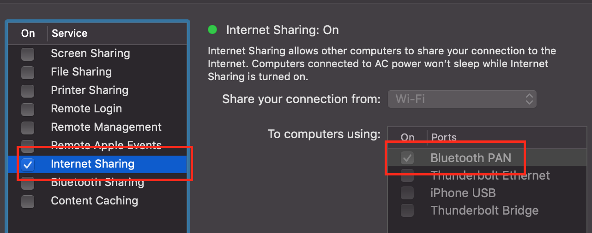  
Select `Internet sharing` from `Bluetooth` (or another combination which 
would work for you).  

**Connect from phone**

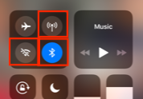  
On your phone, switch off all connections, including mobile data.  
Leave only Blueetooth on.

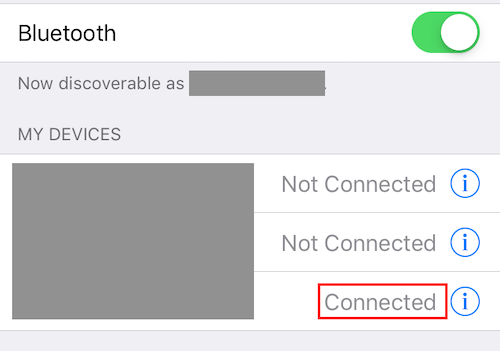  
Connect to your laptop.  

**...and profit!**

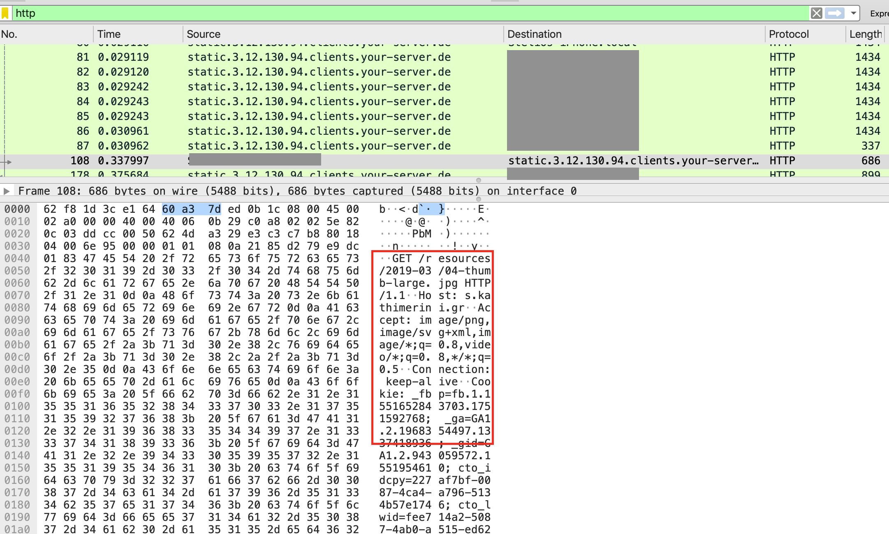  
You can immediately see traffic from/to your phone.  

You can now start filtering/dissecting for what you are looking for.   

## Parting thought

> Photo by Maria Teneva on Unsplash

For many of us, our phones may be worth much-much more than their monetary 
value.  
Taking an occasional look on what goes in and out does not hurt.

Happy 'sharking! 

   [1]: https://www.wireshark.org/
   [2]: https://en.wikipedia.org/wiki/IEEE_802.11
   [3]: https://wiki.wireshark.org/CaptureFilters
   [4]: https://wiki.wireshark.org/HowToDecrypt802.11
   [5]: https://idioms.thefreedictionary.com/grasping+at+straws 
   