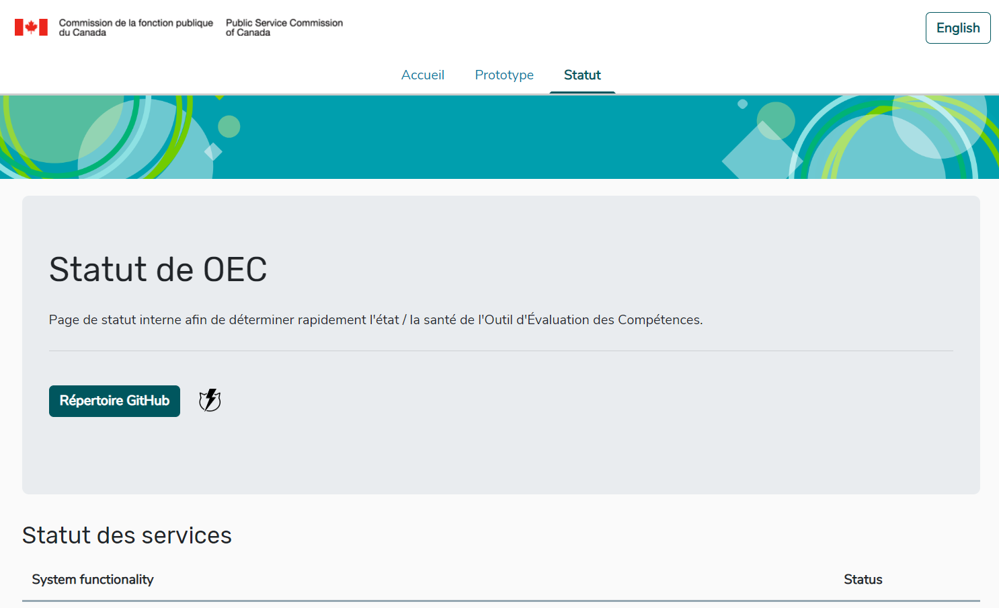
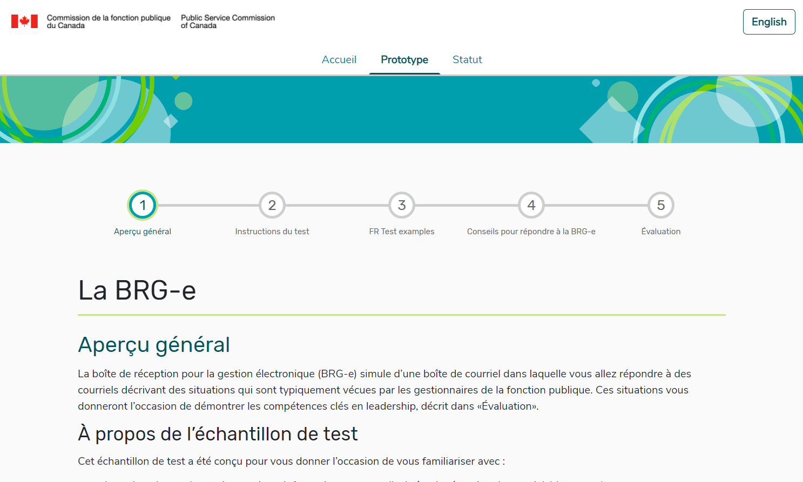

La dernière fois, nous avons parlé de la fin de notre période de découverte. Depuis lors, nous avons rapidement entamé l’étape de conception de ce projet. Jusqu’à la fin juin, nous travaillerons sur la mise en place des caractéristiques du produit par le moyen de la conception, du développement, de la mise à l’essai et de l’itération. 
Puisque nous sommes la première équipe de développement de logiciels agiles au sein de la Commission de la fonction publique, nous avons pensé que la présente mise à jour servirait mieux à discuter de la manière dont nous travaillons.
Au tout début, il y avait un certain nombre de grands éléments qu’on nous a demandé de développer. Ces grands éléments sont appelés initiatives épiques. À partir de ces dernières, nous expliquons chaque caractéristique dans un récit d’utilisateur (description courte et simple des caractéristiques, du point de vue de la personne qui effectuera la tâche). L’idée de résumer une initiative épique est de fournir à l’équipe de produit des caractéristiques réalisables qui peuvent être achevées lors du cycle de sprint.
Les récits d’utilisateurs prennent habituellement la forme suivante :

Comme **[utilisateur]**, je voudrais **[objectif/caractéristique]** pour pouvoir **[poser un acte]**.
Ainsi, un exemple d’initiatique épique serait de « concevoir une simulation de boîte de réception », et le récit d’utilisateur afférent serait : « Je veux utiliser une boîte de réception qui a les fonctionnalités Répondre, Répondre à tous et Transférer. »
Nous travaillons selon des cycles de sprint de deux semaines. Le vendredi précédant le début d’un sprint, nous commençons l’établissement d’objectifs, et ces derniers sont les récits d’utilisateur que nous voulons mettre en œuvre durant le sprint.
Nous choisissions nos principales priorités (déterminées par les équipes de la TI et des opérations et notre équipe, c.-à-d. celle du produit), et nous nous mettons au travail. Puisque nous nous sommes lancés dans un projet qui comprenait déjà des maquettes conceptuelles, nous commençons par le marquage et la vérification de celles-ci par rapport aux pratiques exemplaires en matière de recherche, d’accessibilité et de conception de notre utilisateur, ainsi que par rapport aux caractéristiques prioritaires que nous avons déterminées.
Ensuite, nous créons un ensemble de modèles et prévoyons nos articles de travail. Ceux-ci appartiennent à l’une des trois catégories suivantes : travail sur les caractéristiques, processus et formation, déploiement.

Jusque-là, nous avons mis au point les versions initiales :
-	de la page d’accueil;
-	des directives du test préalable;
-	des documents de référence du test;
-	de la possibilité d’afficher le contenu du test en français et en anglais;
-	d’un bloc-notes à utiliser durant le test;
-	d’une page d’état qui vérifie le bon fonctionnement de la plateforme OEC.

 
Page de statut du système OEC

  
Exemple de directives de test dans BRG-e

 
Écrans de renseignements généraux de l’échantillon de test BRG-e comprenant un bloc-notes fixe

