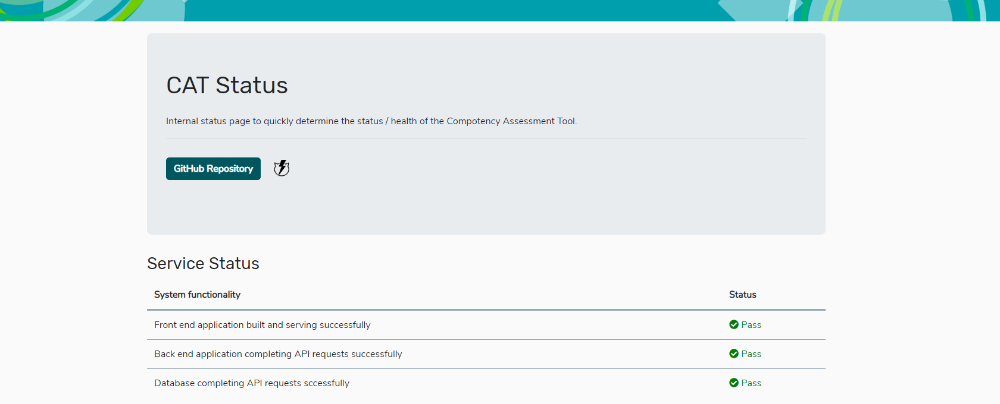
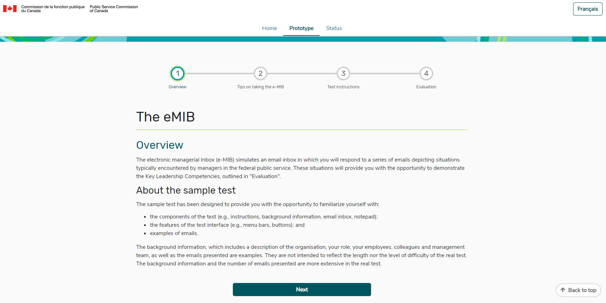
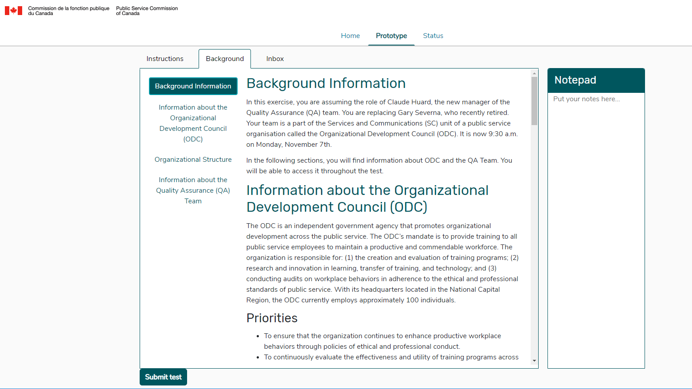

At our last check-in, we talked about the [end of our Discovery period](https://code-for-canada.github.io/psc-updates/update-4/ "End of Discovery!"). Since then, we’ve quickly moved into the build phase of this project. Until the end of June we’ll be working on product feature implementation through design, build, test, and iteration. 
Since we’re the first agile software development team at the PSC, we thought this update would best serve to talk about how we work.
When we first arrived, we were given a number of high-level items that we were asked to build. These large items are called Epics. From these, we break each feature into a User Story (short, simple descriptions of features, told from the perspective of the person who would be taking an action). The idea of breaking down an epic is to give the product team implementable features that can be completed during the sprint cycle.  

User stories typically take the following pattern:

As a <strong>[user]</strong>, I want a <strong>[goal / feature]</strong> so that I can <strong>[take an action]</strong>.
So, for example, an epic might be “build an inbox simulation”, and a user story from that might be, “I want to use an inbox that has reply, reply all and forward functionality.”
We work in two-week sprint cycles. The Friday before a sprint starts, we start by setting goals. Our goals are the user stories we aim to implement during the sprint.
We pick our highest priority items (identified by IT, business and us, the product team), and get to work. Because we walked into a project that had existing wireframes, we start by marking those up and checking them against our user research, accessibility and design best practices, and priority features that we’ve identified.
Next, we make a set of designs, and plan our work items. Work items fall into 1 of 3 categories: feature work, processes and training, and deployment.

So far, we’ve built initial versions of:
-	A homepage
-	The pre-test instructions
-	Test background information
-	Ability to view the test content in English and French
-	A notepad for use throughout the test
-	A status page that checks the health of the CAT platform

 
CAT system status page

eMIB sample test instructions

Background Information screens from the eMIB sample test, featuring a static notepad.

