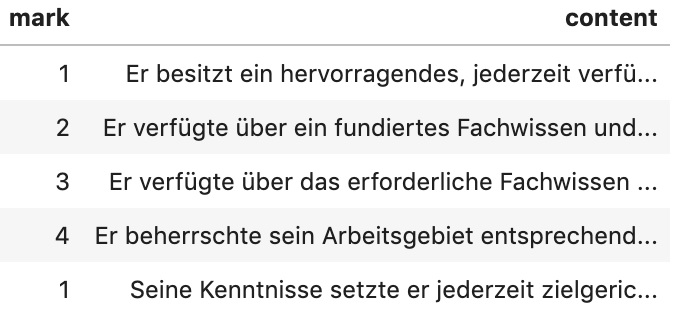

## Logistic classification of German reference letters

In the [part 1](http://work.haufegroup.io/german-zuegnisse-no-fooling-nlp/) we covered some ground about why German reference letters are so special, how the reference letter language is controlled writing and the constraints for employers when writing reference letters. We also described how Machine Learning helps to crack the Aesopian language and shows what the fuzzily formulated sentences in these references really mean.

If you missed it, I encourage you to read the [part 1](http://work.haufegroup.io/german-zuegnisse-no-fooling-nlp/) now, before diving into this article. 

## Evolving the model to better answer the question

Moving on from predicting sentiment, we take our approach to the next level. Unlike the first experiment, where we could only predict if the sentence is more likely to be positive or negative, we have now assigned  scores to each sentence. 

As a result, we’ve got all sentences from the employee’s assessment evaluated with assigned scores to them. With sentence rankings, it is no longer rocket science to figure out how good the overall score of the reference letter is.

Just like in the first article, we have a very clean and legally verified dataset with labeled sentences from our editorial department, which serves as a ground truth for the model. We decided to use the same scoring system as in our dataset, where the highest score is 1 and the lowest is 4. There are no intermediate values between scores.

## Sorting and finding bordering indices

The key idea is to consider the four scores as four clusters. Let’s walk through the technical details of the process.

This is how the data look like in the beginning:

 We sort the whole dataset by score. Now it is easy to find border indices of scores and divide the dataset into four data sets. These data sets correspond to our four score clusters.

As usual, we need to convert from words to numbers. Before we do that, we need to clean the data. Processing steps here are documents that are not strings, are too short and/or not written in German. Then, we remove punctuation and transform every word to lower case.

As a last step before training, we apply a simple CountVectorizer to convert our words into numerical form. As a very common measure to offset frequently appearing words in general from the words specific to the particular corpus we also apply the TF-IDF algorithm. Now we are ready to start training.

Just like in the first experiment, we select the logistic regression method. The assumption is that if it performs well for sentiment analysis, it should perform in a similar way for clustering too. The most probable reason why it works well is that the whole palette of reference letter sentences is more or less linearly distributed. Mostly, there is not much room for special wordings and tricks that would alter the scores.

## From predicting sentiment to predicting a score

Using this approach we have created a classifier and can assign scores to new unseen sentences with an accuracy of about 63%. The accuracy was measured by testing the model against scored sentences found on professional HR websites. By prediction errors, the algorithm makes no degree distinction between being off by one degree - predicting a 2 instead of a 1 - or by two degrees - predicting a 3 instead of a 1. Even after manual analysis, it is not always clear for the human eye why the ground truth sentence was evaluated as 1 and not 2. One reason for errors could be that training sentences may have been labelled "incorrectly" because people interpret text differently.

Here is the example in German how the classifier evaluates very similar sentences.

| Score |	Sentence |
| :----: | :---- |
|  [1]	|	Seine Kenntnisse setzte er jederzeit zielgerichtet und äußerst |erfolgreich in die Praxis um. |
|  [2]	|	Seine Kenntnisse setzte er jederzeit zielgerichtet und erfolgreich in die Praxis um. |
|  [3]	|	Seine Kenntnisse setzte er zielgerichtet und erfolgreich in die Praxis um. |
|  [4]	|	Seine Kenntnisse setzte er erfolgreich in die Praxis um. |

There is also another important limitation that I must mention. The model was only exposed to the sentences from the reference letter world. Thus, it is biased towards specific words and formulations and may fail horribly if somebody tries to test sentences that contain different writing styles. For example, in real reference letters the word “very” or “sehr” in German, may only appear in exceptionally good assessments. There’s no such a thing as “the employee worked very bad”. 

It is also forbidden by law to include such extreme sentences in reference letters. So if a sentence with "very bad" is fed in, the model might pick up words like “very” and since the model has never encountered words like "bad", may assign a score of 1: i.e. the model is only performant for texts that conform to the legal constraints of German reference letters, and, would have to be retrained to fit different kinds of texts. 

## Next steps: scrubbing irrelevant and wrong data away

Further experiments focus on confidentiality evaluations. Sentences should be redacted and cleansed first before being fed into the classifier. It will help to separate sentences, which don’t fulfill legal requirements and also those, which are not part of the assessment, like company or role description.

Despite the results we’ve gotten so far, it still feels more like a beginning. Stay with us, we are not done yet.
