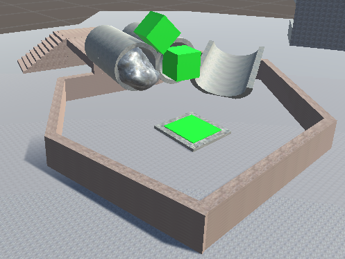

We need more level!

# Different level

There have only been one levelformat that have been discussed in the blog before.
There was the first and second level, in which you have to upgrade yourself in order to gain new skills.
And the tutorial has a similar format with the difference that the purpose of it is to show the player the basic mechanics.

The game cannot only consists of these level, since there are only so much upgrades you can do.
To get more level, there will be level which unlock new areas that you couldn't do before.
These level will all follow one design principle.
You have to use the abilities you learned in order to pass the level. Without these abilities the level will be impossible to complete. 

We have created a level that follows this and opens up a new area (which is not existing yet) where you will need you skills ofmthe first area.

On the left you see the door that blocks the new area and in order to open it you have to prss the button on the far right.
This level can only be completed with the "pickup" skill since you need a cube on order to open the door to access the other button.
The entry challenge are stairs where you have to lift up a cube. The cube will be spawned at the start of the level.

On order to unlock the area door button you have to solve a simple puzzle. The puzzle is designed to not show the solution right off the bat but in reality the solution is extremly simple.

The puzzle looks like this:

It look like you have to somehow push the cube from the pipe or the cube on top of the pipe. An other option could be to use the ramp on order to slide the cube on the button. In reality both won't work! You will simply have to drive up the stairs with a cube in hand (that you picked up earlier) and drive over the wall into the area with the cube. The ramp is your escape from the area so you can continue the game and yre not trapped.

# Time invested

Time: 3h