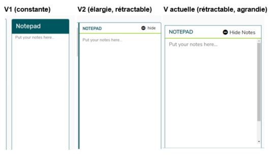

L’itération constitue l’une des pierres angulaires du développement agile, ainsi qu’un atout pour n’importe quelle équipe agile. 

L’utilisation d’une méthode agile pour livrer un produit numérique présente des avantages intéressants. Le plus important est la priorité accordée à la participation du client et de l’utilisateur. Quand vous essayez d’introduire de nouvelles façons de travailler, l’un des principes de base du programme de d’associé de Code for Canada, la participation du client et de l’utilisateur est cruciale. 

## Notre mode de fonctionnement

Nous travaillons selon des cycles de sprint de deux semaines. Toutes les deux semaines, nous livrons un élément de logiciel **utilisable**, qui peut être mis à l’essai auprès de vrais utilisateurs. Nous effectuons des mises à l’essai de produits durant chaque cycle, ce qui nous aide à vérifier notre travail, et à effectuer des changements d’après les commentaires tirés de situations réelles.

Au cours du projet, l’une des plus grandes difficultés que nous avons éprouvées était de repousser les traditionnelles exigences opérationnelles en cascade. Le fait de travailler selon une approche agile implique de se servir de petites itérations rapides. Il s’agit d’une adaptation qui peut être déroutante, mais c’est aussi un mécanisme très important dans l’évaluation et la réduction des risques. Même s’il peut sembler souvent que nous n’avons pas de « plan » ou de réponses pour les questions difficiles, en réalité, nous essayons de nous montrer suffisamment souples pour être capables de modifier notre version, au besoin. Il ne serait pas possible d’agir ainsi dans un environnement en cascade.

Nous utilisons la méthode de la mise à l’essai de produits pour avoir une meilleure idée des éléments que nous devons concevoir.

**Mise à l’essai de produits 101**

Quand on nous demande pourquoi nous effectuons la **mise à l’essai de produits**, nous répondons qu’il s’agit de la meilleure façon pour nous de nous assurer que nous concevons quelque chose d’utilisable et de centré sur les besoins des utilisateurs. Dans le cas de la BRG-e, même s’il y a un certain nombre de spécifications importantes relatives au contenu, puisqu’il s’agit d’une simulation interactive, il est essentiel que la plateforme de test elle même soit facile à utiliser.

La mise à l’essai de produits nous aide à :

-	valider les choix de conception auprès de vrais utilisateurs;
-	obtenir de la rétroaction sur le produit pendant sa conception et non après qu’il est terminé;
-	nous rappeler que nous ne sommes pas les utilisateurs du produit;
-	tester des hypothèses et des conceptions différentes, afin de voir ce qui fonctionne le mieux.

Nous voulons offrir aux utilisateurs une expérience qui leur permet de concentrer leur énergie en vue de réussir dans le cadre du test, ce qui nécessite de réduire le plus possible le nombre d’obstacles à l’intégration du produit.

Certaines de nos séances de mise à l’essai menées jusqu’ici ont révélé que la fonction du bloc notes était trop étroite, que la navigation n’était pas compatible avec un lecteur d’écran, que nous devions permettre aux utilisateurs de zoomer dans les organigrammes, et que les utilisateurs ne savaient pas vraiment où ils devaient se rendre après avoir terminé de lire les instructions. 

Ces commentaires précieux nous ont aidés à produire de meilleures itérations de la BRG-e, lesquelles montrent des améliorations mesurables par rapport aux premières versions.

Par exemple, voyez à quel point notre bloc notes a changé depuis notre première itération :

Il y a quelques étapes simples à suivre afin de mettre à l’essai un produit.

**1. Mettre au point un prototype fonctionnel.** Vous pouvez effectuer vos tests sur quelque chose d’aussi rudimentaire qu’une feuille de papier, ou au moyen d’une application comme Figma, ou en codant directement, ce que nous avons fait la plupart du temps.

**2. Créer un script.** Ayez une idée de ce que vous voulez évaluer avant de faire appel à un utilisateur. Par exemple, nos premiers tests pour la BRG-e étaient uniquement axés sur la vitesse à laquelle les personnes lisaient les consignes pour le test et d’autres renseignements généraux. Actuellement, nous testons des changements plus subtils apportés aux fonctions de la boîte de réception. Dans chacun des cas, nous avons demandé à des utilisateurs de jouer le rôle de la personne qui subit le test. Nous les avons chronométrés, et les avons placés dans un local tranquille avec le test en mode plein écran, afin de mieux simuler un environnement de mise à l’essai;.

**3. Tenir des statistiques.** Il est important de savoir de quelle manière vous évaluerez les résultats de votre test. Souhaitez-vous réduire le nombre de clics ou améliorer le temps par page? Dans quelques-unes de nos séances de mises à l’essai, nous avons mesuré le temps qu’il fallait pour lire les renseignements généraux, et si les améliorations apportées à l’intégration contribuaient à diminuer le temps requis. Cette méthode nous a donné une bonne idée si ces changements fonctionnaient, car nous voulions que l’interface soit la plus conviviale possible pour un nouvel utilisateur.

**4. Analyser.** La partie la plus importante et la plus amusante de la mise à l’essai de produit, c’est d’apprendre quelque chose de nouveau grâce à un utilisateur réel. Si vous avez l’intention de solliciter des commentaires, il est important de compiler ces commentaires, de trouver les problèmes que les utilisateurs rencontrent le plus souvent et de bâtir un plan pour améliorer le produit.

**5. Effectuer des itérations.** Maintenant que vous savez ce qui doit être réglé, faites le! Vous pourriez vouloir procéder de nouveau à une mise à l’essai de produits sur les fonctions que vous aviez déjà testées, mais auxquelles vous aurez apporté de nouveaux changements, ou vous pourriez vouloir mener quelques tests A/B afin de déterminer quel changement donne les meilleurs résultats. 

Vous pouvez accéder à beaucoup de ressources intéressantes en mettant votre produit à l’essai. Nous considérons qu’il s’agit d’une pratique capitale qui devrait être introduite au sein du gouvernement numérique, et nous espérons que la CFP poursuivra dans cette voie au terme de notre mandat en tant que fellows.

