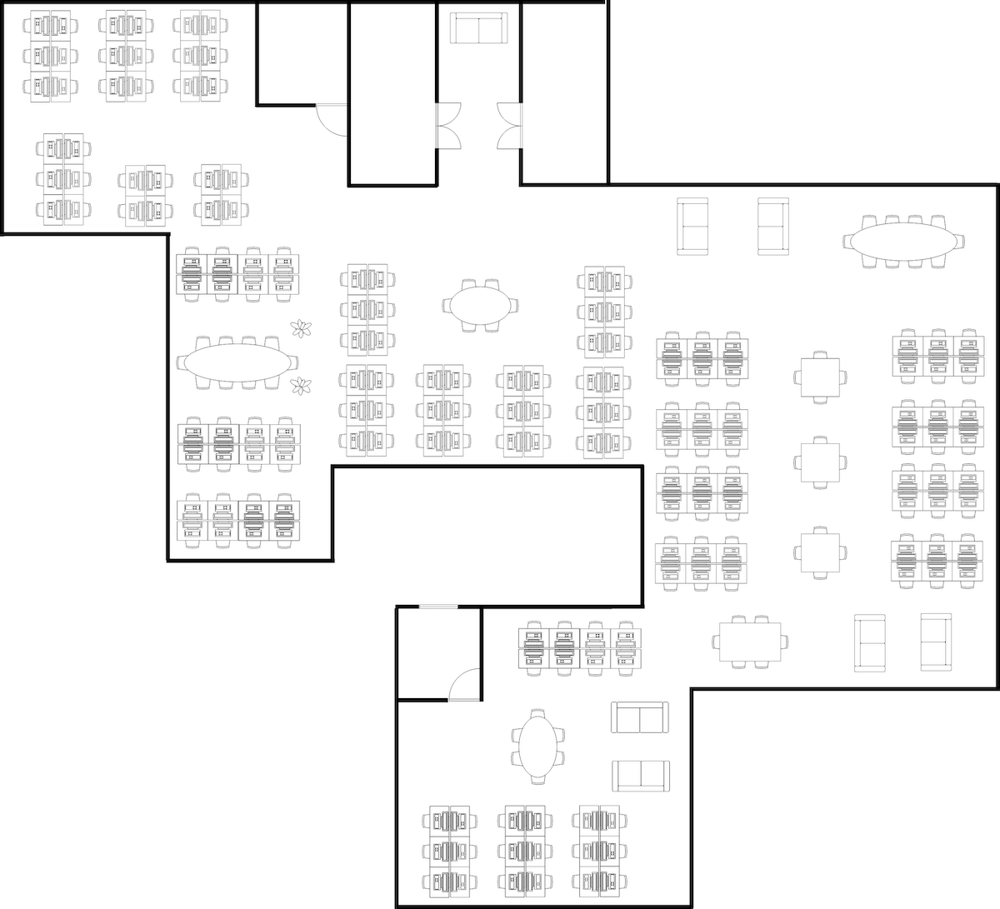
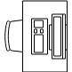
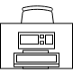
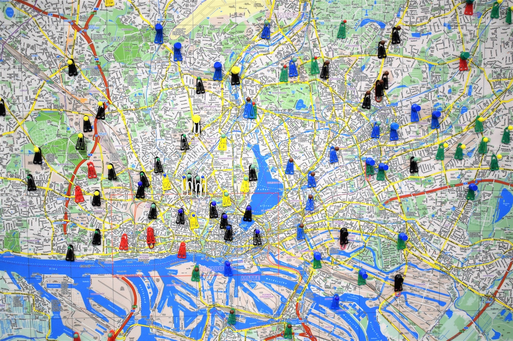

A fast-growing company has all kinds of good problems.  
One of them (admittedly the smallest) is the frequent question of new-joiners:  "where does everyone sit in this new office?".  

Luckily, regular [hackathons][1] give the opportunity to address all the issues (big or small) stacking up.

This post will show a slightly expanded version of a desk reservation prototype we worked on during that day, using 
some simple image processing and a Kotlin [Spring][2] back-end.

## Problem statement


> Photo by Shridhar Gupta on Unsplash

My current company is expanding rapidly, changing into bigger offices.   
It has also launched a number of new regional offices, which will soon also expand themselves. 

New joiners (including myself) are faced with a few weeks/months of having to ask repeatedly "where do you sit?", until 
they get their bearings. 
 
In an ideal world, we would need a system offering a view of the office's floor plan with the names of everyone on it. 

There is already a number of [systems][17] [out there][18], which do this and [much more][19] (desk reservation, 
meeting room reservation,...). 

However, they have 2 slight drawbacks:  
* they require someone to create the layout plan in them
* they cost money :-)
 
Is there a way to create something quickly and update with the new office(s), as and when they expand? 

Things that we could readily use: 
* The company is already using a cloud identity provider, so we can re-use that for employee information
* Each office has an architect's layout plan available, so we could piggy-back on that

The [MVP][20] would offer 2 core pieces of functionality:   
* Show where each colleague sits
* Allow everyone to name their desks in a self-serve fashion. 

In the future, it could even be expanded to facilitate hot-desking, i.e. connect with the HR's leave system and indicate 
which desks are available for the day. As the company keeps expanding, we will need to better utilize the existing space.

## Desk detection


> Photo by Kobu Agency on Unsplash

First problem to solve is how to best digitize the layout of the office(s). 

The image below shows an example of how the floor layout looks like.


> Semi-realistic floor layout 

Can we easily use the floor plan image as is?  
With a tiny sprinkle of [computer vision][3] it appears we can! 

What we need to do is process the layout image for [template matching][5], with the desks being the templates.

In a [proper-proper image processing setup][6] one would need a [rotation][7] [and][8] [scale][9]-[invariant][10] 
[template][11] matching. 

But this is a hackathon and we can get away with  
* building on a [basic example][4] of template matching and 
* extracting the templates ourselves with a little bit of select-copy-paste from the big image



> Examples of desk templates

### Initial run

The initial code of our Python template matching (slightly adapted from the [example above][4]) looks like this

*OpenCV template matching with 4 templates*

```python

import cv2 as cv
import numpy as np

def process_image():

    img_rgb = cv.imread('./floors/floor.png')
    img_gray = cv.cvtColor(img_rgb, cv.COLOR_BGR2GRAY)

    search_template(img_rgb, img_gray, './templates/desk_1.png', (0, 0, 255))
    search_template(img_rgb, img_gray, './templates/desk_2.png', (0, 255, 0))
    search_template(img_rgb, img_gray, './templates/desk_3.png', (255, 0, 0))
    search_template(img_rgb, img_gray, './templates/desk_4.png', (100, 0, 255))

    cv.imwrite('./output/floor_output.png', img_rgb)


def search_template(floor_image_rgb, floor_image_gray, template_name, color):
    template = cv.imread(template_name, 0)
    w, h = template.shape[::-1]

    res = cv.matchTemplate(floor_image_gray, template, cv.TM_CCOEFF_NORMED)
    threshold = 0.5
    loc = np.where(res >= threshold)

    desk_count = 0

    for pt in zip(*loc[::-1]):
        cv.rectangle(floor_image_rgb, pt, (pt[0] + w, pt[1] + h), color, 1)
        desk_count += 1

    print("Found {} desks, color {}".format(desk_count, color))

def p_to_s(point):
    return '{}_{}'.format(point[0], point[1])

if __name__ == "__main__":
    process_image()
```

This renders the 4 templates onto the image and counts how many desks we have detected.  
We start with an initial threshold of `0.5`. 

The first run prints out  
```
Found 1063 desks, color (0, 0, 255)
Found 176 desks, color (0, 255, 0)
Found 1025 desks, color (255, 0, 0)
Found 162 desks, color (100, 0, 255)
```

WOT?!?  
Almost 2,500 desks?!

The `floor_output.png` image looks like this


> Initial template matching 

The thickness of the lines gives an indication of what is happening.  
Our matcher is matching the same desks (give or take a few pixels) over and over again.

Let's increase threshold to `0.9`. 


> Template matching 2nd attempt 

Now half the desks have not been matched. 

### Improved version

A few more attempts to change it, will show that the threshold alone is not enough to give us the right number of 
template matches.  
We actually need to ignore the area of the last matched template so as to detect things only once.  

Continuing this [StackOverflow-driven-development][12] approach, the code changes slightly 

*Improved OpenCV template matching code*

```python

import cv2 as cv
import numpy as np

def process_image():

    img_rgb = cv.imread('./floors/floor.png')
    img_gray = cv.cvtColor(img_rgb, cv.COLOR_BGR2GRAY)

    search_template(img_rgb, img_gray, './templates/desk_1.png', (0, 0, 255))
    search_template(img_rgb, img_gray, './templates/desk_2.png', (0, 255, 0))
    search_template(img_rgb, img_gray, './templates/desk_3.png', (255, 0, 0))
    search_template(img_rgb, img_gray, './templates/desk_4.png', (100, 0, 255))

    cv.imwrite('./output/floor_output.png', img_rgb)


def search_template(floor_image_rgb, floor_image_gray, template_name, color):
    template = cv.imread(template_name, 0)
    w, h = template.shape[::-1]

    res = cv.matchTemplate(floor_image_gray, template, cv.TM_CCOEFF_NORMED)
    threshold = 0.5
    loc = np.where(res >= threshold)

    desk_count = 0

    mask = np.zeros(floor_image_rgb.shape[:2], np.uint8)

    for pt in zip(*loc[::-1]):
        if mask[pt[1] + h/2, pt[0] + w/2] != 255:
            mask[pt[1]:pt[1]+h, pt[0]:pt[0]+w] = 255
            cv.rectangle(floor_image_rgb, pt, (pt[0] + w, pt[1] + h), color, 1)
            desk_count += 1

    print("Found {} desks, color {}".format(desk_count, color))

if __name__ == "__main__":
    process_image()
```
 

We have now added a mask which we update each time we find a match.  
This "blacks out" that area, making sure we do not have multiple matches close to each other.

This improved code now prints

```
Found 43 desks, color (0, 0, 255)
Found 40 desks, color (0, 255, 0)
Found 43 desks, color (255, 0, 0)
Found 40 desks, color (100, 0, 255)
```

And the output is


> Template matching 3rd attempt 

166 matched desks, compared to the 148 actual.  
Much better! 

We can play around with the value of the threshold and/or the creation of the mask.  
But this is a hackathon, so we can pause here. 

## Image maps


> Photo by Waldemar Brandt on Unsplash

The reason we are detecting the desks is not just to highlight them on the floor plan image.

It will get much more interesting once we make that image dynamic and interactive.  
Think hovering above a desk and seeing the name of the colleague sitting there, clicking to fill in a form etc.

There are 2 ways of achieving this.

**SVG** 

[SVG files][13] are [widely supported][14] and a [great way][16] to present raster information on a [variety][15] of 
devices.  
If there is a way of exporting the source image in SVG format, then the located desks can become "hot rectangles" with an 
attached Javascript action. 

The Python code could then inject something like this in the SVG, whenever it detects a template. 

```python
  print('<a onclick="doSomething(\'{}\')">'.format(idGen(pt)))
  print('<rect id="{}" fill="#00D300" opacity="0.2" x="{}" y="{}" width="{}" height="{}"/>'.format(idGen(pt), pt[0], pt[1], w, h))
  print('</a>')
```

This would inject in the SVG file an "actionable" rectangle for every located desk.  
The desk would get a unique id, passed in the method `doSomething`. 

Unfortunately this would only work well if we had access to the original drawing of the floor plan (e.g. in Visio).  
This way we would be able to save as SVG, without any loss of quality.  

Anything else (e.g. converting from JPEG) would result in an unclear image at best, mangled at worst, especially if the 
source image is low quality or pixelated. This is due to the nature of raster graphics.

**Image map** 

Another way is to create a [image map][21] and [super-impose][22] it on our floor plan image.  
This would achieve the same effect of creating "hot spots" over the desks. 

The Python code would generate it upfront by printing something similar to 

```python
  print('<map name="mapname">') # outside of the detection loop

  # inside the detection loop
  print('<area shape="rect" coords="{}" onclick="doSomething(\'{}\')"  >'.format(toCoords(pt), idGen(pt))

  print('</map>') # outside of the detection loop
```

This would create a series of rectangular hot spots. 

The main downside of image maps is that by themselves [they are not responsive][23].  
One would need to use a [jQuery plugin][24] and still have to test. 

In our case, to keep things simple, we are going for vanilla image maps, accessible on desktop device.


**In the next article**  
We will take a look at the back-end microservice.  


   [1]: https://en.wikipedia.org/wiki/Hackathon
   [2]: https://spring.io/
   [3]: https://en.wikipedia.org/wiki/Computer_vision
   [4]: https://docs.opencv.org/trunk/d4/dc6/tutorial_py_template_matching.html
   [5]: https://en.wikipedia.org/wiki/Template_matching
   [6]: https://en.wikipedia.org/wiki/Mass_surveillance_in_China#Camera_surveillance
   [7]: https://arxiv.org/abs/1707.05647
   [8]: https://dsp.stackexchange.com/questions/6194/scale-and-rotation-invariant-template-matching
   [9]: https://link.springer.com/content/pdf/10.1007/978-3-540-77129-6_13.pdf
   [10]: https://www.sciencedirect.com/science/article/abs/pii/S0031320308000344
   [11]: https://www.pyimagesearch.com/2015/01/26/multi-scale-template-matching-using-python-opencv/
   [12]: https://stackoverflow.com/questions/21829469/removing-or-preventing-duplicate-template-matches-in-opencv-with-python
   [13]: https://en.wikipedia.org/wiki/Scalable_Vector_Graphics
   [14]: http://thenewcode.com/428/Using-SVG-In-Web-Pages
   [15]: http://thenewcode.com/744/Make-SVG-Responsive
   [16]: http://thenewcode.com/696
   [17]: https://www.condecosoftware.com/products/desk-booking/
   [18]: https://www.essential.co.uk/business-automation/meeting-room-desk-booking-system/hot-desk-booking-solution/
   [19]: https://cloudbooking.com/
   [20]: https://en.wikipedia.org/wiki/Minimum_viable_product
   [21]: https://en.wikipedia.org/wiki/Image_map
   [22]: https://html.com/images/how-to-make-an-image-map/
   [23]: https://patrickkettner.com/posts/responsive-image-maps/
   [24]: https://stackoverflow.com/questions/7844399/responsive-image-map