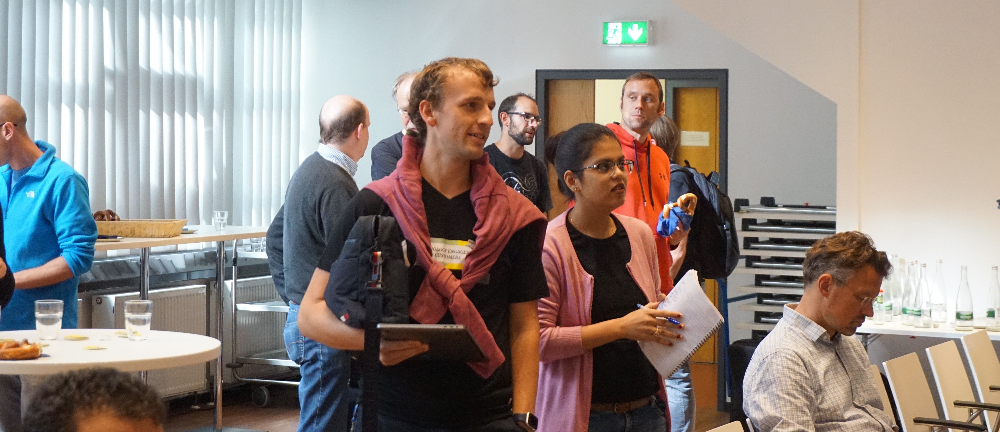
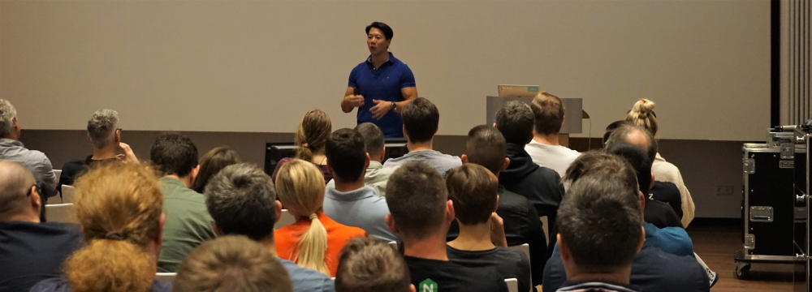
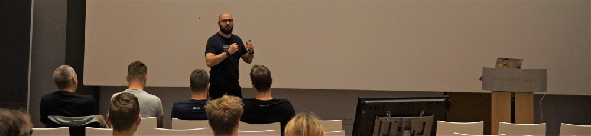
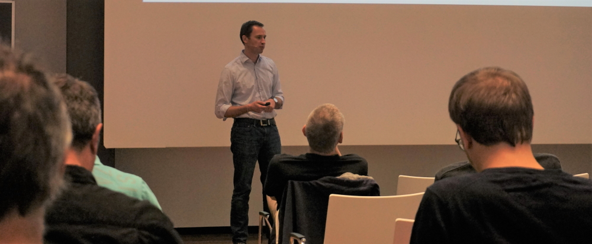
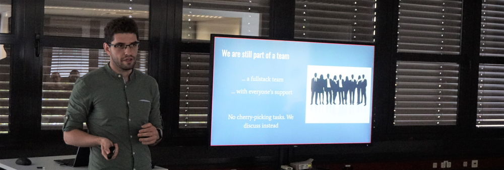
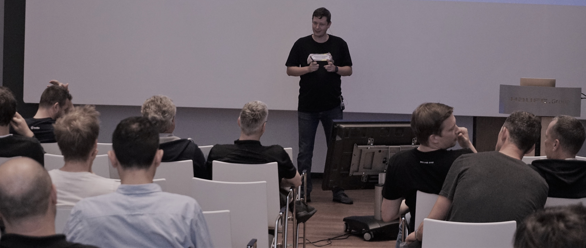
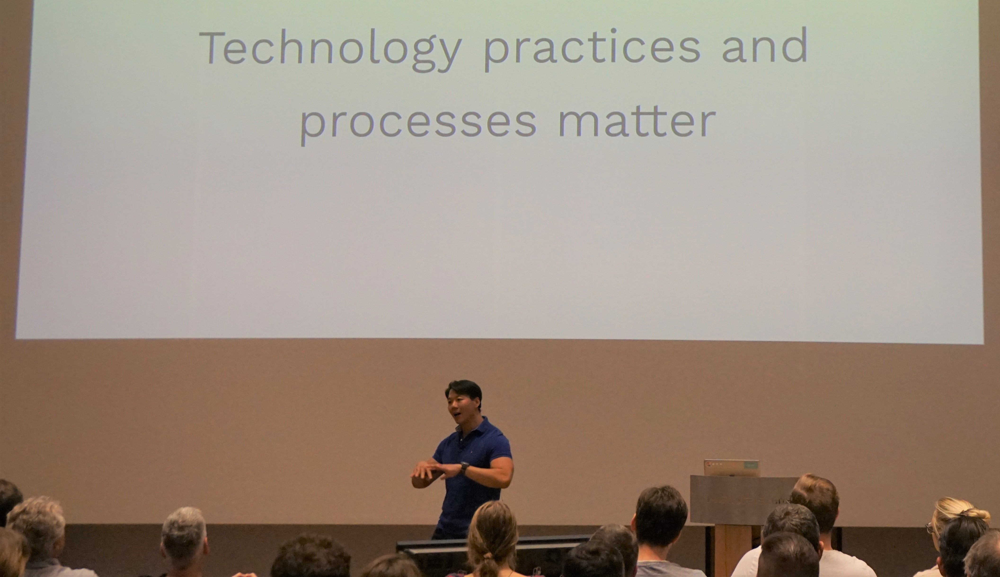

## TEC Day #5

On 26.9 we had our fifth developer day at the Haufe Group - aka TEC Day : TEC Day #5 made it clear how technology has evolved over the years here at Haufe. Technologies that we prioritize are always subject to change because technology moves fast. But this year, other topics like, what is important to us and what’s not, and the right way to structure ourselves to build software and products, entered into the conversation. TEC Day has become the bellwether for the state of technology at Haufe Group.  

What started as a sharp focus on mastering the technologies we needed to implement microservice architectures: containers, API Gateway, infrastructure as code, now addresses the entire spectrum of dev culture - technology, culture, and structure. Yes, we concentrated on new technologies like machine learning, leveraging managed cloud services, exploring serverless architectures, and more, but we also took a look at how to tranfer this knowledge to development teams that are growing by 100% every six months, what kinds of thinking must be combined to build successful products, and what sort of mindset is needed to work as a full stack developer. Here's what happened.

## The Talks

This year’s keynote speaker Patrick Kua – was perfectly suited to address the full gamut of topics. In his talk, he outlined the N26 approach to building products: how the berlin-based bank addresses the needs of their customers, their business, and selects technology to build products that add real value for the 3,500,000 people, who bank with them. 

Holger Reinhardt returned to present the serverless-powered SaaS product that he developed over the last 9 months for Adello, building a cloud-native, microservices application that can meet the micro-trading-like performance needs of the fast-paced advertising industry. 

After Holger was done it was time to break for lunch, and when we returned it was time to start with the breakout sessions.

### The Breakout Sessions

This year we had three waves of breakout sessions, it was hard to decide which ones to go to because there were no repeat performances. 

Raul Geana - Presented [his work on how the mission 4 product team is learning to speed time to innovate](https://www.youtube.com/watch?v=rOE15O7EV_A), by adopting lean working methods and cloud native technology, while at the same time productizing our FLEAT innovation framework.

Oliver Wana - CTO of the Haufe Group newcomer - Haufe Advisory - introduced his company and presented what Haufe Advisory is doing to stay productive while onboarding new developers at hypergrowth pace. 

Nils Rhode - Gave the first of his two awesome presentations about why he and his team decided on Fargate as the managed container service for the Haufe-umantis digital heads product.

Andreas Plaul and the AWS Framework Team - Defined our AWS Cloud compliance framework further by telling the story of why they decided on such a framework and the current status.

Nils Rhode (again!) - Gave his second talk on the decision to use Flutter framework for the next release of the Haufe Instant Feedback mobile app.

Bogdan Cimpoesu - Delivered his manifesto on [being a Full Stack Developer](https://www.youtube.com/watch?v=5MzdbiPaZxc) complete with advice ranging from how to approach tackling full stack development tasks to technology stacks that support lean, full-stack development. 

Martin Danielsson - Talked about how adopting a MERN stack and microservices architecture helped his team to shorten feature branches, and, how with feature flags, they implement, test, and adopt new features for his team’s product at high-velocity. 

Jerzy Kott - Rolled out the Haufe Group's production-ready Data Lake touching on the principles behind the data lake, data lake archtiecture, and implemented features that fulfull compliance and data governance at Haufe Group. 

## Closing

Finally, Raul closed it out with his thoughts on where technology is going for the Haufe Group – changes how we do technical reviews, more support for DevOps and lots of technologies to look at like GraphML, gRPC, and many more. 

Looks like we have our work cut out for us until we get to TEC Day 2020, but that's ok because more and more,

