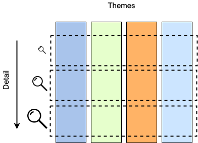

## Systems, systems, everywhere! 


> Photo by Martin Adams on Unsplash

Other than the neighborhood bakery and garage, pretty much every modern-day organisation worth its salt is a technology 
company.
 
As [software is eating the world][5] at an increasing pace, focus is on delivery and pushing features out the door.  
That is the only way to stay ahead of the competition. Deliver X% more than your rivals each day/year and through the 
[compounding interest effect][7] of features and efficiency you will win.

One aspect which is almost always an after-thought is that of documenting the systems and their interactions.   

Here are some ideas of mine on the subject, after a few years in the trenches. 
    
<!--more-->

## Why?


> Photo by Kaleidico on Unsplash

The paragon of modern IT organisations is continuous delivery. The product/service needs to evolve non-stop, requiring 
constant improvements in scale, nimbleness and agility.  
Technology (and software in particular) has a huge deflationary impact and [not only in the economy][8]. When you can 
achieve more with less resources (think smaller teams, SaaS, cloud services,... all acting as force multipliers), 
pausing to document is sub-consciously associated with [stasis][9].

Anyone in the IT industry can produce anecdotal evidence of the almost natural dislike of documentation. Something 
possibly rooted in the [sufficiently smart engineer][2] fallacy.  
Take it one step further and it is easy to assert that [the code is self-documenting][4]. 

I would humbly argue that the above assertions are missing a critical aspect of reality: [staff turnover][1].  

The last few decades of [secular low yields][10] have seen [a torrent of funds][3] chasing the next unicorns. 
In this world, the one and only capital that counts is talent (i.e. human capital).  
The same forces which are fueling exponential growth <sub> by providing abundant capital</sub>, are the same ones causing 
churn of a company's top-hitters <sub>since other companies are also flush with cash</sub>.  
Talent is a rare and sought-after "commodity"! 

Unless your company is one of the few with a talent-attracting brand (think Google), the result is a 
revolving door of new team member onboarding.   
If documentation is not up-to-date, the result is white-board sessions to describe the past and present; usually from memory.
Past assumptions and critical details are almost always missed.

A well-run organisation owes it to itself to capture and pass on the accumulated collective intelligence and experience.  

## What?

So...   
We need to document things. 
 
Where do we start?

Here are some things to consider: 

* Code moves fast.  
Engineers are conditioned to utilize modern source control systems and deploy in a [CI/CD][11] environment.  
The documentation tooling and environment must support this and be compatible. 

* Use as similar toolset as possible.  
This is a corollary of the above.  
Documentation is something to be done by the engineers themselves.  
If you prefer a cheesier quote, the people "making history" should be the ones writing it first hand.  
Context switching takes time, a different tool is a potential barrier to entry.  
Engineers are system and processe users as well, so the goal is to reduce friction as much as possible.

* Be as close to the codebase as possible.  
Another corollary.  
The furthest the docs are from the code, the harder it is to keep them in sync.  
Deep-linking and creating references to modules and classes, becomes increasingly harder with physical distance. 

* How much to document?  
I personally view system documentation a little bit like the sea: readily accessible to everyone.   
Everyone should be able to dip their toes in and appreciate <sub>Awww! How poetic!</sub>. Just as the sea, docs must be 
accessible, transparent and accessible. Up to a depth.  
After that, it is only for experts, most possibly using different tooling than everyone else. 

* Opinions?  
Creating documentation is inherently a collaborative effort.  
It is impossible to fit everything in a person's head without error.  
The tooling and process should facilitate and encourage collaborative editing.

## How?

Given the above, successfully documenting a system needs to capture 2 things:   
  * the sequence of important decisions which lead us to the present state, and
  * the present state, in an as clear way as possible.

### The course so far 


> Photo by Thomas Thompson on Unsplash

Addressing the first need is by answering the question "why is X designed like this and not like that?".  
This will definitely come up again and again, as new members join the team.

The best way to capture this is with [Architecture Decision Records (ADR)][12]. 

The benefits and suggestions on the structure of this approach are [pretty][6] [well][13] [documented][14]. 

Each ADR clearly and briefly answers 4 questions
* What problem / issue had to be addressed
* Which was the chosen solution / system
* When was the decision taken / implemented
* Why it was chosen i.e. what restrictions/requirements/assumptions weighed in on the decision  

The list of ADRs acts as a date-sorted index and entry-point to all the relevant deep-dive and analysis 
documents/JIRAs/post-its/etc created at the time. (Hopefully, you are archiving them somewhere).  
If a new joiner has a [WTF moment][25] with any part of the system, the ADR will provide all the answers on the trade-offs 
and rationale.

If any of the parameters of the problem space have changed since then, or the assumptions no longer hold true, then it 
is perhaps time for a change. 

This is a task which requires discipline more than anything else.  
The actual task of recording the ADRs is of secondary importance.  
You can do something home-grown (e.g. Markdown, Confluence) or use [adr-tools][26].  
By their nature, ADRs are immutable and relatively brief.  
Therefore being discoverable, consistent and in sequence is important.

### Telling the story of now


> Photo by Clem Onojeghuo on Unsplash

Describing the current state is a little bit more involved. 
 
The system itself can be of any size.  
How do you describe the current system state of a small does-only-one-thing-very-well startup?  
Is it the same approach as one would take to document a cloud CRM provider?  
Is the CRM provider the same as, say, a bank? 

Unfortunately there is not one size to fit all.  
What has worked well in past settings, will not necessarily work in the new environment.  
A failure to recognize this will almost certainly lead to poor and/or hard-to-maintain documentation.   

'But haven't [UML][15] and other [similar notations][16] been invented to guide us in this?' one might ask.

I would humbly disagree. 

As their name suggests, these are *languages*.  
Whereas a system design description is essentially a *story*, it should have a flow to be digestible.  
In fiction and story-telling there are [literary frameworks][17] to guide us, each one with its own rules.   
In a similar vein, we should look for some higher level system design frameworks.  
These can guide us in telling the system design "story" in a meaningful way.

After many attempts in the past, I have settled on the dissection of a complex system along 2 axes:  
* themes and
* level of detail   


> System breakdown

#### Themes

Any non-trivial system and organization is composed of too many components, services and interactions between them.
Trying to capture them all in a single diagram would result in something impossible to create, let alone track.

For this reason, it makes sense to split the organization "ecosystem" in easier-to-understand chunks.  
That split can be done along the rough lines of [themes][18] or [sagas][19].  

Remember that one of our basic principles is to make the documentation accessible to everyone.  
Attempting to draw delineation lines along IT systems will not make sense to everybody.  
What is "BigData store" supposed to mean to a customer support person?  

On the contrary, drawing the lines along discreet customer value functions or business principles, is something 
understandable by anyone in the organization.  
"Customer onboarding" means pretty much the same thing to everyone.

#### Drilling down 

Having established how we split the system vertically, how do we go about detailing each theme's inner workings? 

Do we use [Deployment diagrams][21]?  
Something [else][22]?

I have found that a great framework to guide us in the "story-telling" is the [C4 Model][23].  

At a glance, C4 defines 4 levels of increasing detail: 
* **Context**  
At the top-most level users/actors interact with "systems".  
A system is a black box which offers a related set of functionality to its actors ("offers value" in C4 parlance).
This is from a user's point-of-view, so it might be a little subjective.
* **Container**  
Next level of abstraction, Containers live inside systems.  
They are something into which code "runs" or data "lives" (Kubernetes cluster, Postgres DB, HTML 5 app, AWS S3 buckets,...).  
This is where the "logical" architecture intersects with the "physical".  
Containers can be marked/annotated with the characteristics of the actual deployment (2 node cluster, 
some.domain.com, 6 worker pool,...). 
* **Components**  
According to C4, Components are  
> a grouping of related functionality encapsulated behind a well-defined interface, which runs inside a container  

Not much to add to that!
* ...and **Classes**  
The last level of detail should need no further introduction.

It is becoming clear how in the above framework, we can go as deep or remain as shallow as we want for our system description.  
Moreover, at any level, we can utilize all the elements provided by our chosen representation language (e.g. UML).  

Anyone in the organization would be able to follow a Context diagram or a Sequence diagram referring to Systems.  
Architects and DevOps engineers can easily converse over a Container-level diagram.  
Senior engineers can discuss and plan over a Components-level diagram.  
Developers can peruse to their heart's content Classes-level diagrams. 

## Where? 

We have established some principles and frameworks to guide us while compiling and maintaining our system's docs.  
Next question is "where do we do that?".  

### Visio and MS Word

This is the approach most "distant" from the code.  
I only include it here as a counter-example. 
 
Both Word and Visio are feature-rich and very mature.  
However using them in a system documentation capacity inevitably leads to a few problems. 

**Poor collaboration**  
A non-trivial system will inevitably exceed a single person's mental capacity to understand, capture and document in 
an understandable way. Collaboration is key!  
Editing local files inherently leads to version proliferation and long mail bank-and-forths.

**Context switching**  
Going from a development environment and tooling (inherently primarily keyboard- and command-oriented) to something 
completely different (GUI and mouse-based), brings negative connotations for software engineers. 
The difference in the environment (from shortcuts and tricks to different type of hand-eye coordination) adds friction, 
which is associated with "non-productive work".

**The [Visio effect][24]**
Let's face it: the plethora of styling options available can detract even the most focused author!  
Not much more to say here...

### Google docs

Google Docs is an interesting option for enterprise documentation.

Being primarily geared towards collaboration, it allows any number of concurrent editors.  
A team can be performing simultaneous in-place edits and comments, suggested edits and assign to-do tasks.  
The product gives an out-of-the-box history of edits with the ability to rollback in time. 

The editor is quite straight-forward in terms of text authoring and authoring.  
It offers all the options one might want ot get the job done, without being too much of a distraction (i.e. steer you
towards gold-plating). 

Being a Google product, it offers tight integration with the rest of the Google suite, especially if your company's 
back-end is based on [Google Enterprise][34].

It is easy to notice that the GSuite product is geared towards ease-of-use, making it trivial to create new documents.  
However this creates 2 problems, both faces of the same coin. 

* **Accessibility of information**  
All documents start their life in the user's personal Google drive, so it takes additional steps (and team discipline) 
to move them to a shared structure.  
And as with all things shared, there is the question of the folder structure itself.  
How should it be organized? Per team? Per system? Otherwise?  
Retrieving information from an archive of Google docs is another challenge.  
Google's search and machine learning functionality is meant to ease the location of *important* documents.  
This results in a mix of immediate "hits" for the 95th percentile of searches and quite some time spent looking for 
the remaining 5%.  

* **Privacy of information**  
Being an internet-first offering, means that mistakes in GSuite are immediately visible.  
Anyone who has edited a Google doc, quickly finds out that making a mistake in the sharing settings makes the document 
accessible to anyone on the internet.  
In the enterprise Google offering this is less of an issue, but requires careful locking down from the admins and 
discipline from the users.  

### Confluence 

Confluence is the undisputed leader in enterprise information capture.  
Its latest version offers very similar collaboration support as Google docs, with in-place comments, assignable 
task items, etc.  

Confluence, being a wiki, encourages (if not imposes) a hierarchical ordering of pages and information.  
In this regard, this is the opposite of Google docs. In Confluence, pages start their life in their intended location 
from the 1st minute, rather than being moved from the personal space. 

As mentioned in Google docs, having a shared "folder" structure can be a blessing and a curse.   
Should pages be ordered by team? Project? Some other business domain?   
Sometimes this upfront decision-making causes the feeling of over-analysis.  
On the other hand, anyone who has accessed Confluence used for a few man-years, has surely encountered a messy structure, 
feeling like it needs a good cleanup.    
When it comes to hierarchical organization of information, not everyone understands it the same. 

A key difference between Confluence and Google docs or MS Word is the presentation of information.  
Confluence is HTML-/browser-based, while MS Word and GDocs are page-/print-oriented.  
This may sound nuanced, but the more mixed content one has to present (graphics, code snippets,...), the more restrictive 
the print-oriented format starts becoming. 

On the other hand, Confluence is sort of a [one trick pony][27], geared towards editing text and embedding graphics.  
Any other type of information (sheets, slides,...) and one has to integrate with other tools.  

### Markdown

[Markdown][28] has become almost the de-facto method of documenting code, with its ubiquitous support in all modern 
source control servers.  
Its simple syntax makes it very easy to compose with only a keyboard, making it a natural fit for developers.  

In terms of "distance from the codebase", Markdown is definitely the closest one.   
This makes it ideal for component documentation, updating/committing Markdown READMEs alongside the code itself.  
This keeps the documentation "freshness" factor high. 

Like Confluence, Markdown renders in HTML, so it can take advantage of the entire screen estate to display mixed content.  

### ...and AsciiFlow

With the exception of Visio, one thing we have not addressed so far is how to visually represent our systems' setup.  
If "a picture is a thousand words", then a good representative diagram of our system will save us a whole lot of typing. 
   
The most straight-forward, no-frills way to create a diagram is [AsciiFlow][30].  
This is a simple web-based designer which generates [ASCII-based][29] diagrams.   
See a simple example embedded below.

```
+-------+            +--------+
|       |  A line    | A box  |
| Some  +------------+ here   |
| text  |            |        |
+---+---+            +--------+
    |
    |
    |                +-----------------+
    |  An arrow      |                 |
    +--------------->+ ...and a longer |
       some text     | one!            |
                     +-----------------+
```

AsciiFlow is extremely simple to use and as long as the text rendering platform supports [monospaced][31] characters, 
then everything displays fine. 

The downside of being character-based is that diagrams cannot be scaled relative to text.  
This means that large diagrams cannot display well in a page-oriented medium (Word, Google docs), potentially 
stretching out of the page margins. 

### ...and mermaidJS

Another way of creating diagrams without going too far from the keyboard is [mermaidJS][32].  

Mermaid is a great Javascript-based tool to create and embed diagrams.  
Its description language is really simple andoOne can create good-looking diagrams fairly quickly. 

It offers command-line renderers to generate SVG/PNG/PDF.   
However its true power lies in the fact that it can generate live, embeddable diagrams for HTML-based mediums (e.g. 
Markdown).  

For example, see the following embedded diagram

<script src="//cdn.jsdelivr.net/npm/mermaid@8.2.1/dist/mermaid.min.js"></script>
<script>mermaid.initialize({startOnLoad:true});</script>

<div class="mermaid">
graph TD
A[Blog Post] -->|Get idea| B(Start writing)
B --> C{Structure}
C -->|One| D[fa:fa-book Prologue]
C -->|Two| E[Main text]
C -->|Three| F[fa:fa-clock Epilogue]
</div>

> An example embedded mermaidJS diagram

This has been generated using the following embedded code in this blog post's Markdown.  
The browser loads the library which locates and parses mermaid's descriptive language.  
Simples!

```html
<script src="mermaid.min.js"></script>
<script>mermaid.initialize({startOnLoad:true});</script>

<div class="mermaid">
graph TD
A[Blog Post] -->|Get idea| B(Start writing)
B --> C{Structure}
C -->|One| D[fa:fa-book Prologue]
C -->|Two| E[Main text]
C -->|Three| F[fa:fa-clock Epilogue]
</div>
```

MermaidJS is an evolving project, adding support for different types of diagrams.  
One can easily find some wrinkles here and there. 
It also lacks a comprehensive user guide for all different diagram types and features offered by its language.  
So you will regularly find yourself trying out things in the [live editor][33].

However the visual result with only a few lines of mermaid markup is definitely impressive. 

### ...and LucidChart

One of the most complete online offerings
for almost any type of design is [LucidChart][35] 

Works in a freemium model 
and offers a rich feature set 
from different diagram types 
to editing and styling capabilities

almost on par with Visio in terms of features
with the accompanying danger of gold-plating

It has 2 killer features 

Collaboration support

multiple editors can concurrently modify 
the same diagram 
adding comments as they go along

Sharing 

Lucidcharts can be shared live 
on most content publishing platforms 
either via an add-on (MS Word, Google docs, Confluence)
or directly as an embedded `iframe` (Markdown)

For example see an embedded diagram below

<div style="width: 480px; height: 360px; margin: 10px; position: relative;">
    <iframe 
        allowfullscreen frameborder="0" style="width:480px; height:360px" 
        src="https://www.lucidchart.com/documents/embeddedchart/ce860c53-0bc1-4d7f-a4ff-ef2511000511" id="X.L4jCWw-dCu">
    </iframe>
</div>

These features help a lot 
to 

## Parting thought


> Photo by Volodymyr Hotsyk on Unsplash


*Many thanks to [Georges Haidar][20] for introducing me to the C4 Model*


   [1]: https://business.linkedin.com/talent-solutions/blog/trends-and-research/2018/the-3-industries-with-the-highest-turnover-rates
   [2]: https://www.linkedin.com/pulse/myth-sufficiently-smart-engineer-aaron-blohowiak/
   [3]: https://techcrunch.com/2018/07/22/inside-the-rise-and-reign-of-supergiant-venture-capital-rounds/
   [4]: https://thenewstack.io/no-testing-no-documentation-no-problem/
   [5]: https://a16z.com/2011/08/20/why-software-is-eating-the-world/
   [6]: https://github.com/joelparkerhenderson/architecture_decision_record
   [7]: https://www.moneysense.gov.sg/articles/2018/10/effects-of-compounding-interest
   [8]: https://www.ft.com/content/9f945d12-f6e5-11e7-88f7-5465a6ce1a00
   [9]: https://www.merriam-webster.com/dictionary/stasis
   [10]: https://www.niesr.ac.uk/sites/default/files/publications/Box%20A%20-%20Decline%20interest%20rates.pdf
   [11]: https://en.wikipedia.org/wiki/CI/CD
   [12]: https://adr.github.io/
   [13]: https://medium.com/better-programming/here-is-a-simple-yet-powerful-tool-to-record-your-architectural-decisions-5fb31367a7da
   [14]: https://www.agilealliance.org/resources/experience-reports/distribute-design-authority-with-architecture-decision-records/
   [15]: https://en.wikipedia.org/wiki/Unified_Modeling_Language
   [16]: https://en.wikipedia.org/wiki/Systems_Modeling_Language
   [17]: https://en.wikipedia.org/wiki/The_Seven_Basic_Plots
   [18]: https://www.atlassian.com/agile/project-management/epics-stories-themes
   [19]: https://www.scrumexpert.com/knowledge/using-sagas-as-a-strategic-view-of-epics/
   [20]: https://www.linkedin.com/in/georges-haidar-a9314123/
   [21]: https://en.wikipedia.org/wiki/Deployment_diagram
   [22]: https://en.wikipedia.org/wiki/Sequence_diagram
   [23]: https://c4model.com/
   [24]: https://whatis.techtarget.com/definition/gold-plating
   [25]: https://medium.com/swlh/avoiding-the-wtf-moment-685ca73080cb
   [26]: https://github.com/npryce/adr-tools
   [27]: https://dictionary.cambridge.org/dictionary/english/one-trick-pony
   [28]: https://en.wikipedia.org/wiki/Markdown
   [29]: https://en.wikipedia.org/wiki/ASCII_art
   [30]: http://asciiflow.com/
   [31]: https://en.wikipedia.org/wiki/Monospaced_font
   [32]: https://mermaidjs.github.io/
   [33]: https://mermaidjs.github.io/mermaid-live-editor
   [34]: https://gsuite.google.com/enterprise/
   [35]: https://www.lucidchart.com/documents