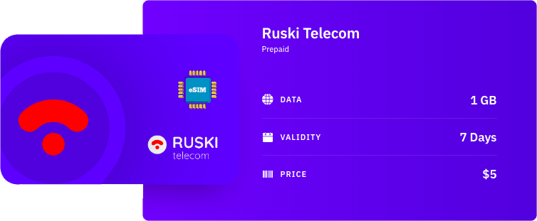

Da diverso tempo, il roaming all'interno dell'Unione Europea è una realtà assodata, e in diversi paesi è possibile ottenere una quantità decente di traffico dati in 4G senza spendere troppo. Oggigiorno, [la maggior parte della popolazione europea comunica basandosi su piattaforme come WhatsApp e Telegram](https://www.messengerpeople.com/global-messenger-usage-statistics/), senza contare le mappe e altre app che possono tornare utili quando si viaggia.

Sfortunatamente, non tutto è semplice come all'interno dei confini comunitari, e mi è capitato di viaggiare in Paesi in cui non solo non parlavo la lingua locale, ma anche procurarmi una SIM si è rivelata una sfida non indifferente, sia per le barriere linguistiche, sia per quelle burocratiche, sia per quelle economiche.
  

### Scegliere la SIM
In alcuni Paesi (come gli Stati Uniti), è possibile ottenere molto semplicemente delle schede SIM per turisti, con durata limitata anche se, molte volte, con un prezzo molto elevato, ma non è così ovunque. Inoltre, è sempre presente l'incognita dei costi di roaming sulla nostra SIM per la prima parte del viaggio, nel caso la nuova card venga acquistata in loco.

Fortunatamente, sempre più smartphone vengono prodotti con il supporto per le eSIM, delle card virtuali che non hanno bisogno di alcun tipo di chip addizionale, ma che permettono di connettersi esattamente come la loro controparte fisica. Una volta appurato che lo smartphone è provvisto di questa tecnologia, si è pronti a partire con un servizio che permetta di acquistarne una ed usarla immediatamente.

Come primo test, abbiamo usato Airalo durante un viaggio di 3 giorni a San Pietroburgo: l'acquisto è relativamente semplice ed in linea con ogni altro servizio (specialmente dall'app) e, una volta acquistata la eSIM, un QR Code viene generato ed è quello che ci permetterà di utilizzare la connessione dati con una compagnia Russa. Esistono diversi servizi come Airalo, e possono essere consultati su siti specializzati come [esimdb](https://esimdb.com/).

La prima installazione su Android 10 è abbastanza semplice, ma noiosa, e (su Pixel 4) richiede la connessione ad una rete WiFi, il riavvio del dispositivo e la scansione del QR Code, per cui è consigliabile eseguire la procedura di acquisto ed installazione prima di partire.

Una volta che la eSIM è installata e disponibile, può essere gestita in maniera molto semplice attraverso le impostazioni del dispositivo, in modo da decidere quale delle due debba gestire la connettività, gli SMS e le chiamate.

### Giudizio

Ho usato la SIM per alcuni giorni a San Pietroburgo, e il mio giudizio è tutto sommato positivo: nonostante la velocità fosse decisamente inferiore a quanto mi aspettassi (nessuna copertura 4G, al massimo in H+), il rapporto qualità/prezzo del pacchetto che ho scelto e la semplicità di installazione, lo colloca decisamente tra le opzioni che considererò in futuro.