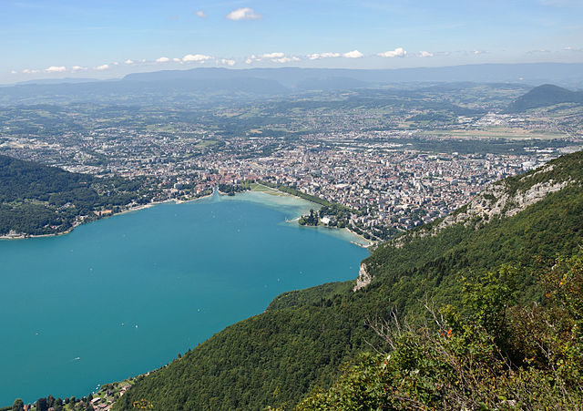

Focus sur les images-lien, images-texte et images légendées.

## Ce que j'ai fait :
- lire l'article <a href="https://www.lelutinduweb.fr/alternatives-textuelles-attribut-alt/">Le vaste monde des alternatives textuelles : l’attribut alt</a> de Julie Moynat
- lire la notice <a href="https://www.accede-web.com/notices/html-css-javascript/6-images-icones/6-3-balise-img/">Images</a> d'AcceDe Web
- lire la notice <a href="https://www.accede-web.com/notices/html-css-javascript/6-images-icones/6-4-images-legendees-figure-rolegroup-figcaption/">Baliser les images légendées</a> d'AcceDe Web

## Ce que j'ai appris
### Les images-lien
Les images-lien sont intégrées au sein d'une balise `<a>` et sont donc cliquables. **L'enjeu pour ce type d'images n'est pas de les décrire mais de renseigner l'internaute sur la fonction ou la destination du lien**. Il existe deux cas de figure :
- l'image est accompagnée d'un texte qui décrit déjà la fonction ou la destination du lien : l'attribut `alt` doit donc être vide. Par exemple :

```
<a href="/">
   
   <span>Commander ses billets pour les vacances de Noël</span>
</a>
```

- l'image est le seul élément du lien : l'attribut `alt` doit être complété et renseigner sur la fonction ou la destination du lien. Il n'est pas nécessaire de débuter le contenu de l'alternative par "Lien vers", car cette information est restituée par défaut par les lecteurs d'écran. Par exemple :

```
<a href="/">
   
</a>
```

Le cas le plus fréquent d'image-lien est celui du logo cliquable renvoyant vers la page d'accueil du site. L’attribut `alt` doit contenir le texte du logo ou le nom du site si le logo n’a pas de texte.

Par exemple, le logo du site Oui.sncf est intégré ainsi :

```
<a href="https://www.oui.sncf/">
   
</a>
```

Sur ce blog, l'entête contient bien une image renvoyant vers l'accueil du site. Elle ne comporte aucun texte décrivant la fonction du lien et le nom du blog n'apparaît pas non plus dans cette image. J'ai donc choisi d'intégrer le code suivant :

```
<a href="https://elbuffeto.github.io/" class="site-avatar">
  
</a>
```

### Les images-texte
Les images-texte sont des images contenant du texte. Prioritairement, si elles peuvent être reproduites en Hypertext Markup Language (HTML) et Cascading Style Sheet (CSS), il ne faut pas utiliser ces images. Si cela n'est pas possible, il est indispensable de fournir une alternative textuelle pour fournir le même niveau d'information à tous :
- sous forme d'un texte présent à proximité de l'image

- dans l'attribut `alt` en reprenant exactement le texte présent dans l'image

### Les images légendées
Les images légendées sont intégrées à l'aide des balises `<figure>` et `<figcaption>`. Il est en effet parfois nécessaire d'ajouter une légende pour préciser des informations sur l'image, par exemple un copyright, une date, un auteur ou une autrice... Afin d'assurer un meilleur support par les technologies d'assistance, il convient d'intégrer ces images légendées en suivant certaines recommandations :
- la balise `<figure> `doit englober l’image `` ainsi que la légende `<figcaption>`

- il faut ajouter un `role="group"` sur la balise `<figure>` afin d'assurer un support optimal avec les lecteurs d'écran

- l'attribut `alt` de l'image doit contenir une référence à la légende adjacente

Prenons un exemple avec l'image ci-dessous :

<figure role="group">
   
   <figcaption>
      Balade au sommet du Mont Veyrier (Annecy, Haute-Savoie, le 10 août 2011).
   </figcaption>
</figure>

Le code correspondant à cette image est le suivant :

```
<figure role="group">
   
   <figcaption>
      Balade au sommet du Mont Veyrier (Annecy, Haute-Savoie, le 10 août 2011).
   </figcaption>
</figure>
```

Dans l’attribut `alt`, je décris la photo en précisant qu'elle est prise depuis le Mont Veyrier. Dans la légende, j'informe à nouveau que la prise de vue est faite depuis le Mont Veyrier : il s'agit là de la référence entre l’image et sa légende.

Vous pouvez vous reporter également à cette <a href="https://disic.github.io/guide-integrateur/demo/9-images/index.html">démonstration d'images légendées</a> extraite du Guide de l'intégrateur. 

