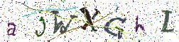
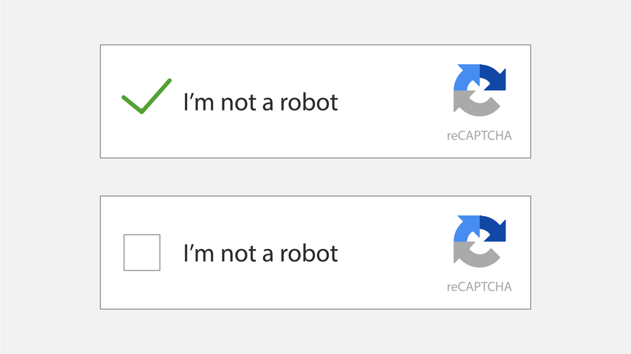

CAPTCHAs et accessibilité font-ils bon ménage ?

## Ce que j'ai fait :
- lire l'article <a href="https://www.w3.org/TR/turingtest/" lang="en" hreflang="en">Inaccessibility of CAPTCHA</a> du World Wide Web Consortium (W3C)
- lire l'article <a href="https://a11y-guidelines.orange.com/web/captcha.html">Les CAPTCHAs et l'accessibilité</a> d'Orange
- lire la notice <a href="https://www.alsacreations.com/tuto/lire/1547-police-font-icone-vectorielle-webdesign.html">Prévoir une alternative pour chaque CAPTCHA uniquement visuel ou sonore</a> d'AcceDe Web
- lire le témoignage <a href="http://webzine.okeenea.com/serie-noire-pour-une-canne-blanche-les-captchas/">Série noire pour une canne blanche : les CAPTCHAs</a> sur le webzine OKEENEA

## Ce que j'ai appris
### Différents types de CAPTCHA
CAPTCHA est l'acronyme de "Completely Automated Public Turing-test to tell Computers and Humans Apart", qui signifie en français "Test de Turing public complètement automatisé pour différencier les humains des ordinateurs". Nommé en mémoire de l'informaticien Alan Turing, **ce type de test vise à différencier un utilisateur d'un programme informatique pour sécuriser les contenus d'un site internet**, au moment d'un achat ou pour poster des commentaires par exemple.

Il existe différents types de CAPTCHAs :
- **les CAPTCHAs visuels** : il s'agit de déchiffrer un ensemble de caractères déformés et pixellisés.
  Par exemple :

  

  D'autres CAPTCHAs visuels s’appuient sur la reconnaissance d'images, par exemple reconnaître une voiture dans une série de photographies différentes.

- **les CAPTCHAs sonores** : il s'agit de retranscrire un message sonore distordu

- **le "No CAPTCHA" de Google** : il s'agit d'une simple case à cocher tandis qu'en arrière plan la résolution de l’écran, le déplacement du pointeur de la souris ou le temps de saisie sont analysés pour s'assurer qu'il s'agit bien d'un humain derrière l'écran.

  

### Impacts sur les utilisateurs
Les CAPTCHAs posent des difficultés à tous les utilisateurs et à toutes les utilisatrices. **Ils sont source de frustration car plusieurs tentatives sont souvent nécessaires pour trouver la bonne réponse**. A titre personnel, il m'est arrivé de devoir faire 5 ou 6 tentatives avant de réussir à passer un CAPTCHA visuel, tant la lecture des caractères était compliquée.

Pour des personnes mal-voyantes, aveugles ou dyslexiques, l'utilisation de CAPTCHA visuel est même rédhibitoire. **Un utilisateur ou une utilisatrice aveugle sera dans l'incapacité in fine de rédiger des commentaires ou de finaliser un achat**, car il n'est pas envisageable de proposer une alternative textuelle, laquelle constituerait une bénédiction pour les robots.

Les CAPTCHAs sonores posent les mêmes soucis car leur message déformé rend la compréhension très difficile.

Quant au "No CAPTCHA" de Google, bien que plus performant il pose encore certaines problèmes. Les programmes d'analyse du déplacement de la souris ou du temps de saisie en arrière plan confondent souvent humain et robot lorsqu'un internaute navigue avec son clavier ou un lecteur d'écran. Et en cas de doute, c'est un CAPTCHA visuel classique qui est alors proposé.

Enfin, alors que l'intégration de CAPTCHAs dans un site est souvent justifiée pour renforcer la sécurité, il semblerait que ces derniers soient loin d'être infaillibles :
- les programmes informatiques et d'intelligence artificielle sont désormais suffisamment performants pour déchiffrer un message déformé ou déterminer si une photographie contient un objet précis. <a href="https://security.googleblog.com/2014/12/are-you-robot-introducing-no-captcha.html" hreflang="en">Un article de Google</a> précise ainsi qu'une intelligence artificielle peut résoudre les tests visuels les plus difficiles avec 99,8% de réussite, soit un score supérieur à celui d'un utilisateur humain.

- il est possible de rémunérer à l'heure des décodeurs de CAPTCHA pour vérifier plusieurs centaines de tests visuels ou sonores

### Quelles solutions ?
Il faut a minima **prévoir des solutions d'alternative d'accès aux CAPTCHAs** :

- **proposer à la fois un CAPTCHA sonore <u>et</u> un CAPTCHA visuel** pour parer aux déficiences visuelles ou auditives.

- **proposer un moyen de contact, par téléphone ou e-mail** permettant de réaliser différemment l’opération souhaitée.

- **proposer des tests logiques tels que des opérations mathématiques ou des questions simples**, appelés CAPTCHAs textuels. Par exemple : "Combien font deux plus deux ? " ou "Quelle est la couleur du cheval blanc d’Henri IV ?".

Prévoir une solution facile de rafraîchissement comme préconisé par AcceDe Web ou avoir la possibilité d'écouter un CAPTCHA sonore à volonté <a href="https://checklists.opquast.com/fr/qualiteweb/les-captchas-audio-peuvent-etre-reecoutes-a-volonte">comme le recommande Opquast</a> sont également de bonnes pratiques à intégrer.

### Les limites de ces solutions
Mais dans les faits, ces solutions ne sont pas optimales : afin de déjouer les robots spammeurs, les CAPTCHAs, qu'ils soient sonores ou visuels, sont de plus en plus compliqués à déchiffrer, et ne sont pas accessibles par définition. Leur utilisation peut donc sérieusement pénaliser un site.

L'alternative de contact par e-mail ou téléphone est beaucoup plus fiable, mais lourde à mettre en place et impose à l'internaute de communiquer des données personnelles.

Les tests logiques, quant à eux, se doivent rester très simples sous peine de pénaliser les internautes souffrant de troubles cognitifs.

En conclusion, **entre les problèmes d'accessibilité et leur efficacité limitée en matière de sécurité, la meilleure recommandation serait donc de se passer de CAPTCHAs**. Il existe également des alternatives ayant peu d'impacts sur les internautes et moins contraignantes :

- **des outils tels que HoneyPot et Time measuring proposent des solutions transparentes pour l'internaute pour détecter les robots spammeurs**. HoneyPot ajoute un champ masqué à l’écran dans le formulaire invisible pour un internaute humain et Time measuring mesure le temps mis pour remplir un formulaire : si le champ invisible est rempli ou si le temps mesuré est trop rapide, alors il s'agit très probablement d'un robot.

- **mettre en place des logiciels anti-SPAM** en examinant les données envoyées et les adresses IP des robots malveillants.

- **envoyer une confirmation par email**
