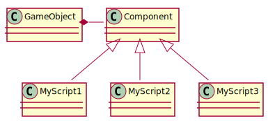

It is about [time](https://i.imgur.com/sqJhJ2H.png) we talk about the architecture of our game.

## Unity GameObject and components

We develop with Unity, that is why we can take advantage of a pretty great architecture to begin with: the GameObject and Component system.  
A scene contains several GameObjects which have several base properties like name, layer (for rendering/collision masks) and tags (to find them based on categories). A GameObject can contain components, truth is they can not do much without components as they are the driving force behind your game.

Components control the behaviour and appearance of a GameObject, for example the `Transform` component which basically every GameObject has contains the position, rotation and scale of it and provides functions to change them or to act upon the local space these properties define.

A Unity developer can either attach built-in components to their GameObjects like `MeshRenderer` and `RigidBody`, or they can write their own components in the form of a class which inherits from `MonoBehaviour`.

There are several special functions in a `MonoBehaviour` instance which are called by Unity at the right time like `void Start()`, `void Update()` or `void OnCollisionEnter()`. With this the components act in a event-driven way and can easily be isolated from another.

## What about us?

Now Unity brings many of the base infrastructure but how does *Purpose and Despair* fit into this? Like this (open in a new window to freely dive into it):

(every *class* in the "Unity[...]" packages inherit from `MonoBehaviour`)

### The cute robot and its little companions

The robot in of itself lives with only two components: `Player` and `PlayerAbilities`. The first component controls the most important part: the player interaction and thus the movement of the robot. Every time the robot speeds against a wall or picks up a cube - the `Player` component knows about it (and propably is responsible for it). The second component contains information about what the robot has already learned, it will be used by e.g. `ManualStandController` to check whether the player is allowed to continue into further level progress.

The logic and physic puzzles one has to solve is based on a very simple concept: An *Activator* activates *Activatable* things. For now this means a `Button` activates a `Door` or a `CubeSpawner` when the robot steps or drops a cube onto it.

### NetGame - fuzzy circuits but clean architecture

The logic of the NetGame is a bit more complicated, there are wires and power running about, things rotating out of control ([Spoiler warning](https://purposeanddespair.github.io/NetGame-Rotating-About/)) and colors flashing. That is why we took that nasty logic and pushed it away from the Unity-related classes.

First we declared a `Direction` enum which in of itself can do things like tell how many steps in a certain dimension one should walk for that particular direction. But a tile in a NetGame can have connections in multiple directions, so we are in need of a container we called `Directions` (quite obvious naming, isn't it?) which now can represent any combination of one or more `Direction`. Because that is our main (and only) interaction, the rotation is already present here. After this we can write our `Vector2Int` clone, we call it `TilePos` and give it helpful extensions like move in a certain `Direction`.

The main game logic is implemented in the `NetGame` class. Itself is created by another class, the `Generator`. You pass in the parameters like width and height into it, call the `generate` function and can play, right? No games are generated in a finished state (so we can gurantee there is a solution to every puzzle), but after you randomize the rotations of every tile you can go and call the `rotateAt` function to play.

On Unity we have two more classes (components to be correct): one (`NetGameBehaviour`) to translate the abstract NetGame state into a rendered version of it and the other to put this into an actual 3D environment (`NetGamePanel`). You may notice that the `NetGameBehaviour` class has a `OnClick` function taking a `Vector2`. That is the second level of abstraction - here we take a normalized vector as position, translate it into a `TilePos` and pass it to our `NetGame` instance to update the game state (and then update the rendered version). The `NetGamePanel` is the simplest version of a 3D integration, one could also imagine a half-broken screen on a robot arm swinging about to make the puzzle harder to solve (maybe a bit extreme but it shows the third level of abstraction in this structure).

So we can summarize the NetGame architecture:

1. Domain logic (in `NetGame`)
2. 2D renderer and 2D interaction (in `NetGameBehaviour`)
3. 3D integration (with `NetGamePanel`)
4. 3D rendering (with the Unity component `MeshRenderer`)
5. Graphics API (also handled by Unity, on Windows most likely DirectX)
6. Graphics card hardware

# Time invested
Hermann: 4h
