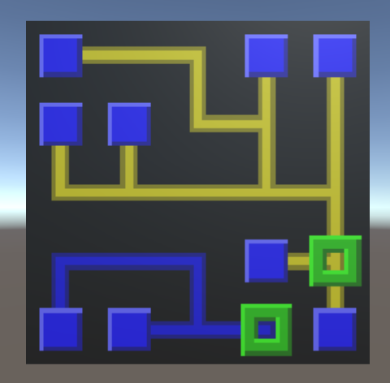
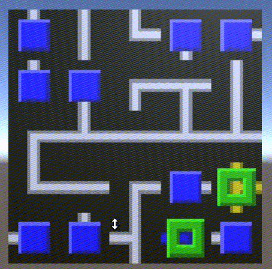

There are things spiraling out of control, find out what and how here!

## Improvements

You remember the NetGame right? (If not [read this](https://purposeanddespair.github.io/NetGame/)). It got some improvements we want to show you:

### Multiple power types

To confuse the player a bit more when he starts a new puzzle we have now multiple power types (for now the colors are blue and yellow). The terminals can be connected to any server any color but of course wire ciruits different colors may not be connected just like wire circuits of the same color (no short circuits!)

And yes this is the first screenshot with servers, it works just as well. It got a bit confusing which server got which power type that is why we have cut a window into the server block. This ought to make later puzzles a bit more interesting.

### Animations

Interactions might have been a bit difficult to interpret, tile connections just jumping about when clicked. This we have changed as well with fancy animations helping the player understand what is happening:

## Time invested
Hermann 3h
