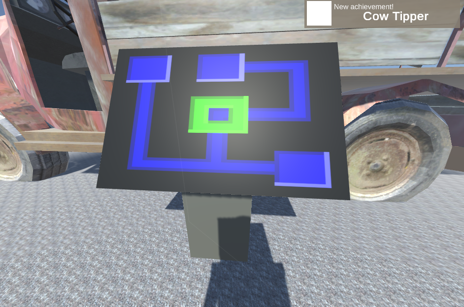

You know you want them!

## What is that again?

An achievement you ask? It is a token of appreciation, to honor your progress or a particular awesome feat you pulled.
No there is not more to it, but the great thing is even if you don't think achievements are worthwhile you still want to collect them.

And who are we to not let you get them? Look at them!

Yes cute icons will be part of achievements.

## Unity and their ScriptableObjects

So quick looksy on how they are implemented: They are declared as ScriptableObject we can configure in the Unity Editor. Then every script in the game can get the instance of the `AchievementManager` singleton and trigger its achievement. Also because ScriptableObjects are assets we can add the specific achievement to trigger as reference - also in the Unity Editor.
Small fun fact to close: Achievements are the first piece of UI in the game 

## Time invested
Hermann: 4h
