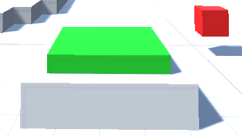

Option for the player to interact with the environment.

# Pickup of objects

The player will be able to unlock new skills and abilities. 
One such ability is to lift a object and carry it around. 
Such an object can be used to solve riddles and activate buttons or such.

When the player is close to an object tat is pickubable he can click the "E" key and and pick it up.
He can carry ot around and drop it when another press of the "E" key.

On the Right you can see the player from a third perspective and on the left you can see the view of the player.

# Button

The pickupable objects can be used to activate a button the red cube next to it show that the button is not pressed.

The button consists of a base and a top that can be activated.
The button will change into an activated state if and object is on top of it.
This can also be the player itself.

In the image below you can see the button is activated by an object, seen in the green color of the cube which changes color accordingly to the state of the button.

## Time invested
Tim 2h