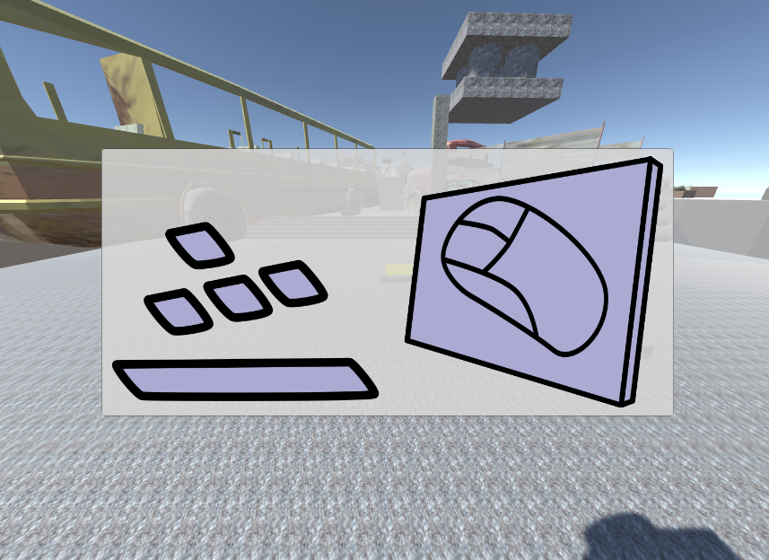
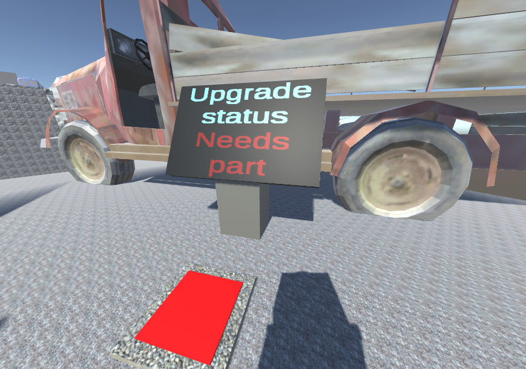

What needs to be done to be playable by somebody not us?

## The gist of it

For a technical prototype that we had to be considered as being an actual demo of a game, the main thing that should be complete is the possibility for others to pick it up and play it.
If each new player needs personally teached instructions (by us the developers) it is no good.

So this is what got done in the last period of time.

## Start/End-Panels

When starting the game right now, you will get this screen:

As you might figured out, the buttons to press and the input method for the netgame puzzles were unspoken pieces of knowledge. And yes, we said (probably multiple times by now) that we don't want an explicit tutorial - but we don't reaally tell you the keys to press (not unambiguously at least).

## How *do* you get upgrades anyway?

Also there is a sequence kept quite secret for the player on how to get an upgrade for themself. For the development that looks like this:

1. Collect the part
2. Solve the puzzle

But for the player there is more going on:

0. What is that big monitor-like thing?
1. What is that floating reactor thingy and why do I collect it?
2. Why should I solve the netgame puzzle?
3. What happened after it?

And to make that a bit more explicit we used a bit of black-screen time the netgame monitor had previously. At first you will see the following on the screen. After you progress on getting the upgrade, the screen will change accordingly, giving the player a bit more information on what the heck is actually going on.

## How do the players start the game?

So right now, if you don't have the correct versions of multiple programs (Unity and Blender) installed, you won't be able to actually start the game. That is bad... we know... But builds are coming! ... Soon... As soon as I have access to a bit more uplink speed

## Time invested

Hermann: 5h
