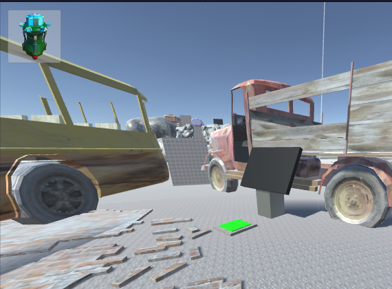
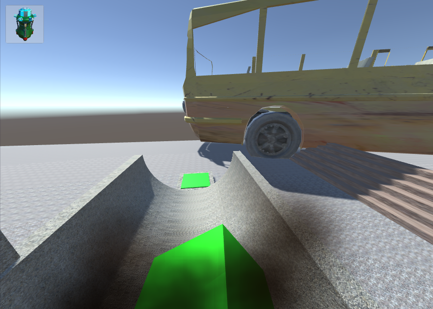

Or "how to do much and achieve less"

## Polishing

The act of polishing a game is to look for small improvements (mostly not gameplay-related) to make the game feel more "complete". Some particles here, some animation there and a prototyp is starting to look more like some actual product. I have taken some time to do a polishing pass on *Purpose and Despair* and here are the little bits I have added:

### Upgrade indicator

How do you know you picked up an upgrade? Easy right, you drove into it and it vanished. Basic game logic. But nevertheless it would be nice to get some kind of confirmation that would you think happened - actually happened.

So how about a little icon showing the thing you currently have picked up?

### Motor stalling

You might remember that in the game at first you cannot even push a cube around - your motor is way to weak to do that. *That is* why you have to get that upgrade in the first place. 

So what happens if you drive against the cube? Nothing. Any kind of explanation at the current state? No! Thats bad!  
What actually happens is that your motor is stalling and thus heats up quite a lot, enough to make your wheels smoke. So let us see that in action:

Trust me it looks even cooler when those particles are animated.

### Achievement icons

Achievement icons are just as important as the text accompanying it, so why do you just get some white square? I don't know but I fixed it. Play the game to see it for yourself!

## Time Invested

Hermann - 3h
