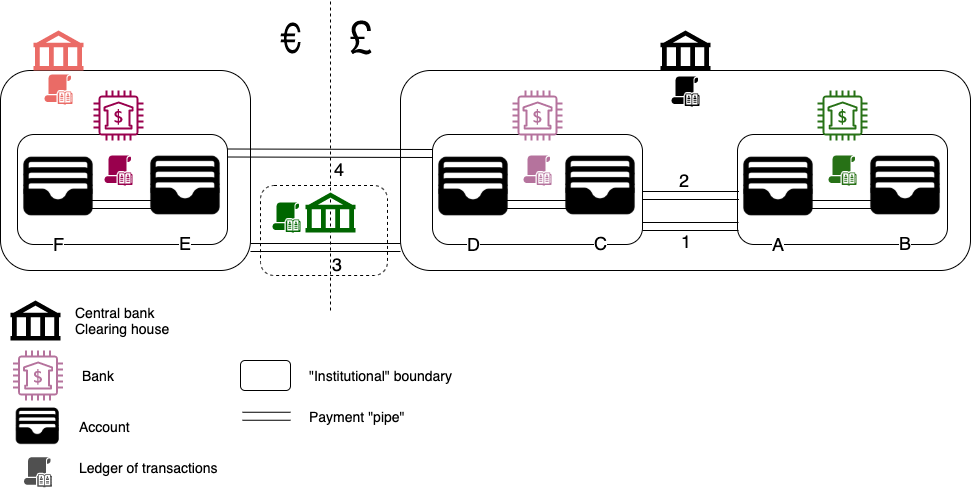

## Please, take my money! 

> Photo by Chris Karidis on Unsplash

You are on holiday in another country. You want to buy a coffee.    
You get your card out, swipe or type your pin and presto! 
Coffee paid for your enjoyment. 

Congratulations! You just participated in the modern marvel of international payments.  
The simple action described above requires levels upon levels of financial structures and instruments.

This series of 3 posts will attempt to give a high level intro on the history, the "what", the "how" and, when possible, 
the "why" of modern payment systems.
    
<!--more-->

## Can I has payment?

### Some definitions

> Photo by Pixabay on Pexels

Let's start with the very basics: what is a payment?  
According to [Wikipedia][1]   
> A payment is the trade of **value** from one party (such as a person or company) to another...

A-ha! Value. How do we define "value"?  Again, [Wikipedia][2] helps us with  
> Economic value is a measure of the benefit provided by a good or service to an economic agent. 
> It is generally measured relative to units of currency...

Hmm. Yet another term: currency. We [have][3]  
> ...a currency is a system of money (monetary units) in common use... recognized as stores of value...

The above turns out to be a slightly cyclical definition.   
However it becomes clear that the transfer of value in a payment is *facilitated* by a currency (a.k.a. money). 
In other words, money "changing hands" is not a goal in itself. Rather it simply helps in the process of a transaction, 
provided that both parties in the transaction recognize money as a trade/store of value.[1](#footnote_1)

### In the olden days...

> Photo by Jordan Rowland on Unsplash

Once upon a time, transactions and payments would take place only in person.  
Starting in the pre-historic times with [barter][4], mankind quickly had to move to something more handy and attuned 
to different types of transactions, some form of money.[2](#footnote_2) 
 
This role was eventually filled in by precious metals: gold and silver. Precious metals [possess a lot][7] of very 
[interesting properties][6] which make them a great fit as an economic medium. That is definitely true for gold and to a
certain extent for silver.

The introduction of metals (in the form of ingots, coins etc) as units of exchange solved the inherent accounting problems 
of barter and allowed the building of more complex economies. However, it still required a very important thing; the 
physical presence and transfer of the metal in order to make a payment.  
This is not as easy as it sounds, due to  
* the weight of metals themselves, and 
* the omnipresent armed bandit behind every bush. 

One solution to that was [merchant][8] and [Templar Knight][9] promisory notes. These solved   
* the weight problem: a piece of paper could carry the value of thousands of coins, and 
* to an extent the security aspect as well: the issuer could ask for some proof of id.  

The logical next step of this innovation was [paper money][10], issued by a central authority.  
Both promisory notes and paper money, introduced 2 new concepts:  
* An alternative medium for the transfer of value in 3d space (in this case paper).  
This acts in lieu of the "real thing".[3](#footnote_3)
* A trusted third party facilitating the flow of value.  
The trust component being that the third party (merchant, Knight Templar, emperor, central bank) will eventually make 
good on the promise to deliver the gold, as "written" on the piece of paper.

## Money vs. Currency

Going back in time and introducing these basic principles, allows us to examine today with a clearer lens and under a 
much brighter light. 

There are two terms which are used interchangeably in everyday life, even in this text here: money and currency.   
With the slight danger of [splitting hairs][11], I will attempt to make a distinction between the two, which I believe 
is useful.  

### Money  
Money is something which  
* has value in and of itself
* is a facilitator of financial transactions, and 
* is globally (or at least very widely) recognised as such.

The archetypal type of money is precious metals, as already mentioned. In the metals' case, the value is derived by their 
natural scarcity and the capital and resources [spent in extracting them][12] from the ground.  

From that aspect, the major [proof of work][13] [cryptocurrencies][14] can also be considered a digital approximation 
of money. This is due to the ever-increasing [capital and operational expenditure][15] required to [mine][16] them.

### Currency

On the other hand, currency (in the current [definition of the word][3]) is a medium of exchange within a bounded 
economic area, such as a country. It is the accepted legal tender in that area (many times the only allwoed [de jure][17] 
medium of exchange).  

In the modern era, until 1971, the world currency system was underpinned by [precious metals][18].  
From that point on, modern currencies (a.k.a fiat money) are only backed by the credibility of their issuing 
authority (government and/or central bank).[4](#footnote_4)

In much simpler words modern currencies are a promise (or, if you prefer, a promise of a promise). It is someone else's 
liability to make good on this promise, if the currency is to have any value.

So, to wrap this section up   
> Money is currency.  
> Currency is not necessarily money.

## Back to payments

> Photo by Shukhrat Umarov on Pexels

If one was to depict the global system of payments in a layman way, it would look a lot like a sequence of "barrels" 
filled up with "liquid" in a storage room.   
These barrels are submerged within larger barrels, which are within even larger ones and so on. 
There are a number of different hierarchies of containers in the same room, each one containing a different type of 
incompatible liquid (think water and oil). 
The containers at the various levels are interconnected with one or more "pipes" allowing the liquid to flow through. 
Each of these pipes is equipped with one or more "meters" to measure the flow each way.

In this simplistic mental example, we  
* The liquids are currencies
* The barrels are the various structures which can hold currency: bank account, commercial bank, central bank (from 
inner- to outer-most)  
* The pipes are the ways of facilitating the transfer of currency between accounts and banks.  
These are called [payment][20] or settlement systems.  
* The meters are the facilities to keep track of what is moved where and by whom. 
At their heart these are [double-entry ledgers][21], recording in which direction money moves and who owes what to whom.

There are 2 differences of the global payments system from the mental model of "barrels of liquid".  
* Currency (the liquid) does not physically "move" down the pipes from one account/bank to the other.[5](#footnote_5)
What actually travel are messages of various [types][22], which result in the ledgers (the meters) recording new transactions 
and updating balances. In other words, value in today's payments world is purely virtual and electronic. 
* The different liquids (just like currencies) are, well... different and do not mix.   
Yet when currency moves across borders, it is the equivalent of water turning into oil. This is a happy corollary of 
modern-day "money" being electronic.[6](#footnote_6)  
In the olden days of gold-backed currencies, central banks would ultimately settle their balances by [gold shipments][27].

Now that you mastered the simple mental model, let's jump right into a nice and complex diagram of the modern banking 
system.  

Instead of explaining all lines and boxes, let's see how things interact with a few examples.

### Intrabank payment

Let's start with the simplest case: a payment from account A to account B, within the same bank. 
Let's call it GreenBank or GB for short.

In this case the pipe connecting the 2 accounts is GB's internal systems.   
If GB is an older, larger bank, offering more products and most importantly more [customer channels][28], then payments 
would probably "settle" overnight as part of large batch operation. In this case, an intrabank transfer is considered 
final only after the nightly batch has processed every transaction across all channels.   
This means that there is a small possibility of the payment being reversed when the system attempts to settle it.
 
If GB is a bank with newer IT systems and fewer channels (e.g. [neobanks][29]), then intrabank payment settlement is 
in real-time (i.e. when it's gone from account A, it's gone).
 
The transaction ("£50 leave here", "£50 go there") is recorded and tracked in GB's transaction ledger. In the case of 
overnight settlement first as "tentative" and as "settled/cleared" when the batch completes. In real-time systems the 
ledger only contains the settled the settled entry.     

An interesting special case of intrabank payments is that of [e-money providers][30].

Let's call our fictitious e-money provider CarrotMoney, or CM for short.

Each CM customer sees their own digital wallet (usually a mobile app) with its own balance.  

Looking "behind the scenes", you can see that there is usually a single bank account backing the whole company.  
This "client money" bank account is held at a "sponsor bank" and contains the money of all of CM's customers 
together in one lump sum.  
The only thing that allows CM to know that from, say, the $150 in the client money account $100 belong to Bob and $50 
to Alice is its own internal ledger. In our scenario if Bob decides to send $20 to Alice, then  
* the CM ledger will be updated, and
* their balances on their CM wallets will change. 
However from the sponsor bank's point-of-view nothing will have changed: the CM client money bank account as a whole 
will still hold $150. The sponsor bank  
the bank had no transaction to record.

Keeping customer money within their own institutional boundary (a.k.a. "ecosystem")  
is a big driver for e-money providers 
(i.e. within their own client money account)
which is why it is a breeze to make payments to other customers of the same e-money provider
CM users get the impression that money moves around when paying other CM users 
but looking from the outside in, the overall balance of the CM client money bank account does not change
Even if Bob and Alice make thousands of payments to each other, from CarrotMoney's point-of-view it is still the same amount 
in the client account (and depending on how CM's business model works, this amount can be [assets under management][31])  
It is only when CM customers send money to a non-CM account that money truly leaves the CM client account
and the sponsor bank records a transaction in its ledger    

### Interbank payment

In the case when a payment needs to go from one bank to another  
i.e. cross institutional boundaries we need a third party to act as the trusted intermediary: the central bank 

Let's consider the case when account A of GreenBank (GB) wants to make a payment of £50 to account D of PurpleBank (PB)
A number of things need to happen:
1. GB needs to make sure that A has at least £50 as available balance
2. GB then needs to debit £50 from A
3. GB needs to somehow send the money to PB, and
4. PB needs to credit £50 to D

From these steps number 3 is the hardest as the 2 institutions need to trust each other 
GB cannot realistically send the money in a bag to PB
it also cannot "communicate" the money electronically; how can GB's recipient banks know that it actually has the £50?

The answer comes via one or more secure messaging networks (diagram lines numbered 1 and 2) facilitated and guaranteed 
by the central bank (in black).[7](#footnote_7)

What (roughly) happens is along the following lines
* GB and PB participate in a [payment system/scheme][32], by depositing an amount of money in their account in the 
central bank
* When A instructs a £50 payment to D, GB checks the balance of A.
* If A's balance can cover the payment, GB sends a message to PB that "£50 are on their way"
* If a modern scheme, PB credits £50 to D as soon as it receives the message.
* At regular intervals, the central bank gathers all payment messages exchanged between the participating banks, tallies 
them up and [nets off][33] the amounts
Outstanding differences are settled by moving money between the banks' accounts held at the central bank. 
At the end of the day, the banks top up that central "stash" if needed and it's all over again the next day 

In this scenario there are 3 ledgers in 3 different institutions which need to be updated: GB, PB and the central bank

Some countries have multiple electronic interbank payment schemes (e.g. in the UK [Faster Payments][34], [Bacs][35], [CHAPS][36],... , 
 in Greece [DIAS][37] and [IRIS][38] etc)

Newer schemes (e.g. Faster Payments) are message-based and payments arrive in the creditor's account in a matter of minutes
Older schemes (e.g. Bacs) are file-based. Instead of messages, all participating banks gather the day's payments in files 
and send them to the central authority for processing and settlement.
Each payment scheme is geared towards a different segment of the payments space e.g. Faster Payments for smaller value 
transfers, CHAPS for higher value, IRIS offers defining payee by mobile phone rather than IBAN etc  

Because of the capital requirement to have a capital buffer in the central bank 
not all banks can or want to be direct participants in a payment scheme (e.g. [UK Faster Payments participants][42]) 
other banks need to have a sponsor bank which propvides the guarantee for them

Unlike intrabank payments, the only cost of which is running the bank's systems, the payment schemes usually have a cost per 
payment 
to cover the expenses of running the scheme
In well-functioning banking eco-systems this cost, especially for small-value transactions, is sometimes absorbed by the banks (e.g. Faster Payments in the UK)
Otherwise this is passed on to the customer, sometimes with sprinkle on top.[8](#footnote_8)

### International payment - Central bank clearing

When money needs to move between countries   
payments involve more steps

### International payment - Nostro/vostro

### Some comments

delays 
[credit and debit messages][23] between banks are almost instant
even [around the world][24]  
but processing them is slow 
settlements are at end of day
the more hops further away the slower the settlements

payments are primarily "push"
the payer sends money to the payee
the payer's responsibility to give the receiver account "coordinates" (i.e. bank account number) correctly

banks around the world treat international payments differently 
due to [KYC][25], [AML][26] and systems' design 
requiring different levels of detail (e.g. account owner name, address, etc) 
 
the more data points required as input the highwer the possibility for mistakes in account numbers 
surprisingly large number of manual processing and corrections

currency markets vs dependency on dollar 
as reserve currency 

swift payment system 
depends on dollar flows/banks
weaponized for sanctions

## Payment rails 

### Cards & mobile

### Remittance services

## ...and the future

### Digital IOUs

#### Libra

### Government cryptocurrencies

### Proof-of-work money 

## Parting thoughts

> Photo by Maxime Lebrun on Unsplash

Money not only makes the world go round 
but also goes around the world 
trillions of times

from the ancient in-person gold-in-hand transactions 
we have evolved into complex currencies and complex structures 
we seem to be going back in full circle 

## Footnotes

1. If someone came to you to buy your house with a handful of green beads and shiny mirrors, you
would probably say no, even if they called the beads "money". That is because you may not attribute so much value to them as this imaginary buyer thought.  
2. Money here refers to the [archetypal meaning and definition of the word][5]. If money is not there 
you end up having to figure out how to buy something with 3.5 live sheep.  
3. The "real thing" being the gold or silver sitting in the emperor's or Knights Templar's vault.
4. An extreme example to clarify this point: The people of North Korea are perfectly "happy" to 
be using the [won][19] as a medium of exchange. Their government's credibility is (literally!) a matter of life and death 
to them. How much value would *you* put on a North Korean won banknote and why?
5. In the sense that if we make a payment from Japan to the U.S. at no point in time will anyone 
put yen bank notes in a box and send them over the ocean to complete the transaction. 
6. One side makes a note "I owe that country X billions" and writes those billions off its 
central bank balance sheet (the equivalent of "burning money"). The other side makes a note "that country owes me X billions"
and adds those in its central bank's balance sheet (the equivalent of "printing money"). It is slightly more complex than
this, but you get the idea. 
7. This is a slight over-simplification. In practice the trusted third-party is an institution managing the payment 
scheme. This institution is setup and sponsored by the central bank.
8. It is funny how IRIS was initially advertised as [free to use][41] for bank customers, yet Greek 
banks [end up][39] [charging][40] regardless. 

  [1]: https://en.wikipedia.org/wiki/Payment
  [2]: https://en.wikipedia.org/wiki/Value_(economics)
  [3]: https://en.wikipedia.org/wiki/Currency
  [4]: https://dictionary.cambridge.org/dictionary/english/barter
  [5]: https://www.sparknotes.com/economics/macro/money/section1/
  [6]: https://www.goldmoney.com/research/goldmoney-insights/golds-natural-monetary-properties
  [7]: https://www.weforum.org/agenda/2019/07/why-gold-is-money-a-periodic-perspective/
  [8]: https://en.wikipedia.org/wiki/History_of_money#400%E2%80%931450
  [9]: https://www.bbc.co.uk/news/business-38499883
  [10]: https://en.wikipedia.org/wiki/History_of_money#Banknotes
  [11]: https://www.collinsdictionary.com/dictionary/english/split-hairs
  [12]: https://www.theglobeandmail.com/globe-investor/investment-ideas/how-much-does-it-really-cost-to-mine-an-ounce-of-gold/article20709844/
  [13]: https://cointelegraph.com/explained/proof-of-work-explained
  [14]: https://en.wikipedia.org/wiki/Cryptocurrency
  [15]: https://www.thebalance.com/can-bitcoin-mining-make-a-profit-4157922
  [16]: https://www.bitcoinmining.com/
  [17]: https://en.wikipedia.org/wiki/Legal_tender
  [18]: https://en.wikipedia.org/wiki/Bretton_Woods_system
  [19]: https://en.wikipedia.org/wiki/North_Korean_won
  [20]: https://en.wikipedia.org/wiki/Payment_system
  [21]: https://en.wikipedia.org/wiki/Double-entry_bookkeeping_system
  [22]: https://www.iso20022.org/payments_messages.page
  [23]: https://www.swift.com/
  [24]: https://www.investopedia.com/articles/personal-finance/050515/how-swift-system-works.asp
  [25]: https://en.wikipedia.org/wiki/Know_your_customer
  [26]: https://www.investopedia.com/terms/a/aml.asp
  [27]: https://www.gold.org/about-gold/history-of-gold/the-gold-standard
  [28]: https://howbankswork.com/banking-framework/channels/
  [29]: https://en.wikipedia.org/wiki/Neobank
  [30]: https://www.fca.org.uk/firms/payment-services-regulations-e-money-regulations
  [31]: https://www.investopedia.com/terms/a/aum.asp
  [32]: http://www.accesstopaymentsystems.co.uk/introduction-payment-systems-and-schemes
  [33]: https://www.kantox.com/en/glossary/payment-netting-2/
  [34]: http://www.fasterpayments.org.uk/
  [35]: https://www.bacs.co.uk/Pages/Home.aspx
  [36]: https://www.bankofengland.co.uk/payment-and-settlement/chaps
  [37]: https://www.dias.com.gr/?lang=En
  [38]: https://www.europeanpaymentscouncil.eu/news-insights/insight/greeces-steady-progress-towards-cashless-society
  [39]: https://www.alpha.gr/-/media/alphagr/pdf-files/diafora-sunodeutika-pdf/xrisima-eggrafa/oroi-sunallagon-promithies-loipa-eksoda.pdf
  [40]: https://www.eurobank.gr/-/media/eurobank/rates/timologio-trapezikon-ergasion.pdf
  [41]: https://www.asfalisinet.gr/%CE%B7-online-%CF%85%CF%80%CE%B7%CF%81%CE%B5%CF%83%CE%AF%CE%B1-%CF%80%CE%BB%CE%B7%CF%81%CF%89%CE%BC%CF%8E%CE%BD-iris-%CF%87%CF%89%CF%81%CE%AF%CF%82-iban-%CE%BA%CE%B1%CE%B9-%CF%87%CF%81%CE%B5%CF%8E/
  [42]: http://www.fasterpayments.org.uk/directly-connected-participants