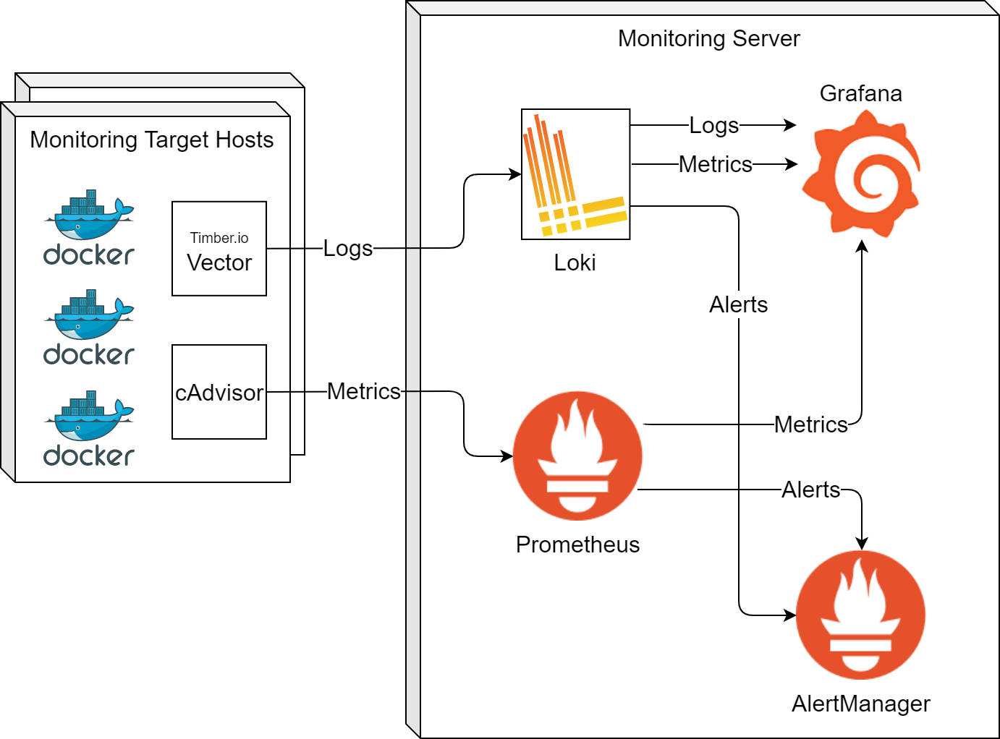

# Introduction
In the current tutorial we shall introduce on how Prometheus is deployed in a federated environment where different servers running different docker containers interact with a monitoring server to expose their metrics. 


## Motivation
 Why an organization needs monitoring?

 What is the importance of distributed monitoring?

 Why logging?

## Overview
After reading this blog, you should be able to perform the following:
1. **Runtime Metrics:** Collection of run time metrics of running containers at different hosts. This mainly includes the resource and network bandwidth usage of the running containers. We shall achieve this using Prometheus, cAdvisor and Grafana.
2. **Alerting:** Alerting helps the administrators or the maintainers to know the service status without manually following the service status visualizations. The administrators can create different alerting rules and get notifications through different channels. We shall achieve alerting using Alertmanager and Prometheus. 
3. **Distributed Logging:** Logging gives an insight to the running applications and their behaviour. This can be used by the service providers to deduce the causes for malfunctioning and to get an overview of the client behavior. In the current document, we visualize the logs exported by NGINX. We shall achieve the logging using Loki and Grafana.
# Deployment and the Data Flow
The figure below shows a possible deployment where both metrics (collected by Prometheus and derived from Loki logs) and logs (collected by loki) are visualized using Grafana. Monitoring target hosts are being monitored by the monitoring infrastructure running on monitoring server. Vector and cAdvisors running on the target hosts help in exporting the metrics and logs to the monitoring server. Vector is used to publish the logs to Loki and cAdvisor is used to expose the metrics of the monitoring targets so that Prometheus can pull from them using cAdvisor APIs.




## Setting up the Monitoring Server
## Open ID provider

Monitoring server is composed of Grafana, Prometheus, Loki and Alertmanager. Optionally one can run vector and cAdvisor in case you want to monitor the monitoring server itself.

download the docker compose file and the configuration files:
```
# Download Docker compose
$wget  https://raw.githubusercontent.com/linksmart/blog/master/_posts\resources\2020-01-29-Monitoring-Prometheus-Loki-Grafana/docker-compose-monitoring_server.yml -O docker-compose.yml

# create a conf directory
$mkdir conf

# Download alertmanager conf
$wget https://raw.githubusercontent.com/linksmart/blog/master/_posts\resources\2020-01-29-Monitoring-Prometheus-Loki-Grafana/prometheus_conf_alertmanager.yml -O conf/alertmanager.yml

# Download prometheus configuration
$wget https://raw.githubusercontent.com/linksmart/blog/master/_posts\resources\2020-01-29-Monitoring-Prometheus-Loki-Grafana/prometheus_conf_prometheus.yml -O conf/prometheus.yml

# Download loki configuration
$wget https://raw.githubusercontent.com/linksmart/blog/master/_posts\resources\2020-01-29-Monitoring-Prometheus-Loki-Grafana/loki_loki-config.yaml -O conf/loki-config.yaml

```

## Setting Up the Monitoring Clients


# Use Case (EFPF)
Introduction to efpf and its infrastructure

Multiple clients located at different locations sending the logs
Example client(s)


