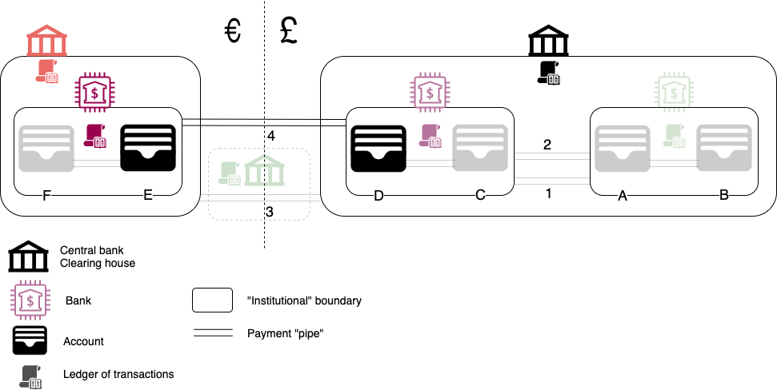
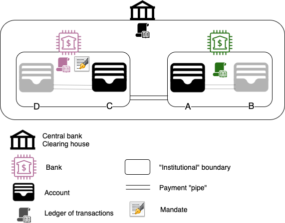

## Going international 

> Photo by JK on Unsplash

*In the [previous installment][1] of this series, I talked about the history behind payment systems and described how 
domestic payments work.*  

*In this post I will cover* 
 * *cross-border payments*
 * *pull payments, and* 
 * *discuss some of their pros and cons.* 
    
<!--more-->

Take a look around you.  
Try to count how many items are **not** imported. Chances are you have not managed to count many.
 
With international trade so prevalent, money crossing borders is crucial to keep our world connected.
But how does water turn into oil? [1](#footnote_1)

### International payments - Nostro/vostro

The oldest form of cross-border payment mechanism is via [correspondent banking][3] (a.k.a. [nostro/vostro][4] accounts).

In this model (line 4) PurpleBank (on the right) has a correspondency relationship with RedBank (on the left). What this 
means is that RedBank holds a bank account under its name in PurpleBank.

When PurpleBank customer D wants to send money to RedBank customer E, what she does is deposit the equivalent amount to 
RedBank's own account inside PurpleBank. This deposit has a reference that the amount is intended for E.

RedBank sees the amount deposit confirmed (possibly intraday, since it is all part of PurpleBank's systems) and credits 
the account of E with the equivalent amount on the other side. The deposit in E's account comes from RedBank's "own" money.

Notice that in the above scenario, there was no cross-border transfer of value or even a single payment message. [2](#footnote_2)  
The remote account (owned by RedBank, held in PurpleBank) is part of RedBank's assets, even though it is in a far away 
place. [3](#footnote_3)

This setup is the money equivalent of a teleportation gate; money appears on the other side almost magically. It is the 
legal agreements, the way [balance sheets work][8] and ledgers on both sides of the correspondency which make this possible.   

Correspondency banking used to be the **only** way cross-border payments happened back in the day, but now it is almost 
obscure and little known, "buried" under additional layers of payments systems. So much so that it was used as a window 
for [insiders to bypass][6] the [2015 Greek capital controls][78] with almost no-one realising (all credits go to the [original source][5]).

There are 2 issues with using nostro/vostro accounts at a large scale.  
* They were much easier to setup and implement as a bilateral agreement when world currencies were on [fixed exchange rates][9]. 
In the modern world, currencies fluctuate momentarily, which makes it harder to track the value of transactions. 
* There is always [counter-party risk][10] from the side of the nostro holder (in the above example RedBank). [4](#footnote_4)  
This was demonstrated in a great way in 1974 with the [Herstatt Bank][11] bankruptcy.

### International payments - FX markets & Central clearing

Addressing the above 2 aspects we have  
* **Fluctuating currencies**  
Currencies post gold-standard are traded in pairs, i.e. their price is determined against each other. Their "spot price" 
is determined in [FX markets][13]. FX markets is a very broad term to describe effectively bilateral [OTC][14] trades,
between big international banks and brokers. And by "OTC trade" we mean the purchase of the equivalent amount of foreign 
currency X, paid in local currency Y.  
* **Risk**  
As with all other financial transactions, using a [clearing house][15] as a guarantor reduces counter-party risk.

Putting the above back in our diagram, we have line 3.

The fundamental difference between line 4 (nostro/vostro) and 3 (central clearing and facilitation) is not so much that 
it has some 3rd parties facilitating the international movement of funds. It is **when** the payment will be considered 
[settled][16] as opposed to netted off or held as a liability from the other bank (which is the case with nostro/vostro).

Let's take an extreme example of efficiency, EU's [TARGET2][17] settlement system.  
In TARGET2 all transactions are cross-border but they have the benefit of a single currency. This makes the underlying 
operating principles roughly similar with national payment systems [described in part 1][1]. In TARGET2 it is [ECB][18] 
which holds the virtual central pool of money and EU central banks play the role of the guarantor for commercial banks. 
The core aim is to replenish the outstanding balances by [the end of the day][19] and keep the system whole. However, the 
flows being international means they are usually [unbalanced][21]. [5](#footnote_5)   
This results in the receiving country's central bank lending the sending country's from the excess of the money it has 
just received [13](#footnote_13). This permanent state of [cross-border imbalance][40], fuelled by trade, is the subject of much discussion.    
  
In the general case, cross-currency payments do not have the slick operation of TARGET2. The mechanisms employed are 
more complex as there are 3 hurdles to overcome.

**Currency conversions**  
As discussed previously, large global [market makers][22] buy big sums of foreign currency and then re-sell that "down 
the food chain" to brokers and smaller banks for a fee. So, in the process of any cross-border payment, there will be a 
transaction to convert currency by using the "FX markets". 

**Counter-party risk**  
Since there is no "Planet Earth Central Bank" to guarantee all global transactions, international value transfers are 
facilitated and guaranteed by a [number][23] of regional and [international][24] settlement systems and clearing houses.  
These settle transactions between central banks, companies and everything in between.    

**Routing**  
The global financial system is a mesh (and a mess) of interconnected nostro/vostro accounts between the thousands of 
banks in the world. For a payment to find its way from point A to point B (say, from Mexico to Vietnam), it needs to 
"navigate" 3, 4 or more of these correspondent banking "hops".  
For this reason the [SWIFT][25] network has been setup to [facilitate][26] the actual payment routing.  
At its core, SWIFT is very similar to the internet [IP routing][27] infrastructure:  
* the [BIC][28] and [IBAN][29] are the [IP address][30], 
* the banks are the routers, and
* the SWIFT [messages][31] are the IP packets.

However, unlike in IP where routers just forward packets, in SWIFT 
* intermediary banks also "forward" the payment amount to the next bank in the chain, and
* liberally take a [cut from the cake][32] for this.

### A brief pause

> Photo by Wade Austin Ellis on Unsplash

It is worth pausing for a minute and discussing these options. 

Nostro/vostro is the oldest and simplest form of cross-border financial plumbing. It is also the single "lego block" 
used to build the complex SWIFT infrastructure and its younger EU cousin [SEPA][33].

Despite the apparent elegance of SWIFT, SEPA and TARGET2 payment networks, there are a number of issues affecting them 
to a varying degree.

### Reliability 

The farther away in "financial proximity" the more unreliable the payment execution is. Timings of a cross-border payment
(i.e. when funds will actually land on the recipient account) can [vary wildly][41]. 

This is down to 2 main reasons  

**Disparate legislation**  
Payments are effectively "push" actions: the payer sends money to the payee. It is the payer's responsibility to give 
the receiving account "coordinates" (i.e. bank account number) correctly.  
Jurisdictions and banks around the world treat international payments differently, due to [KYC][25], [AML][26] and 
IT system design. They require different levels of detail (e.g. account owner name, address, etc) and may have 
various quirks in their system implementation (e.g. truncate long strings, punctuation marks,...).  

The more data points required as input, the higher the possibility for mistakes in processing a payment instruction. 
Especially considering how many different banks the instruction must "hop through" on its way. It should not come as 
a surprise that banks around the world employ armies of people tasked solely with manually checking, correcting and 
processing international payments.  
This affects SWIFT much more than SEPA, due to the latter taking advantage of enforced common standards across the 
Eurozone.

**System processing**  
SWIFT [credit and debit messages][23] between banks are almost instant, [around the world][24]. But actually processing 
them is slow.   
Most banking systems are batch processes, taking place at the end of the day. Their day!  
The more correspondent banking hops the payment has to go through, the slower the eventual receiver [value date][42]. 
Timezones, bank holidays and business day cut-off times are all working against the payee getting her money. 

### Trust 

This should not be seen as an issue, because it should be taken as a given. But surprisingly it is (an issue) because it
is not (taken as a given).  
International transfers are based on an "arm's length" relationship, with clearing houses used to reduce risk and 
establish trust. It is the more integrated network, TARGET2, which suffers from a growing lack of trust. 

As mentioned previously, TARGET2 facilitates intra-EU payments by allowing EU member central banks to effectively lend 
each other. This means that the consequent surpluses and deficits are balance sheet records; Germany's assets are Italy's, Spain's 
etc liabilities. This has resulted in a [trillion][43] euro domino tower; a unilateral exit from the Euro by any of the 
[southern debitors][44] would be, well... interesting, to say the least!  
The northern European banking system would be lucky to survive. 

This mounting risk is causing a lot of untold headaches and might one day cause an EU-wide [Mexican stand-off][52]. 

### Geopolitics

The world is turning multi-polar. 

Whether it is [China-US-EU][34] or some [other][35] [combination][36] is of little importance. What is important to 
note is the disproportionate dominance of a single currency (US dollar) in the global payments system.  
Just a cursory glance at the actual [topology][37] of the [SWIFT network][38] is enough to prove that SWIFT is global in name only. 
95% of the network's routing goes through US financial institutions.  
This makes it laughably easy for the US to [weaponize][39] its infrastructure and for the world to immediately comply. [6](#footnote_6)
An EU attempt to keep the Iran nuclear deal [alive][54] (and override US sanctions), resulted in something more [like a barter 
system][53] than a payments network.

US dominance is a strategic threat which countries and corporations around the world are only now waking up to.

## Pull payments

> Photo by Pixabay on Pexels

So far we spoke about push payments, where the payer sends the payee money (e.g. because there is an outstanding invoice to pay).

There are 2 scenarios where this model is not sufficient  
* Recurring payments, e.g. for subscriptions or repayments. You just want to get paid based on a contract, rather than 
chasing people to send you the payment.
* [Point of sale][46] purchases. When you are in the supermarket and not carrying cash, you cannot drop your shopping 
and go to the bank to transfer the amount to the shop-keeper.  

### Direct Debit

According to the [Wikipedia definition][47] definition a direct debit is  
> a financial transaction in which one person (or company) withdraws funds from another person's bank account...
> the payer must have advised the bank that he or she has authorized the payee to directly draw the funds

Direct debit (or with any other name it is known around the world) is an *automated variable recurring payment* 
mechanism and network. It has been around for [60 years][48] already.  
It needs 2 basic things to operate:  
* the account numbers of both parties (payer and payee), and
* the payer's authorisation (a.k.a. [mandate][49])   

Putting this in our usual diagram, we have something very similar to normal payments. 

Let's say that customer C with an account in PurpleBank (left) started going to the gym owned by merchant A (account in 
GreenBank). A wants to start charging C an amount monthly.  
For this reason, A asks C to setup a mandate with C's PurpleBank. [7](#footnote_7) Once this is setup, on the 
pre-agreed intervals (e.g. every 15th of the month), C's direct debit processor submits a debit instruction to the 
scheme. 

This is grouped together in batch files and submitted to the central scheme (e.g. [Bacs][73] in the UK) for processing, along 
with all other payments. As already discussed in [part 1][1], the payment scheme has a central pool of money from all 
participating banks. 

Unlike push payments, in this case C's account will be credited immediately by using money from the central pot. 
Meanwhile the scheme will claim (debit) the money from A's account to make up for the difference. In case something went
wrong with A's debit (e.g. not enough funds, mandate no longer valid), the scheme will take the money back from C.  

This latent, eventual settlement is a basic difference between direct debits and push payments.  
In order to improve the experience for the payee (receive owed money as soon as possible, to assist with cashflow), most 
direct debit schemes inverse the order of actions. [8](#footnote_8) In the rare case where there is a late 
failure (e.g. account closed, owner deceased, mandate incorrect,...), money will appear and consequently disappear from 
the payee's account (because the collection failed and the payout needs to be reversed). 

It is interesting to note here that to set up a mandate all one needs is a correct owner name and account number. This 
can lead to some interesting [cases of id theft][50] with legacy, paper- or telephony-based processors. A new wave of 
online direct debit processors add [automated identity checks][51] in the process to tackle this ingrained inefficiency. [9](#footnote_9)  
 
### Cards 

The plastic card, [debit][64] or its older sister [credit][65], has been around since the '50s.

It attempts to solve the following problem
> How do you perform a financial transaction at point of sale without exchanging cash or bank account details?  

The answer is... you guessed it! by introducing additional trusted third parties.

When paying with a card [10](#footnote_10), there are 4 tiers of processing that take place. Let's take the 
case of a customer using her [chip & pin][55] card at a merchant's [POS terminal][46].  

* After the customer enters her PIN and completes the cardholder verification step, the terminal sends the transaction's 
details (amount, card number, merchant id) to the Payment Processor (PP), to whom the terminal belongs (arrow 1).
* After some basic checks, the Payment Processor immediately forwards the transaction to the Card Network (CN) (arrow 2). 
* The CN maps the card number to the bank in which the customer has her account C (a.k.a. Issuer bank). It immediately 
forwards the transaction to the Issuer (arrow 3).
* The Issuer checks all kinds of things: Is the account open? Does it have enough limit to cover the transaction? Are 
there are blocks for the transaction (e.g. fraud alerts)? etc  
If all is ok, the confirmation travels all the way back to the terminal and gives the customer the happy beep!

This is where it ends for the customer. But not yet for the merchant; she needs to receive the funds.  
Depending on how things are setup, M can receive the funds the same day or many days later, with all the involved parties 
taking a bite off the cake.  
* The PP may be able to front the payment (a.k.a. provide cashflow). In this case  
  * funds are transferred from the PP's bank account to M at the end of the day,
  * PP submits the batched payment instructions for the day to the CN, asking to receive the equivalent amount, and
  * the CN forwards the files to the bank for the amount to be sent to to the PP  
* The merchant's bank (a.k.a. Acquirer bank) may be providing cashflow. In this case  
  * the CN notifies the Acquirer of a successful confirmation (arrow 4),
  * the Acquirer pays the merchant's account M from their own funds, and
  * the PP submits payment files instructing the transfer from the Issuer bank (C) to the Acquirer 
* Noone provides liquidity and the merchant has to wait.  
In this case the PP submits the payment instructions for a direct transfer from C to M.  

The underlying money transfer mechanisms (pipe 5) are the exact same ones described so far (domestic 
and international). There is no magic or alternative way of transferring value in the case of cards.  
From that lens the card network is a huge "traffic controller", a trusted middle-man. It uses the card number and merchant 
identifier as virtual addresses to locate the bank accounts of both and "get them in touch". 

It is also interesting to note the presence of a Payment Processor, in addition to the card network.  
This is because the card network is strictly [b2b][56]; maintaining a network of thousands of banks is enough work. The 
Issuer bank handles the relationship with the card holder. The Payment Processors [11](#footnote_11) handle 
the relationship with the Merchant.  

The main benefit of card networks is their ubiquity.  
Visa alone has a network of over [14,000 banks][57] and billions of cards issued.

However, complexity and abstraction come at a price.  
There are 2 main drawbacks to card usage.  
* Fraud  
There are tens of millions [stolen card details][58] online. With the card doubling as a direct pointer to the bank 
account, it used to be [very easy][59] to perform online fraud. This is slowly tackled by introducing [2FA][59] in the
online checkout process (e.g. [Verified by Visa][60]). 
* Failure rates  
The additional middlemen and network hops result in some [pretty][61] [dire][62] failure rates; up to 15% (!!) according 
to [Worldpay][63]. Friction can be a huge loss of revenue, especially for online merchants. 

### ...and mobile

In the previous diagram you may have noticed a small mobile device next to the customer.  
We cannot talk about pull payments, without covering mobile wallets (e.g. [ApplePay][66], [GooglePay][67], 
[Samsung Pay][68],...). 

Mobile payments are layered on top of the credit card networks.  

The actual card details (number, name, expiry date,...) are initially turned into a secure token, following the [EMVCo 
specification][69]. This happens by communicating them once to Apple [12](#footnote_12), getting the token back
and storing on the mobile phones' secure wallet.  
Whenever the phone is near a POS reader, the wallet is unlocked using the PIN/thumb/etc. The tokenized card is used to 
sign the transaction (amount, merchant,...) which, via the reader, is sent for verification.  
It is routed to Apple's servers where the token is verified to indeed represent a card. After that the request is 
processed like a normal card payment. 

In this context Apple is taking partly the role of the payment processor, facilitating the transaction routing. For this
it is taking a percentage off the payment (0.15% in the US for Apple).  
With mobile phone usage and wireless micro-payments [exploding worldwide][70], this is a very lucrative revenue stream, 
increasing the [CLV][71] of mobile phone owners by orders of magnitude.

Again, complexity comes at a price.  
With Apple / Google / etc becoming a trusted intermediary in the payment chain, mobile payments are [more open to fraud][72] 
than plain card usage, at least for now. That is because the thumbprint or PIN at the point of sale, only proves device 
ownership, not card ownership. Any stolen card can be added to the device and consequently used.

## Stay tuned... 

> Photo by JESHOOTS.com from Pexels

In the next and final installment, we will go over  
* some modern "payment rails" developed in the last decade, 
* the emerging role of crypto-currencies into the "payments mix", and
* wrap up with some parting thoughts.

## Footnotes

1. To use an analogy from [part 1][1].
2. In the olden days, banks would send a telegraphic message and later Telex.  
In the modern day, for all that we know, RedBank may be employing a person to just press [Ctr+F5][7] 
all day, to see new credits in their nostro account. 
3. Which means that by giving money to account E, RedBank did not just "magic" some money up.  
It just counter-balanced its newly acquired asset (money in its PurpleBank account), with a liability (giving money to E). 
So, all is zero in the end. 
4. If PurpleBank proves to be dodgy and its deposits evaporate, then RedBank's asset (their 
account in PurpleBank) is worth nil and has to be written off.  
5. For example, the Spanish buying more German cars than the Germans [jamon iberico][20]. 
6. Being placed under sanctions goes beyond financial transactions. Any part of the [US 
infrastructure][45] from SWIFT message processing to mail servers etc is blocked for entities considered adversaries. 
And this can increasingly be anyone.
7. The mandate is the equivalent of C declaring "Please allow A to take (debit) from my account 
in PurpleBank every X days and deposit it in her account in GreenBank". 
8. In a "normal" push payment it is first debit (from the payer) and then credit (to the payee).  
In direct debit, it is first credit (to the payee) and then debit (from the payer), or at the very least these 2 happening 
almost in parallel. 
9. Full disclosure: I am an employee of GoCardless, an online direct debit provider, at the 
time of writing this blog post. 
10. Debit and credit cards have no practical difference in this discussion.
11. This used to be exclusively the remit of the Acquiring banks. But as technology and terminals 
started becoming more advanced, it becomes harder and harder for "generalists" (as the banks are) to compete. Hence the 
rise of dedicated processors. 
12. When mentioning 'Apple' in this section, I refer to Apple, Google, Samsung,... 
13. Hard to make sense, I know! I had to re-read that myself... :-/

  [1]: https://sgerogia.github.io/Payments-Intro-Part1/
  [2]: https://sgerogia.github.io/Payments-Intro-Part1#mental_model
  [3]: https://www.investopedia.com/terms/c/correspondent-bank.asp
  [4]: https://en.wikipedia.org/wiki/Nostro_and_vostro_accounts
  [5]: https://www.techiechan.com/?p=2529
  [6]: ../images/Greek_Bank_Decision.pdf
  [7]: https://www.wikihow.com/Force-Refresh-in-Your-Internet-Browser
  [8]: https://www.guru99.com/assets-and-liabilities.html
  [9]: https://en.wikipedia.org/wiki/Gold_standard
  [10]: https://www.investopedia.com/terms/c/counterpartyrisk.asp
  [11]: https://en.wikipedia.org/wiki/Herstatt_Bank
  [12]: https://en.wikipedia.org/wiki/Capital_controls_in_Greece
  [13]: https://en.wikipedia.org/wiki/Foreign_exchange_market
  [14]: https://en.wikipedia.org/wiki/Over-the-counter_(finance)
  [15]: https://en.wikipedia.org/wiki/Clearing_house_(finance)
  [16]: https://en.wikipedia.org/wiki/Settlement_(finance)
  [17]: https://en.wikipedia.org/wiki/TARGET2
  [18]: https://en.wikipedia.org/wiki/European_Central_Bank
  [19]: https://www.youtube.com/watch?v=fstoINqXJK8
  [20]: https://en.wikipedia.org/wiki/Jam%C3%B3n_ib%C3%A9rico
  [21]: https://www.fxstreet.com/analysis/fuse-is-lit-target2-imbalances-hit-crisis-levels-an-email-exchange-with-the-ecb-over-target2-201702270841
  [22]: https://www.investopedia.com/terms/m/marketmaker.asp
  [23]: https://www.corporatetobank.com/resources/payment-clearing-and-settlement-systems/
  [24]: https://www.bis.org/banking/finserv.htm?m=4%7C20
  [25]: https://en.wikipedia.org/wiki/Society_for_Worldwide_Interbank_Financial_Telecommunication
  [26]: https://transferwise.com/gb/blog/everything-you-need-to-know-about-swift-network
  [27]: https://en.wikipedia.org/wiki/IP_routing
  [28]: https://www.swift.com/standards/data-standards/bic
  [29]: https://www.swift.com/standards/data-standards/iban
  [30]: https://en.wikipedia.org/wiki/IP_address
  [31]: https://en.wikipedia.org/wiki/SWIFT_message_types
  [32]: https://blog.revolut.com/swift-sepa-how-international-money-transfers-actually-work/
  [33]: https://en.wikipedia.org/wiki/Single_Euro_Payments_Area
  [34]: https://tribune.com.pk/story/1945783/6-emerging-tripolar-world-china-america-europe/
  [35]: https://carnegieendowment.org/2011/02/09/tri-polar-world-india-china-and-united-states-in-21st-century-event-3153
  [36]: https://www.asiatimes.com/2019/02/opinion/tripolar-world-china-ascendant/
  [37]: https://en.wikipedia.org/wiki/Network_topology
  [38]: https://www.swiftinstitute.org/wp-content/uploads/2014/09/SWIFT-Institute-Working-Paper-No.-2012-006-Network-Analysis-of-Global-Payment-Flows_v5-FINAL.pdf
  [39]: https://www.ft.com/content/8f16f8aa-e104-11e8-8e70-5e22a430c1ad
  [40]: https://www.ecb.europa.eu/pub/pdf/scpwps/ecb.wp2076.en.pdf
  [41]: https://fexco.com/fexco/news/how-long-international-bank-transfers-take/
  [42]: https://en.wikipedia.org/wiki/Value_date
  [43]: https://www.handelsblatt.com/today/finance/target2-when-is-a-trillion-euro-not-a-trillion-euro/23582376.html?ticket=ST-567213-S69wymscfit5pWXBKtad-ap4
  [44]: https://www.telegraph.co.uk/business/2019/06/04/german-bundesbank-comes-clean-euro-default-risks-italys-parallel/
  [45]: https://www.congress.gov/bill/116th-congress/senate-bill/482/text
  [46]: https://en.wikipedia.org/wiki/Point_of_sale
  [47]: https://en.wikipedia.org/wiki/Direct_debit
  [48]: https://www.youtube.com/watch?v=HLpIbRLi_x4
  [49]: https://gocardless.com/direct-debit/mandates/
  [50]: https://www.theguardian.com/money/2008/jan/07/personalfinancenews.scamsandfraud
  [51]: https://gocardless.com/guides/posts/direct-debit-in-the-digital-age/
  [52]: https://en.wikipedia.org/wiki/Mexican_standoff
  [53]: https://www.gtreview.com/news/mena/analysis-will-europes-new-iran-payment-mechanism-work/
  [54]: https://en.wikipedia.org/wiki/United_States_withdrawal_from_the_Joint_Comprehensive_Plan_of_Action
  [55]: https://en.wikipedia.org/wiki/EMV
  [56]: https://en.wikipedia.org/wiki/Business-to-business
  [57]: https://usa.visa.com/dam/VCOM/download/corporate/media/visa-fact-sheet-Jun2015.pdf
  [58]: https://blog.cybersixgill.com/23million_stolen_cc_blog
  [59]: https://en.wikipedia.org/wiki/Multi-factor_authentication
  [60]: https://www.visa.co.uk/pay-with-visa/featured-technologies/verified-by-visa.html
  [61]: https://www.spreedly.com/blog/credit-card-vs-debit-card-decline-rates-processing-fees
  [62]: https://blog.recurly.com/benchmarking-minimizing-credit-card-transaction-decline-rates
  [63]: https://www.worldpay.com/en-us/insights-hub/article/3-ways-to-drive-higher-approval-rates-in-online-payments
  [64]: https://en.wikipedia.org/wiki/Debit_card
  [65]: https://en.wikipedia.org/wiki/Credit_card
  [66]: https://en.wikipedia.org/wiki/Apple_Pay
  [67]: https://en.wikipedia.org/wiki/Google_Pay
  [68]: https://en.wikipedia.org/wiki/Samsung_Pay
  [69]: https://www.emvco.com/emv-technologies/payment-tokenisation/
  [70]: https://www.statista.com/topics/4322/apple-pay/
  [71]: https://en.wikipedia.org/wiki/Customer_lifetime_value
  [72]: https://www.forbes.com/sites/thomasbrewster/2019/03/27/millions-are-being-lost-to-apple-pay-fraudwill-apple-card-come-to-the-rescue/#134e0c10622f
  [73]: https://en.wikipedia.org/wiki/BACS#Direct_Debit
  [78]: https://en.wikipedia.org/wiki/Capital_controls_in_Greece