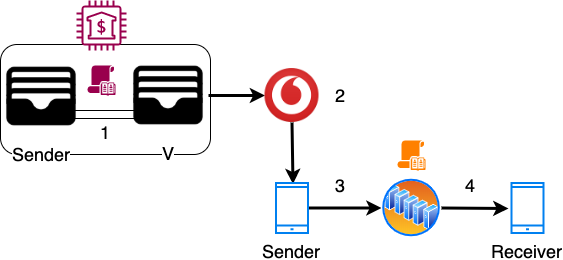
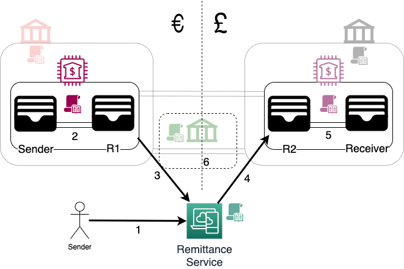
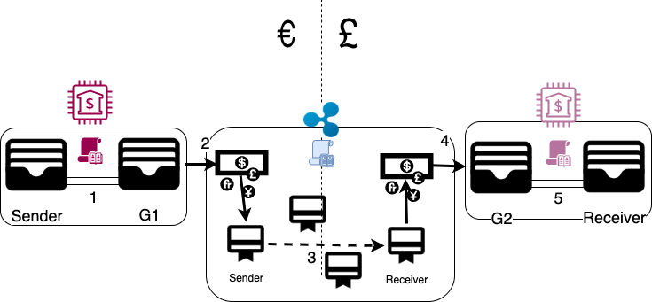
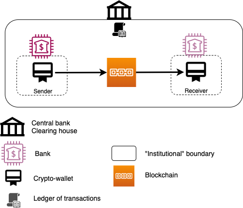

## On the rails 

> Photo by Christian Holzinger on Unsplash

*In the previous 2 instalments ([1][1], [2][2]) of this series, I talked about the history behind payment systems and 
described how domestic and international payments work.*  

*In this post I will cover* 
 * *modern payment "rails"*
 * *blockchain-based systems, and* 
 * *close the "trilogy" with some parting thoughts.* 
    
<!--more-->

### E-money

#### M-Pesa  

Mobile money (or [M-Pesa][3] as is widely known from its initial Kenyan incarnation) is the answer to the question  
> How do you provide digital financial services to third world populations, where the only technological device 
> available is an [indestructible brick phone][5]?

It seems that the populations had already found the answer themselves: [swapping of airtime][4].  
M-Pesa was just the glossy version of an existing unofficial practice.

Let's see how it works in principle.

1. The Sender wants to top up her mobile money account balance.  
She sends the equivalent amount to the Telco's bank account (V).
2. The Telco is notified that a new deposit was made and increases her balance.
3. The Sender can now make a payment using M-Pesa's mechanisms (e.g. an [STK][8] application with secure SMS) to the 
Receiver. 
4. The transaction is recorded on the Telco's ledger and the account balances are adjusted.

The Receiver can use the balance for a mobile payment in the ecosystem or convert the amount into "real world" 
money and paid to her account (lines 5, 6).  

From its inception, M-Pesa was meant to be an [on-ramp][7] / [off-ramp][6] system, parallel to the "real" 
financial world. In practice, even to this day, the off-ramping (5, 6) is rarely, if ever, exercised. This is a 
combination of the plain lack of bank accounts and the [exorbitant withdrawal costs][9], up to 20%.  
This last statement reveals a gross simplification of the above diagram: the vast majority of on- / off-ramping 
does not happen through bank accounts. It takes place through a vast network of [street agents][10], who convert 
cash into mobile money, taking a commission.  
Street agents are the equivalent of a bank's brick-and-mortar network. The extremely low [capex][11] 
to setup an agency, gave telcos an advantage of quick scale. 

Since everything happens within one IT system (the telco's servers), transfer and settlement is instant. This is 
combined with the mobile phone's PIN, providing a rudimentary layer of security.    
This level of convenience and the lack of a viable alternative, led to African telcos becoming the de-facto 
financial infrastructure is some countries. [1](#footnote_1) This ubiquity makes the off-ramp 
almost unnecessary. It took years for the West to achieve a [similar level][13] of customer convenience.    

Despite their importance and the huge commissions made, telcos were very lightly regulated in most countries until 
recently. Concepts like [segregation of funds][14] are only now [being addressed][15], with telcos held to the same 
standard as banks have been. 

#### Super apps

[Super apps][17] is a relatively recent term, describing mobile apps developed in East and South East Asia. They are 
worth mentioning here, due to their rapid growth.

Not originally conceived as payment rails, they have moved into payments and financial services in recent years. After that
they quickly grew to rival banks in terms of transaction volume. Some examples are [WeChat][20] and [Alipay][21] [2](#footnote_2) 
in China, [PayTM][23] in India and [GoJek][22] in Singapore/Indonesia.

The underlying mechanics of this payment rail are pretty much identical to those of M-Pesa.  
App users can fund their account with a variety of means: from a normal debit/credit card to the [ojek][25] driver [becoming
an agent on wheels][24]. The payment system is a general ledger running inside the company's domain, tracking transfers 
of value between users. The demographic and economic tailwinds of the region have enabled them to grow into massive 
user bases and now rapidly expanding into all kinds of financial services, beyond payments (lending, credit scores,...).  
Especially in the case of China (a prime example of [command economy][26]), WeChat and Alipay have become deeply integrated
with the [state apparatus][27], offering unique insights for the [social credit score][28] system.
 
M-Pesa was created because of the lack of a viable alternative for payments in its home countries and keeps on growing 
on the back of that. Super apps started with a killer core feature [3](#footnote_3) and are now growing on 
the back of innovation and the irresistible power of the [network effect][18]. 

#### Paypal and friends

Based on e-mail
trusted third party 

to facilitate e-commerce 
careful UX and web integration in the early internet days  

Adding layers of efficiency on top of an inefficient core
Once core becomes more efficient race to the top in terms of innovation and race to the bottom in terms of 
price for consumer and margins for company

### OpenBanking

[OpenBanking][65] is a broad term which refers to   
> The use of open APIs that enable third-party developers to build applications and services around the financial 
> institution.

It took its name from the UK regulator's initiative. UK decided in 2016 to [front-run][66] the upcoming pan-European 
[PSD2 directive][67], itself coming into full effect in September 2019. The term has now become global and describes 
open financial APIs, offered by banks.  

At its core OpenBanking enables bank customers to perform all their banking tasks through a third party's application   
Focusing on payments 
it is a layer above the existing payment mechanisms
Let's see how it works 

disintermediate banks 
and commoditize them 

UK ingeniously front-runned the roll-out of PSD2 in Europe

billion $$ gamble which paid off
https://www.finextra.com/newsarticle/35199/uk-fintech-scene-sees-record-investment-in-2019
https://www.consultancy.uk/news/22152/uk-fintech-investment-doubles-to-2-billion

### Remittance services

We saw in part 2 how complex (and more often than not complicated) international payments are 

What if there was a magic way of sending value cross-border without anything actually crossing borders?
Sounds weird?
This is where remittance services come in

The magic happening behind the scenes is netting off of flows
https://www.kantox.com/en/glossary/payment-netting-2/

In practice this works like this 
Sender having an account in RedBank in the Eurozone wants to send money to the Receiver 
having an account in PinkBank in the UK
1. Sender logs in to Remittance Service (RS) and enters her desired trade. Say, convert €100 to GBP and send to the 
Receiver's GBP account
RS gets the current spot price (link?) and provides the details of its Euro bank account (R1)
The transaction for now is still pending in RS's ledger
Sender has an alloted amount of time to send the funds, or the transaction is voided
2. The Sender makes the transfer (1)
This is usually a local transfer using the mechanisms described in part 1 (link?) 
3. RS gets a notification that the amount has been deposited in its R1 account
The transaction is marked as "funded" 
4. RS then instructs its GBP account (R2) to pay out the GBP equivalent, at the rate that the Sender agreed.
5. Again using a local payment mechanism (e.g. Faster Payments in the UK), Receiver gets the money
The transaction is then marked as completed in RS's ledger and the books are balanced
 
Let's pause here and unwrap the phrase "the books are balanced" 
In step 2 RS's account R1 received €100, so RS's assets increased by €100
By sending out the equivalent amount in GBP in step 5
overall RS no longer owns the €100
By nominally "securing" the FX rate at the moment of transfer, the books are balanced

This setup greatly accelerates cross-border transactions 
as there is no need for SWIFT messages or nostro/vostro movements
only requirement is that R2 has the required cash buffer to service the payouts  

The importance of the FX rate comes into play when we have the reverse flow 
Let's say that Receiver wants to return the received amount
The steps are followed in the reverse order and the balances in the 2 accounts (R1, R2) change accordingly

This is the power of netting off flows
RS takes a fee out of each transaction as an FX merchant would, 
but actually moves a fraction of the transacted amounts 
This fraction is dependent on the https://en.wikipedia.org/wiki/Balance_of_payments between the 2 currencies
If the flows between Euro and GBP are balanced over time, then the balances of R1 and R2 will find an equilibrium  
If we imagine that there is an imbalance of 5% more payments Euro-to-GBP than GBP-to-Euro, then R1 will be needing a 
periodic 5% topup 
Depending on the size of the short-fall this can be covered in any number of ways
* a periodic international payment from R2 to R1 to re-balance the books (line 5)
the FX fees paid by RS will be for a fraction of the fees it has collected for the total flows
* interest accrued on R1, or
* local borrowing (if the cost of capital is really-really cheap)
In short, the more balanced a currency pair, the more profitable for the RS

Some currency pairs are more imbalanced than others 
This is especially the case in the remittances market 
where emigrants send money back home (e.g. from USD to Mexican Pesos) 
This is one of the reasons why, past a certain size, all remittance providers try to expand into the 
business payments market to balance their flows
e.g. countries with high emigration are net importers, i.e. a lot of money leaving the country as business payments  

The myriad of Hawala agents of old would be proud 
https://en.wikipedia.org/wiki/Hawala

## ...and the future

### Digital IOUs

Will consider Ripple 
Although stellar is practically the same thing
https://www.fxempire.com/education/article/ripple-vs-stellar-will-there-be-only-one-winner-521999

The public Ripple network has all the components to be an all-in-one drop-in blockchain replacement for  
* global nostro-vostro accounts, 
* FX markets, and  
* the [SWIFT network][35] built on top of them.
By extension a private Ripple network (i.e. a network deployed from source code) can perform all the functionality 
that a Hawala network would

The fundamental concept underlying Ripple is that of liability and debt, a.k.a. an [IOU][29].
We mentioned in [part 1][1] that paper money came from [Kinghts Templar and merchant promissory notes][30] 
all of which were forms of debt 
since mutual debt cancels out [4](#footnote_4) everyone could be performing financial transactions 
simply by oweing each other value, without money actually changing hands

This is what is actually happening in the real world 
as the modern day equivalent of the Florentine merchant notes are cross-border nostro-vostro accounts 
 
There are 2 missing ingredients in the equation: 
* what type of debt do you trust?  
Like in the real world, in Ripple you can have many issued [currencies][31], i.e. debt denominated in those currencies
As a participant, you can choose which currencies to trust
* Whose debt do you trust? 
i.e. who do you think issues promissory notes which they will make whole? 
Ripple solves this by introducing the concept of [trust lines][32] between [accounts][33]

Let's see how it works in a practical example.  
Sender wants to makes a cross-currency payment to Receiver.

1. The Sender has a Ripple account, which needs to be funded.  
To do so, the Sender uses a [gateway][34] she trusts to convert her Euro fiat into "Ripple EUR" IOUs. She does so by 
funding the gateway's collateral bank account (G1). 
2. The gateway sees the deposit in the bank account, creates the equivalent amount of IOUs and funds the Sender's 
account. The Sender has a trust line with the gateway, i.e. she trusts the issued IOUs.
3. The Sender makes a payment to the Receiver.  
The Sender and the Receiver do *not* need to be directly connected by a trust line. Instead, the Ripple network finds a 
[path of trust lines][39] connecting the two. This is the same way that SWIFT finds a path of nostro-vostro accounts to 
facilitate international payments. The transaction is then propagated through [5](#footnote_5) the connected 
accounts until it reaches the Recipient. In Ripple-speak the transaction "[ripples][36]" through the network of accounts,
with all balance adjustments recorded in Ripple's [distributed ledger][38].  
When the transaction is a cross-currency one, Ripple provides a singular [decentralized exchange][37] where interested 
parties can transparently submit bids/asks on currency pairs. Ripple/XRP (i.e. the crypto-currency) exists as an 
intermediate "reserve currency", to facilitate exchanges between "exotic" pairs. [6](#footnote_6)  
In our example, the payment has resulted into a conversion from "Ripple EUR" to "Ripple GBP". 
4. Once the Receiver has received the payment of "Ripple GBP", she can choose to take this to the issuing gateway 
[7](#footnote_7) and convert it to "real" GBP. Once the right-hand gateway receives the "Ripple GBP", it 
"burns" it and takes it out of circulation [8](#footnote_8). 
5. The money is then transferred out of the gateway's collateral account (G2) to the Recipient. 

Ripple is an on-ramp off-ramp system
and solves many problems of the international payment networks [we have discussed][2]
quite elegantly through the use of the blockchain 
there are some questions on its [consensus algorithm][41] resilience

All of the above are in theory.  
In practice the public Ripple network's design suffers from a few core flaws, inherent and acquired

**Monetary imbalance**  
At the core is the monetary imbalance in the public network's design 
gateway IOUs are the equivalent of [stablecoins][40], their value is pegged to real-world currencies and are created/burnt 
on an one-in-one-out basis
but XRP itself is arbitrarily priced and not pegged to (or backed by) anything 
Therefore the central "reserve currency" of the network draws its value solely by the network itself
Not very reassuring in an unwinding scenario  

**Centralization of funds**
Highly centralised as over 50% of XRP 
is controlled by a single entity
Criticism on the lack of auditing transparency 
https://www.forbes.com/sites/jasonbloomberg/2019/03/01/is-ripple-a-scam/#5dd363a179a4

**Centralization of control** 
public network nodes are a closed set 
has a say on which entities can join the network as gateways
This is part-and-parcel of Ripple's strategy to partner with existing financial institutions 
but is an anathema to the rest of the libertarian crypto community 

The other contender in this space, [Stellar][42], is essentially a fork of Ripple 
Its main difference to Ripple is that it tries to avoid the centralisation of funds by 
a [distribution schedule][43] 

Based on the above one might think that these projects offer little value
However this could not be further from the truth 
Though the economics and [incentives][44] of the public networks may be open for debate
both technologies allow financial organisations with a cross-border foot-print 
to effectively create a robust payments network in a single sweep  

### Stablecoins

These are crypto-currencies 
maintaining a 1-1 value parity with a real-world currency, usually the US dollar

This is achieved in one of two ways
* backed by real-world asset  
E.g. USDT, USDC
Issued by an entity equivalent to the on-ramp gateway of Ripple
receives currency in its bank account and issues digital currency units
as long as the market believes that all digital coins have a real-world equivalent 
market remains stable

* Backed by digital collateral  
E.g. DAI, 
Users deposit other crypto assets (e.g. Bitcoin, Ethereum,...) and receive newly minted stablecoins
Since the digital collateral has itself a fluctuating price
This class of stablecoins achieves a virtual peg to a real-world currency by an elegant set of market incentives  

At their core stablecoins are on-ramp/off-ramp systems
either implicitly or explicitly (in the case of DAI)
Their utility has been in offering a stable unit of account in the super-volatile crypto-currency space 

### Libra

Libra combines some of the concepts mentioned above to offer a blockchain based payment network.

Let's quickly examine how Libra works (making a lot of simplifications for brevity, where Facebook is the Libra foundation yada yada)
A Sender wants to send an amount of €100 to the Receiver via Libra 
both of them have the Calibra wallet installed

1. Sender needs to fund her wallet with the Libra equivalent of €100
For this reason she sends €100 to Facebook's bank account F [9](#footnote_9) 
2. Facebook is notified of the amount 
and **creates** the equivalent amount in Libra
and funds Sender's wallet 
This is what asset-backed means: tokens are created on the fly, as and when the backing bank account (or asset store) receives
an asset
3. Sender can then use the Calibra wallet to issue a blockchain payment
Blockchain nodes are the trusted ones of the Libra members
4. ...and a few seconds later the Receiver sees her Libra balance increasing 

If the above looks very familiar, it's because, well... it is!

At its core Libra is **not** a currency 
it can be considered at once a digital IOU, a token
as well as an asset-based stablecoin, backed by a basket of currencies

steps 1 and 2 are the on-ramp (link) to the platform d 
what is missing on the other side of this diagram is the off-ramp, where Libra would be converted to GBP

But this is missing intentionally 
because the intention has been from the start to become a one-way digital currency  
The project's marketing has been that of a global currency, bank the unbanked and all that nice stuff
Facebook's user base guarantee that the currency would have the network effect from day 1 
so that users would rarely need the off-ramp

I honestly do not know the future 
but I strongly believe that at some point Libra is going to become a case study for Silicon Valley's
endemic delusion of grandeur and detachment from reality

Why not baptize it as a remittance service, a digital IOU, helping African 
micro-businesses to trade internationally,... something fairly conspicuous, woke-ish and under the radar.
Facebook already had the partnerships in place to make it a silent success and de facto global 
payments network overnight

But it had to be a revolutionary global currency!
Taking away the [only thing][45] that makes a government a government
Revolutions don't start with press statements

### Government cryptocurrencies

Last few years increasing interest in the replacement of fiat currencies with central-bank issued
crypto-currencies  

The underlying payment mechanism in such a case would be extremely simple  
* The Sender has a crypto-wallet on her device, possibly facilitated by a bank
She issues a payment to the central bank's network of nodes
This network will almost certainly be non-public with either the compute capacity owned entirely by the central bank
or with the national retail banks all offering hash power to form a network
* The payment will probably be attached to a block in a way similar to how existing blockchains operate and confirmed 
by the network
* At which point the Receiver's wallet has received the amount 
and the transaction has been immutably recorded in the network's distributed ledger  

One might wonder "payments are pretty much electronic now, why bother with the crypto stuff"?
The answer is definitely [above my paygrade][46] but I will offer my limited understanding

Transactions might already be electronic, but not 100%.  
There are also stores of value outside of the "system", with cash and precious metals/stones being the prime examples
It is not by co-incidence that capital controls immediately restrict access to cash 
and that all countries impose limits on the amount of valuables one may export [10](#footnote_10)
India's [2016 demonetisation][47] was a huge social experiment, observed with very keen interest from central bankers
around the world.

Fiscal policy (a.k.a. taxation) becomes almost trivial
Hard to believe but taxes are fairly new in human history 
However states now have an insatiable appetite for revenue [11](#footnote_11)
Having all transactions visible in real-time and recorded immutably forever has a very-very particular allure
Why wait for the end of the quarter or the fiscal year to see if tax reduction has boosted business when you can see it 
the next minute?
Why reduce taxes for all businesses when you can see that the economic slow-down is from a few crypto-addresses
in the Barcelona area? Just reduce taxes for them 
Not to mention the amount of information revealed by such a [panopticon][49] payments network.
  
In the same vein, the elimination of cash and intermediaries (a.k.a. banks) opens up endless creative possibilities in 
the area of monetary policy. 
Why fight with ever-lower interest rates and bother with QE and trickle-down economics, when you have seen it cannot 
create real inflation? [12](#footnote_12)
Why not send an airdrop (a.k.a. helicopter money) straight into people's crypto-addresses? Why not make it more 
interesting and force velocity of money by making them auto-burn every few days? [13](#footnote_13)
Why worry about the debt crisis when you can have centrally controlled and auto-adjusted debt margins and [jubilees][48]? 

It is common knowledge that the current system is well overdue for a reset
due to exceeding monetization
going from a banking crisis to an unfolding debt crisis
The current coronavirus pandemic is merely the needle to pop the balloon  

The government and central banks' answer to the previous crisis 
is more control 
MMT approaches have entered the [Overton window][50] of economical orthodoxy and will be deployed in the next few years
The current virulent outbreak and consequent recession / depression will only hasten their arrival  

### Proof-of-work money 

## Some racing thoughts 

> Photo by San Fermin Pamplona - Navarra on Unsplash

In these articles ([part 1][1], [[part 2][2]) we saw how the transfer of value 
has evolved over millenia 
from a simple hand-in-hand transaction in the olden days to national payment networks, mobile money
and complex global banking systems and value routes

As we were describing these systems there were a couple of emerging common patterns which emerged

The existing payment systems' fundamental shortcoming is that of trust
Just as in person-to-person transactions, in the insitutional payment space trust can only be effectively established on
a bilateral basis 
sometimes with a "neutral" trusted third party for additional guarantees   
This trusted third party is usually [de jure][51], an institution enshrined in law or international agreements
 
is that additional networks and payment rails 
are layered on top of existing systems 
debit/credit cards cannot operate without an underlying bank account and payment network
SWIFT cross-border payments cannot operate without the underlying complex web of nostro-vostro accounts
The old systems' inefficiencies are merely papered over with a layer of technology 
and usually another trusted third party, this time an unofficial and [de facto][52] one

These patterns have been addressed both at once with the introduction of blockchain
Blockchain is effectively an automated [distributed trust machine][53]  
and allows multiple unrelated parties to transact 

This is self-evident in the simplicity of proof-of-work payments 
compared to the layers and layers of complexity of the current systems

Every possible monetary policy has been modelled and exists now in the wild 
from fixed supply, to fixed inflation, to deflation to asset-backed and everything in between
This [Cambrian explosion][55] is a stark contrast to the current fiat monetary system's [stagnation][56]  

So in my eyes a "regime change" in the global payments and monetary system was very likely, replacing fiat with a 
crypto-based system (central and/or decentralized) 
The current Covid19 outbreak is making it inevitable 

The only remaining question in my head then is "what would be the role of today's banks in this new landscape"?
Would they continue being the pillars of the system? 
Or would they shrink beyond recognition?
Even without the current debt crisis [14](#footnote_14) the current trend was for banking to be democratized, 
to be dispersed across the economy with thousands of companies becoming banks in all but name

In a crypto world, what would even be the role of banks?
Would they be only providing KYC and simply be custodians of wallet holder personal information?

Would they be one of the [m-of-n custodians][57] in a [multisig][58] government crypto-currency wallet? 
Would they be the trusted [node operators][59] and [notaries][60] in a Corda-like network?
Would they only offer [custodian services][61], essentially only hold some private keys in their vaults? 

Whatever the end state of the world 
I cannot see how banks will not shrink to a tiny fraction of their current size and importance 
In a fully crypto world maintaining alternative channels [15](#footnote_15) and being [systemically important][62] 
is beyond pointless 

The evolution of the global payment systems 
will probably be an [extinction event][63] for the majority of the current financial system
What will remain after, will be [hardly reminiscent][64] of what was there before

## Footnotes

1. E.g. [half of Kenya's GDP][12] is processed through mobile payments.
2. AliPay is the payment rail originating from the B2B platform [Alibaba][19]. It is a bit of a 
stretch, but I am including it here nevertheless.
3. E.g. chatting in WeChat, ride hailing in GoJek. A.k.a. as the [thin end of the wedge][16] strategy.
4. If I owe you 10 and you owe me 10, we owe each other nothing.
5. Sender says to Joe "Pass £10 on to Recipient and I owe you". Joe says to Jane "Here is the £10
that I owed you, pass it on, please". Jane says to Jack "Here are £10 for Recipient, add it to my debt". Jack finally
says to Recipient "Here is £10 from Sender, you now owe me". This is better visualized and explained [here][36].
6. This is the same role that the US dollar plays in the real-world FX markets and cross-border 
payments.
7. Just as "Ripple EUR" was issued by the left-hand gateway, "Ripple GBP" has been issued by another 
gateway. This is what is converted in the Ripple exchange: one type of IOU for another. It is not "magic'ed up". 
8. Same way you rip a debt certificate once the debt has been paid off.
9. Here I am over-simplifying as in real-life the payment would be facilitated via card, OpenBanking 
or some other mobile-friendly way.
10. Yes, illegal activity is also a concern, but it is the central bank's balance sheet that 
counts. Imagine the Argentinas and Greeces of the world if their citizens could take their assets' worth into gold to a 
more stable place.  
11. Say your unit of labour gives you £10. You are taxed at source with £3. Then you buy a 
T-shirt and pay VAT. Then you put the remainder towards a house and pay stamp duty, etc. Even though you worked once, 
your work's result (i.e. your salary) will be taxed multiple times, every time that a fraction of it changes hands.
12. The only inflation QE and negative yields have caused are in asset prices. In simple words:
you have not taken a noticeable pay rise in forever, TVs and blenders are becoming better and cheaper and, yet, houses, 
gold coins and Netflix shares become ridiculously unaffordable.
13. I.e. use it or lose it. It may sound impossible to create in the current regime, but in 
the world of [smart contracts][54] it is almost trivial to implement.
14. Or maybe because of it. 
15. Branches, ATMs, mobile banking, telephony, cheque processing,...

  [1]: https://sgerogia.github.io/Payments-Intro-Part1/
  [2]: https://sgerogia.github.io/Payments-Intro-Part2/
  [3]: https://en.wikipedia.org/wiki/M-Pesa
  [4]: https://citeseerx.ist.psu.edu/viewdoc/download;jsessionid=F00099E30481904D5EB009DB1E9349AB?doi=10.1.1.501.7811&rep=rep1&type=pdf
  [5]: https://www.techtimes.com/articles/197815/20170219/a-look-back-before-the-comeback-why-many-loved-the-nokia-3310.htm
  [6]: https://www.dictionary.com/browse/off-ramp
  [7]: https://www.dictionary.com/browse/on-ramp
  [8]: https://en.wikipedia.org/wiki/SIM_Application_Toolkit
  [9]: https://www.mtn.co.ug/insight/mobile-money-tariffs/
  [10]: https://en.wikipedia.org/wiki/Mobile_payment#/media/File:Mobile_money_outlet.jpg
  [11]: https://www.investopedia.com/terms/c/capitalexpenditure.asp
  [12]: https://www.paymentscardsandmobile.com/mobile-money-transactions-half-of-kenyas-gdp/
  [13]: https://www.theguardian.com/money/2016/sep/10/contactless-cards-wave-pay-oyster-london-use
  [14]: https://www.handbook.fca.org.uk/handbook/CASS/7/13.html
  [15]: https://drive.google.com/open?id=1fp3MZ5GL1OQm55aapuEsK73jCzvBRnl9
  [16]: https://www.businessinsider.com/the-thin-edge-of-the-wedge-strategy-2011-1?r=US&IR=T
  [17]: https://www.ft.com/content/0788d906-1a7b-11ea-97df-cc63de1d73f4
  [18]: https://en.wikipedia.org/wiki/Network_effect
  [19]: https://www.alibaba.com/
  [20]: https://www.wechat.com/en
  [21]: https://global.alipay.com/index.htm
  [22]: https://www.gojek.com/
  [23]: https://paytm.com/
  [24]: https://customers.twilio.com/1601/go-jek/
  [25]: https://en.wiktionary.org/wiki/ojek
  [26]: https://www.thestar.com.my/business/business-news/2017/09/23/chinas-command-economy
  [27]: https://www.bbc.co.uk/news/blogs-china-blog-48552907
  [28]: https://en.wikipedia.org/wiki/Social_Credit_System
  [29]: https://en.wikipedia.org/wiki/IOU
  [30]: https://goldsilver.com/blog/the-people-who-invented-banking-the-knights-templar/
  [31]: https://xrpl.org/issued-currencies-overview.html
  [32]: https://xrpl.org/trust-lines-and-issuing.html
  [33]: https://xrpl.org/accounts.html
  [34]: https://xrpl.org/become-an-xrp-ledger-gateway.html
  [35]: https://en.wikipedia.org/wiki/Society_for_Worldwide_Interbank_Financial_Telecommunication
  [36]: https://xrpl.org/rippling.html
  [37]: https://xrpl.org/decentralized-exchange.html
  [38]: https://xrpl.org/consensus.html
  [39]: https://xrpl.org/paths.html
  [40]: https://en.wikipedia.org/wiki/Stablecoin
  [41]: https://blockgeeks.com/guides/ripple-vs-stellar-ultimate-comparison-guide/#2_Ripple_vs_Stellar_Consensus_Algorithm
  [42]: https://www.stellar.org/developers/guides/get-started/index.html
  [43]: https://www.stellar.org/foundation/mandate#ecosystem-support
  [44]: https://en.wikipedia.org/wiki/Incentive
  [45]: http://libertytree.ca/quotes/Mayer.Amschel.Rothschild.Quote.8BED
  [46]: https://www.urbandictionary.com/define.php?term=Above%20my%20Paygrade
  [47]: https://en.wikipedia.org/wiki/2016_Indian_banknote_demonetisation
  [48]: https://en.wikipedia.org/wiki/Seisachtheia
  [49]: https://en.wikipedia.org/wiki/Panopticon
  [50]: https://en.wikipedia.org/wiki/Overton_window
  [51]: https://en.wikipedia.org/wiki/De_jure
  [52]: https://en.wikipedia.org/wiki/De_facto
  [53]: https://www.economist.com/leaders/2015/10/31/the-trust-machine
  [54]: https://en.wikipedia.org/wiki/Smart_contract
  [55]: https://en.wikipedia.org/wiki/Cambrian_explosion
  [56]: https://www.cnbc.com/2019/06/28/central-banks-have-run-out-of-ammunition-says-oecd-angel-gurria.html
  [57]: https://trybe.one/crypto-idea-collective-custody-platform/
  [58]: https://en.bitcoin.it/wiki/Multisignature
  [59]: https://docs.corda.net/key-concepts-node.html
  [60]: https://docs.corda.net/key-concepts-notaries.html
  [61]: https://en.wikipedia.org/wiki/Custodian_bank
  [62]: https://en.wikipedia.org/wiki/Systemically_important_financial_institution
  [63]: https://en.wikipedia.org/wiki/Cretaceous%E2%80%93Paleogene_extinction_event
  [64]: https://www.nhm.ac.uk/discover/why-are-birds-the-only-surviving-dinosaurs.html
  [65]: https://en.wikipedia.org/wiki/Open_banking
  [66]: https://www.openbanking.org.uk/wp-content/uploads/OB_MediaPDF_FINAL.pdf
  [67]: https://en.wikipedia.org/wiki/Payment_Services_Directive#Revised_Directive_on_Payment_Services_(PSD2)