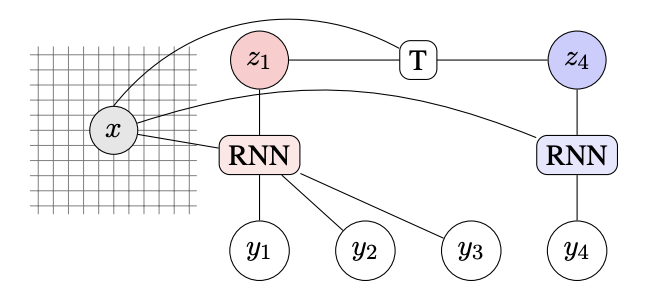

Hi, everyone! UCLA ACM AI's technical blog has been revived 😃 Check out our first technical blog post on [Learning Neural Templates for Text Generation](https://medium.com/@arjunsub00/learning-neural-templates-for-text-generation-cfe53c0dd571), written by Arjun Subramonian (Outreach Director 2020-2021). 

Stay tuned for more blog posts! 

